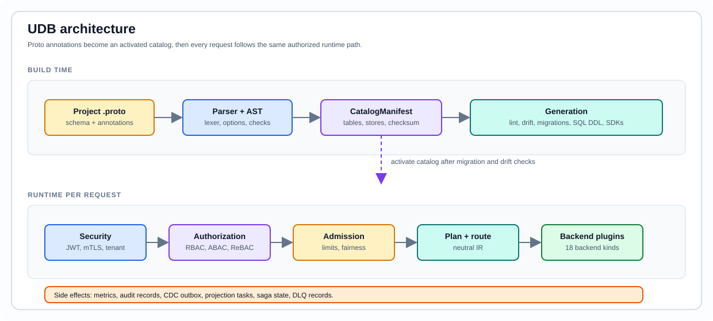

<p align="center">
  
</p>

<h1 align="center">Universal Data Broker</h1>

<p align="center">
  <strong>UDB :: Universal Data Broker</strong><br>
  <sub>gRPC data plane | native control plane | tenant/project scope guard<br>crate v0.5.7 | protocol v1.0.0</sub>
</p>

<p align="center">
  <a href="Cargo.toml"></a>
  <a href="proto/README.md"></a>
  <a href="sdk/UDB_PROTOCOL_VERSION"></a>
  <a href="#sdks"></a>
  <a href="LICENSE"></a>
</p>

UDB is a public, schema-driven knowledge graph and data broker for applications
that need one typed API in front of many data systems.

You describe your domain in normal `.proto` files, add UDB annotations for
storage and security behavior, then run one broker in front of relational
databases, object stores, caches, vector stores, document stores, graph stores,
analytics systems, and native identity services. Application code calls UDB
through gRPC or an SDK; UDB handles routing, metadata, authorization, migrations,
CDC, and backend-specific execution.

<p align="center">
  
</p>

## What UDB Gives You

- One `DataBroker` API for relational records, objects, vectors, cache entries,
  documents, graphs, analytics, catalog operations, migrations, transactions,
  CDC, and admin health.
- A native control plane for authentication, authorization, API keys, identity
  providers, tenants, notifications, analytics, storage, assets, WebRTC, and
  versioned policy distribution.
- A descriptor-driven contract: protos define services, tables, field security,
  endpoint security, SDK surfaces, event contracts, and generated docs.
- Multi-tenant request context on every call: tenant, project, user, purpose,
  service identity, scopes, correlation id, and client catalog version.
- SDKs for Go, Python, TypeScript/Node, Java, C#, and PHP/Laravel.
- A single CLI named `udb` for proto export, formatting, SDK generation, native
  service setup, app integration, local dev, broker serving, and diagnostics.

## Current Surface

The service surface below is generated from the embedded descriptor — do not
edit the counts by hand. Run `udb native docs` (which also regenerates
[docs/generated/native-services.md](docs/generated/native-services.md)) and
commit the refreshed block; the `readme_services_block_matches_embedded_descriptor`
staleness test fails if it drifts.

<!-- BEGIN GENERATED:services -->
| Area | Surface |
|---|---|
| Data plane | 79 `DataBroker` RPCs |
| Native control plane | 27 services, 300 RPCs |

Per-service RPC counts (native control plane):

| Service | RPCs |
|---|---|
| `analytics` | 7 |
| `apikey` | 9 |
| `asset` | 8 |
| `authn` | 59 |
| `authz` | 41 |
| `backup` | 8 |
| `cache` | 7 |
| `config` | 5 |
| `control` | 6 |
| `embedding` | 19 |
| `idp` | 27 |
| `livequery` | 1 |
| `lock` | 5 |
| `metering` | 6 |
| `notification` | 12 |
| `scheduler` | 6 |
| `search` | 5 |
| `storage` | 9 |
| `tenant` | 7 |
| `vault` | 20 |
| `webhook` | 6 |
| `webrtc_peer` | 5 |
| `webrtc_room` | 9 |
| `webrtc_signaling` | 1 |
| `webrtc_track` | 4 |
| `webrtc_turn` | 1 |
| `workflow` | 5 |
<!-- END GENERATED:services -->

| Area | Surface |
|---|---|
| Contract manifest | 733 messages, 49 table-backed models, 192 event contracts |
| Backends | 18 backend kinds across SQL, cache, vector, object, document, graph, and column stores |
| SDKs | Go, Python, TypeScript/Node, Java, C#, PHP/Laravel |
| Release | crate/SDK version `0.5.7`, wire protocol `1.0.0` |

## Why UDB

Any app that outgrows a single database ends up hand-writing the same plumbing:
a client per datastore, a tenant filter on every query, retry and idempotency
logic, an auth layer, a secrets store, a search index, a job runner. UDB is that
plumbing — built once, behind one typed API — so your code stays about your
product, not the seams between systems.

- **Tenant isolation you can't forget to add.** Every row is scoped by a
  canonical tenant UUID, enforced in the database — not by a `WHERE tenant = …`
  you might leave off one query. Pass your human tenant code (`"acme"`) and the
  SDK resolves it to the UUID, so the classic first-week bug — a code/UUID
  mismatch that silently returns zero rows — simply can't happen.
- **Writes that behave, so you delete code.** Read-after-write consistency,
  idempotent `Upsert`/`Delete` (a retried mutation replays safely and reports
  `was_duplicate`), and typed errors on a stable wire contract are built in —
  correctness glue you'd otherwise re-write in every service.
- **The rest of the backend, already built.** Auth with SSO, secrets, search,
  cache, schedulers and durable workflows, webhooks, metering, embeddings, file
  storage — the [control plane](#native-control-plane) you'd normally assemble
  from a dozen vendors, all tenant-scoped and reached through the same SDK as your
  data.
- **Swap the database without a rewrite.** The same `Select`/`Upsert`/`Delete`
  fronts [18 backend kinds](#backends) — relational, document, vector, object,
  cache, graph, wide-column, analytics, and search — so choosing or changing a
  store is a config decision, not a rewrite of your app.
- **Identical behavior in every language.** The Go, Python, TypeScript, Java, C#,
  and PHP SDKs are generated from one proto contract, so an `Invoice` behaves the
  same in all six.

None of this is aspirational: every backend and RPC is exercised by live
conformance tests against a running broker in each language — the surface is
proven, not just declared.

## How It Feels

Your project owns the model:

```proto
syntax = "proto3";
package acme.billing.v1;

import "udb/core/common/v1/db.proto";

message Invoice {
  option (udb.core.common.v1.pg_table) = {
    schema: "billing"
    table: "invoices"
  };

  string invoice_id = 1 [(udb.core.common.v1.pg_column) = {
    primary_key: true
    sql_type: "text"
  }];

  string tenant_id = 2;
  string customer_id = 3;
  int64 total_cents = 4;
}
```

Application code calls the broker through an SDK:

```python
from udb_client import Metadata, UdbClient, decode_records

meta = Metadata(
    tenant_id="acme",   # your human tenant code; the SDK login flow resolves it to
                        # the canonical UUID that RLS checks — see examples/python_enterprise
                        # (passing a raw code is the #1 "why are my reads empty?" bug).
    user_id="user-1",
    purpose="billing.api",
    scopes=("udb:read", "udb:write"),
    service_identity="billing-service",
    project_id="billing",
)

with UdbClient("127.0.0.1:50051", meta) as udb:
    rows = udb.select(message_type="acme.billing.v1.Invoice", limit=50)
    print(decode_records(rows))
```

## Quick Start

The whole idea: **you describe your data model in protobuf, and UDB turns it into
a running, multi-tenant, RLS-protected API over your database — no ORM, no
hand-written SQL, no schema migrations to babysit.** Here's the path from an empty
folder to querying your own tables.

**1. Get the `udb` CLI** — from a release binary, an SDK launcher, or source:

```bash
cargo install --path .
```

**2. Pull in UDB's shared protobuf annotations** so your own protos can use them:

```bash
udb proto export --fmt      # writes udb/core/common/v1/*.proto into your project
```

**3. Describe your data model.** Write normal protos and annotate the fields UDB
should turn into tables/columns — that annotation file is the one you just
exported:

```proto
import "udb/core/common/v1/db.proto";   // gives you pg_table / pg_column, RLS, tenancy
```

**4. See exactly what UDB will build** before you run anything — the catalog, the
SQL it generates, and a human-readable lint of your model:

```bash
udb catalog proto            # the tables/columns UDB derived from your protos
udb sql proto                # the DDL it will run
udb lint proto --human       # plain-English warnings (missing tenant column, etc.)
```

**5. Start the broker.** It generates the schema and serves your model over gRPC:

```bash
udb serve proto "" 0.0.0.0:50051
```

**6. Confirm it's healthy:**

```bash
udb doctor --human           # readiness in plain English
udb compat-matrix            # which backends/features are live
```

**7. Connect your application.** Now point an SDK at the broker, authenticate, and
do tenant-scoped CRUD. The shortest correct path — including the tenant-code →
canonical-UUID handling that trips up most first integrations — is in
[`examples/go_enterprise`](examples/go_enterprise) (Go), with equivalents in
[`examples/python_enterprise`](examples/python_enterprise) and
[`examples/ts_enterprise`](examples/ts_enterprise). Start there rather than
wiring the raw gRPC clients yourself.

## CLI

All public commands use the short binary name `udb`.

| Command | Purpose |
|---|---|
| `udb init` | Build or preview a project-aware UDB setup plan |
| `udb proto export --fmt` | Export UDB annotation and broker protos into an app |
| `udb proto fmt --check` | Check annotation formatting |
| `udb catalog`, `udb sql`, `udb plan`, `udb drift` | Inspect schemas, SQL, migrations, and drift |
| `udb sdk generate` | Generate descriptor-aware SDK surfaces from templates |
| `udb native list`, `udb native manifest`, `udb native docs` | Inspect native-service contracts |
| `udb app init` | Add a language/framework integration scaffold |
| `udb dev up`, `udb dev smoke` | Run and test the local playground |
| `udb serve` | Start the gRPC broker |
| `udb doctor`, `udb health-check` | Check runtime and dependency readiness |
| `udb auth ...` | Use control-plane helpers for principals, sessions, API keys, roles, relations, and policies |
| `udb dbops sync` | Sync generated database-operation artifacts |

## Backends

UDB knows these backend kinds:

`postgres`, `mysql`, `sqlite`, `sqlserver`, `clickhouse`, `redis`, `memcached`,
`qdrant`, `weaviate`, `pinecone`, `minio`, `s3`, `azureblob`, `gcs`, `mongodb`,
`elasticsearch`, `neo4j`, and `cassandra`.

The live capability matrix distinguishes compiled support from configured
runtime availability:

```bash
udb compat-matrix
```

## Native Control Plane

UDB ships a separate internal control-plane listener for native services. Bind
it to an internal interface or place it behind a trusted gateway.

| Service family | What it covers |
|---|---|
| Authn | Login, sessions, refresh tokens, JWT/JWKS, MFA, OTP, devices, WebAuthn |
| Authz | RBAC, ABAC, ReBAC, decisions, policy bundles, native access, governance |
| API keys | Hashed keys, scopes, rotation, revocation, usage stats |
| Identity providers | OIDC, SAML, SCIM, JIT, external identity links |
| Control distribution | Versioned policy/resource distribution with ACK/NACK |
| Tenant, notification, analytics | Tenant config, messages, templates, metrics, SLA views |
| Storage and asset | Object metadata, presigned URLs, asset pipelines, vector-ready workflows |
| WebRTC | Rooms, peers, tracks, TURN credentials, signaling, egress/SFU |
| Vault | Secrets, transit encrypt/sign/HMAC, dynamic database credentials |
| Metering | Usage recording and per-tenant quotas |
| Scheduler, workflow, lock | Cron/one-shot jobs, durable sagas, distributed locks with fencing tokens |
| Search, embedding | Managed search indexes, vector retrieval, and backfill enumeration |
| Webhook | SSRF-guarded outbound webhook endpoints and delivery tracking |
| Config, live query | Feature flags and server-streaming live-query subscriptions |
| Backup | Tenant-scoped backup and restore |

Details, including the read-your-writes consistency contract (write receipts,
read fences, consistency modes) and idempotency `was_duplicate` replay:
[docs/native-services.md](docs/native-services.md).

## SDKs

| Language | Install |
|---|---|
| Go | `go get github.com/fahara02/udb/sdk/go@v0.5.7` |
| Python | `pip install udb-client==0.5.7` |
| TypeScript / Node | `npm i @udb_plus/sdk@0.5.7` |
| PHP / Laravel | `composer require fahara02/udb-laravel:^0.5.7` |
| C# | `dotnet add package Udb.Client --version 0.5.7` |
| Java | `dev.udb:udb-java-client` (`0.5.7` target; build from checkout until publishing lands) |

Start here: [sdk/README.md](sdk/README.md).

## Examples

| Example | Focus |
|---|---|
| [examples/go_arbitary_project](examples/go_arbitary_project/README.md) | Go app with app-owned protos and UDB broker calls |
| [examples/python_arbitary_project](examples/python_arbitary_project/README.md) | Python app flow with generated models and SDK calls |
| [examples/php_arbitary_project](examples/php_arbitary_project/README.md) | PHP/Laravel app flow |
| [examples/php_quickstart](examples/php_quickstart/README.md) | CRUD, authz scopes, and relationships |
| [examples/native-services](examples/native-services/README.md) | Native auth/authz/API-key/native-access examples |
| [examples/multi_project](examples/multi_project/README.md) | One broker serving separate project catalogs |
| [examples/toy_backend_plugin](examples/toy_backend_plugin/README.md) | Minimal external backend plugin |

## Documentation

- [docs/README.md](docs/README.md) - documentation index
- [docs/architecture.md](docs/architecture.md) - architecture, request flow, routing, pooling, events, and backend capability
- [docs/api-rules.md](docs/api-rules.md) - API route rules, OpenAPI operation IDs, and SDK alias policy
- [docs/annotations.md](docs/annotations.md) - proto annotations
- [docs/integration.md](docs/integration.md) - application integration
- [docs/native-services.md](docs/native-services.md) - native auth, authz, IdP, storage, assets, WebRTC, and SDK facades
- [docs/operations.md](docs/operations.md) - production readiness, config, runbooks, SLOs, and validation
- [docs/security.md](docs/security.md) - request context, identity, authorization, sensitive data, and compliance profiles
- [docs/testing.md](docs/testing.md) - test commands and live checks
- [VERSIONING.md](VERSIONING.md) - release and protocol versioning
- [TESTING.md](TESTING.md) - top-level test guide

## Development

Fast local checks:

```bash
cargo test --lib
buf lint
buf build
node scripts/check-versions.mjs
```

SDK conformance:

```bash
node sdk-conformance/run.mjs
```

The default Rust suite is designed to run without external services. Live
backend, HA, and load checks are documented separately and require the matching
infrastructure.

## License

MIT. See [LICENSE](LICENSE).
