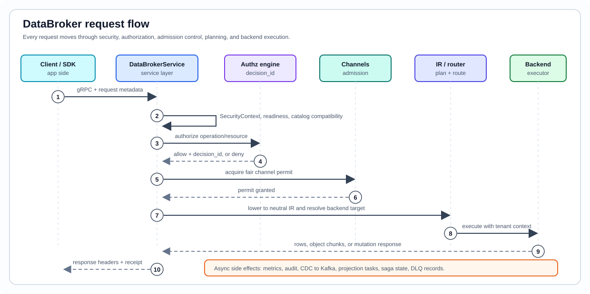

# Architecture


```text
┌────────────────────────────────────────────────────────────────────────────┐
│                                                                            │
│    ██    ██  ██████   ██████                                               │
│    ██    ██  ██   ██  ██   ██                                              │
│    ██    ██  ██   ██  ██████                                               │
│    ██    ██  ██   ██  ██   ██                                              │
│     ██████   ██████   ██████                                               │
│                                                                            │
│    UNIVERSAL DATA BROKER                                                   │
│    gRPC data plane | native control plane | tenant/project scope guard     │
│                                                                            │
│    crate v0.4.3 | protocol v1.0.0                                          │
└────────────────────────────────────────────────────────────────────────────┘
```
UDB is a Rust gRPC broker that turns protobuf domain schemas into a runtime
catalog and uses that catalog to route requests to configured backends.

<p align="center">
  
</p>

## Why UDB Exists

Most growing products end up with the same operational shape:

- user data in Postgres, MySQL, SQLite, or SQL Server;
- search in Elasticsearch;
- embeddings in Qdrant, Weaviate, or Pinecone;
- files in S3, MinIO, Azure Blob, or Google Cloud Storage;
- cache and session data in Redis or Memcached;
- analytics in ClickHouse or Cassandra-style stores;
- tenant, auth, audit, retry, and migration rules repeated in each service.

UDB moves that shared contract into protobuf descriptors and a broker runtime.
Applications send typed requests such as "select invoices", "upsert this
customer", "store this object", "search these vectors", or "can this user read
this resource?". The broker checks request context, resolves the active project
catalog, verifies capabilities, calls the correct backend, and emits the
configured operational signals.

## Principles

UDB brokers access to external databases and services. Backends own their own
storage durability and replication. UDB owns the request contract, catalog,
routing, tenant context, authz, migrations, events, SDKs, and operational
signals around that access.

Protobuf descriptors and UDB annotations define RPC surfaces, table and column
metadata, endpoint security, field security, SDK surfaces, CLI scaffolds, event
contracts, and native service identity. Runtime checks, generated manifests,
docs, and SDKs all derive from that descriptor contract.

UDB is explicit about capabilities. A backend is only offered for an operation
when the current binary, configuration, runtime health, and backend semantics
support that operation. Unsupported or degraded paths fail before side effects.

## Layers

| Layer | Role |
|---|---|
| Protobuf contract | App schemas, UDB annotations, native service descriptors |
| Catalog manifest | Normalized tables, fields, stores, security metadata, checksums |
| DataBroker | Public data-plane API for records, objects, vectors, cache, CDC, transactions, admin, and health |
| Native control plane | Internal API for authn, authz, API keys, IdP, tenants, notifications, analytics, storage, assets, WebRTC, and policy distribution |
| Runtime routing | Project/tenant context, backend target selection, admission control, authorization, and execution |
| Backends | SQL, cache, vector, object, document, graph, and column systems |
| Events | Outbox, CDC envelopes, domain events, DLQ, and replay controls |

## Request Flow

<p align="center">
  
</p>

1. A client sends a gRPC request with UDB metadata.
2. The broker extracts tenant, project, purpose, user, service identity, scopes,
   correlation id, and client catalog version.
3. Method security and authz policy evaluate the request.
4. Admission control applies per-operation and tenant-aware limits.
5. The request is lowered into a backend-neutral operation.
6. Routing chooses the configured backend instance for the project and operation.
7. The executor runs the backend-specific query or command.
8. The response carries typed data plus catalog and consistency metadata.
9. Audits, metrics, CDC events, projections, and sagas run through their
   configured paths.

## Data Plane

`DataBroker` exposes 77 RPCs for:

- relational CRUD and batch operations;
- streaming record sets;
- object/blob put, get, presign, and multipart workflows;
- vector and hybrid search;
- cache, document, graph, time-series, and analytical operations;
- transactions, 2PC/XA, saga coordination, CDC, DLQ, catalog, migration, and
  admin health.

The data plane is intentionally backend-neutral at the API boundary. Backend
details are resolved through the active catalog, project routing rules, backend
capabilities, and runtime configuration.

## Project Protos

Application protos are the source of the domain model. They do not need to
define the UDB `DataBroker` service. They import UDB annotations when a message,
field, service, or method needs storage, security, SDK, or event metadata.

The parser understands:

- table and column projections;
- primary keys, indexes, foreign keys, checks, and reserved fields;
- tenant columns and row-level-security metadata;
- vector, cache, object, document, graph, time-series, column, and model-store
  annotations;
- endpoint and field security metadata;
- language options for generated SDK surfaces;
- compatibility modes for annotation validation.

Export the shared annotations into an app project with:

```bash
udb proto export --fmt
```

## Catalog Manifest

The catalog manifest is UDB's normalized view of app and native descriptors. It
contains message names, table names, fields, stores, constraints, security
metadata, checksums, warnings, and validation errors.

The manifest feeds:

- runtime routing and catalog compatibility checks;
- SQL and backend artifact generation;
- migration diffing and drift checks;
- field redaction and output views;
- SDK metadata;
- generated docs and descriptor manifests.

Useful commands:

```bash
udb catalog proto
udb sql proto
udb lint proto --human
udb plan proto --prior previous-manifest.json
```

## Neutral IR

Data-plane calls lower into backend-neutral operations before they reach a
backend compiler or executor.

| IR family | Used for |
|---|---|
| `LogicalRead` | relational, document, graph, analytical, and projected reads |
| `LogicalWrite` | insert, update, upsert, and batch mutation |
| `LogicalDelete` | delete and tombstone-style workflows |
| `LogicalSearch` | vector, hybrid, and search-backed operations |
| `LogicalAggregate` | grouped analytical and SQL aggregate paths |
| `LogicalResourceOp` | backend resource administration and lifecycle commands |

Compiler modules render those neutral operations into SQL dialects, JSON/HTTP
payloads, key/value commands, object storage calls, CQL, Cypher, or vector
backend requests. This keeps the public API stable while backend details stay
behind capability checks.

## Native Control Plane

The native control plane is served on a separate listener. Its descriptor-rendered
service catalog covers identity, access control, storage, assets, WebRTC,
tenancy, notifications, analytics, and policy distribution.

See [native-services.md](native-services.md).

## Backend Kinds

UDB recognizes 18 backend kinds:

`postgres`, `mysql`, `sqlite`, `sqlserver`, `clickhouse`, `redis`, `memcached`,
`qdrant`, `weaviate`, `pinecone`, `minio`, `s3`, `azureblob`, `gcs`, `mongodb`,
`elasticsearch`, `neo4j`, and `cassandra`.

Backends are grouped by tier:

| Tier | Backends |
|---|---|
| SQL / relational | Postgres, MySQL, SQLite, SQL Server |
| Analytical / column | ClickHouse, Cassandra/Scylla |
| Cache | Redis, Memcached |
| Vector / search | Qdrant, Weaviate, Pinecone, Elasticsearch |
| Object | MinIO, S3, Azure Blob, Google Cloud Storage |
| Document / graph | MongoDB, Neo4j |

## Backend Matrix

UDB separates backend identity from runtime availability:

- `BackendKind` is the known backend enum.
- `BackendTier` groups SQL, cache, vector, object, document, graph, and column
  stores.
- `BackendRole` describes whether a backend can be canonical system state,
  projection-only, or an auxiliary target.
- Backend capabilities describe operation and consistency guarantees.
- Runtime configuration says whether an instance is actually mounted.

| Backend | Tier | Common role | Notes |
|---|---|---|---|
| Postgres | SQL | canonical | relational CRUD, transactions, RLS, migration/system state |
| MySQL | SQL | canonical | relational CRUD, transactions, XA-style workflows |
| SQLite | SQL | canonical/dev | embedded relational store and local/dev workflows |
| SQL Server | SQL | canonical where configured | relational CRUD and SQL Server session context |
| MongoDB | document | projection or canonical profile | document operations; native profile depends on topology |
| ClickHouse | analytical/column | analytical/canonical profile | analytical query and append-oriented workloads |
| Neo4j | graph | graph/canonical profile | graph operations and relationship-heavy workloads |
| Cassandra / Scylla | column | wide-column/canonical profile | LWT/quorum-backed wide-column workflows |
| Qdrant | vector | vector/canonical profile | vector search/upsert and vector system-state adapter |
| Weaviate | vector | vector/canonical profile | vector and hybrid search |
| Pinecone | vector | vector/canonical profile | managed vector and hybrid search |
| Elasticsearch | search/document | search/canonical profile | search, document, and hybrid/knn paths |
| Redis | cache | cache/conditional canonical profile | cache operations and durability-profile-gated state |
| Memcached | cache | projection only | cache get/set; not a durable system-state anchor |
| S3 / MinIO | object | object projection | object streaming, presign, multipart workflows |
| Azure Blob | object | object projection | object storage with staged block behavior |
| Google Cloud Storage | object | object projection | object storage and signed access workflows |

UDB distinguishes:

- known backend kind;
- support compiled into the current binary;
- configured backend instances;
- operation capabilities;
- canonical versus projection role;
- deployment-specific guarantees.

Inspect the current binary and runtime configuration:

```bash
udb compat-matrix
udb doctor --human
```

## Canonical Stores And System State

UDB has internal state for catalogs, migrations, native services, CDC, saga
coordination, projection tasks, audit records, and singleton leases. A backend
can be a canonical store only when it satisfies the shared system-state contract
for the current deployment profile.

System-state areas include:

- catalog versions and project bindings;
- migration runs and operation ledgers;
- CDC event journal, offsets, locks, topic policy, and DLQ;
- saga coordinator state;
- projection task state;
- auth, tenant, notification, analytics, storage, asset, and WebRTC native
  service state;
- admin/audit records and operational metrics.

Object stores, caches, search systems, and vector systems can still be first
class runtime targets even when they are not the canonical authority for all UDB
system state.

## Routing

Routing inputs include:

- `x-tenant-id`;
- `x-udb-project-id`;
- `x-purpose`;
- `x-scopes`;
- `x-service-identity`;
- operation family;
- message or resource type;
- configured backend instances;
- backend health and capability state.

UDB first resolves the active catalog for the project. It then checks whether
the operation is valid for the target message/resource and chooses a backend
instance that can serve the operation.

Examples:

- relational records route to SQL backends;
- object metadata routes through UDB while object bytes use object storage;
- vector and hybrid search route to vector/search backends;
- cache operations route to Redis or Memcached when configured;
- graph operations route to graph-capable backends.

Project id is the primary application boundary for routing. Tenant id remains
the security and isolation boundary inside the request.

## Multi-Project Runtime

One broker can serve multiple project catalogs. Each request carries
`x-udb-project-id`, and the runtime resolves that project before it validates
message types, backend targets, and catalog compatibility. This lets unrelated
applications share a broker deployment without sharing schema ownership.

Tenant id remains independent of project id. A project describes an application
catalog; a tenant describes the security and data-isolation boundary for a
request.

## Pooling And Admission

UDB separates request admission from backend connection pooling.

Admission applies bounded concurrency before work reaches backend pools. Limits
are grouped by operation family and request scope so overloaded tenants or
methods cannot consume all runtime capacity.

Backend clients use their own connection or HTTP pools. Size broker replicas,
admission limits, and backend pools together. Per-replica admission limits
multiply by the number of replicas behind a load balancer.

## Event Contracts

UDB uses event contracts for CDC, native-service lifecycle events, audits, and
replayable operational streams.

Events carry stable context:

- event id and event type;
- tenant id and project id;
- actor and service identity where available;
- operation and resource;
- correlation id and trace context;
- schema or descriptor version;
- redaction profile;
- payload.

The generated contract currently contains 192 event contracts. Inspect it with:

```bash
udb native manifest
```

## Capability Honesty

Health reports, docs, CLI output, SDK manifests, and generated contracts should
describe mounted and configured behavior. When a backend cannot provide a
guarantee, UDB reports that clearly and refuses operations that require the
missing guarantee.

## Repository Map

| Path | Purpose |
|---|---|
| `proto/udb/**` | Broker, entity, native-service, event, and annotation protos |
| `src/parser` | Proto lexer/parser and annotation extraction |
| `src/generation` | Manifest, SQL, DSN, drift, lint, and backend artifact generation |
| `src/migration` | Diffing, migration plans, audited apply, and db-ops sync |
| `src/ir` | Neutral operations and backend compilers |
| `src/backend` | Backend identity, capability matrix, and plugin inventory |
| `src/runtime` | Broker runtime, routing, security, CDC, services, stores, metrics |
| `src/cli` | Public `udb` command implementation |
| `sdk` | Language SDKs, generated clients, and CLI launchers |
| `sdk-conformance` | Cross-language SDK behavior checks |
| `crates/udb-portable` | Parser/checksum/schema-cache subset for browser and edge use |

Use this map to find code. Public product docs avoid exposing internal work
plans or transient implementation history.
