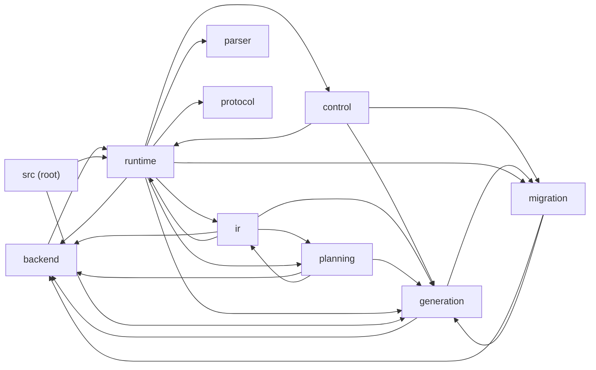
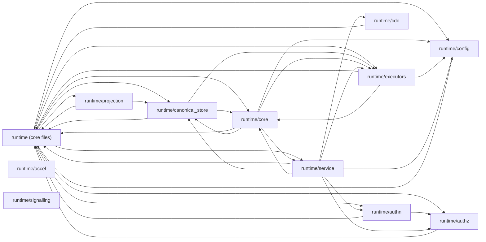

# UDB codebase map (GENERATED — do not edit)

Regenerate: `python scripts/generate-codebase-map.py`  ·  CI freshness-gates
this file. Read this FIRST to locate a subsystem/symbol, then grep the
symbol name — that beats discovery-grepping every time.

- **Graphs:** macro module dependencies (`use crate::…` edges, aggregated).
- **Index:** per file — module-doc summary + public symbols (test modules
  excluded). `pub(crate)` items are included: they ARE the internal API.

## Module dependency graphs

### Top-level modules



### Inside src/runtime



## Public-symbol index

### backend  (22 files)

- **src/backend/kind.rs** — types: `BackendKind` · fns: `as_str`
- **src/backend/mod.rs** — types: `BackendTier`, `BackendCapability`, `LifecycleSupport`, `SystemStoreSupport`, `ControlPlaneHaLevel`, `CanonicalCandidateProfile`, `CanonicalFeasibilityProfile`, `BackendCapabilityV2`, `BackendRole`, `BackendCapabilityMatrixEntry` · fns: `from_token`, `tier`, `orm_tier`, `role`, `capabilities`, `capabilities_v2`, `lifecycle_support`, `system_store_support`, `control_plane_ha_level`, `transport_label`, `has_runtime_probe`, `canonical_candidate_profile`, `canonical_promotion_goal`, `canonical_feasibility_profile`, `default_env_key`, `dsn_scheme`, `from_store_kind`, `as_str`, `as_str`, `admits_dispatch`, `is_native_executor`, `as_str`, `is_canonical`, `as_str`, `parse_deployment_tier`, `as_str`, `derive_v1`, `as_str`, `can_host_system_tables`, `can_be_durability_anchor`, `can_receive_projections`, `all_known`, `supported_operations`, `supports_operation`, `capability_matrix_entry`, `capability_matrix`, `capability_matrix_configured` · consts: `ALL`, `UNSUPPORTED_OPERATION_CODE`, `CORE_BACKENDS`, `CANONICAL_SYSTEM_STORE_BACKENDS`
- **src/backend/plugin.rs** — Per-backend plugin trait — the U2 seam. `Backend` is the single, object-safe trait that a backend module implements to declare its identity, capabilities, and (in later steps) its generation and executor factories. Th… · traits: `Backend` · types: `BackendSupportState`, `BackendPluginSurface`, `BackendPluginContract`, `BackendConformanceReport`, `RegisterCtx` · fns: `as_str`, `is_runtime_supported`, `diagnostic`, `required`, `default_for`, `conformance_report`, `compiler_mediated_runtime_path_wired`, `has_runtime_implementation`, `support_state_for_kind`, `support_state_for_token`, `all_plugins`, `plugin_for`, `plugin_for_kind`
- **src/backend/plugins/azureblob.rs** — C9 — Azure Blob Storage backend plugin. · types: `AzureBlobPlugin` · consts: `PLUGIN`
- **src/backend/plugins/cassandra.rs** — C9 — Cassandra / ScyllaDB backend plugin. · types: `CassandraPlugin` · consts: `PLUGIN`
- **src/backend/plugins/clickhouse.rs** — ClickHouse plugin. Delegates connection setup to `runtime::core::setup_data::register_clickhouse`. Only compiled with the `clickhouse` Cargo feature. · types: `ClickHousePlugin` · consts: `PLUGIN`
- **src/backend/plugins/elasticsearch.rs** — C9 — Elasticsearch backend plugin. Promotes Elasticsearch from a metadata-only enum entry to a real wired plugin. Mirrors the Qdrant / Mongo plugin shape: zero-sized struct + `pub static PLUGIN` + `Backend` impl whose… · types: `ElasticsearchPlugin` · consts: `PLUGIN`
- **src/backend/plugins/gcs.rs** — C9 — Google Cloud Storage backend plugin. · types: `GcsPlugin` · consts: `PLUGIN`
- **src/backend/plugins/memcached.rs** — C9 — Memcached backend plugin. Promotes Memcached from a metadata-only enum entry to a real wired plugin backed by the canonical `memcache` crate (sync binary protocol, wrapped in spawn_blocking from the executor). · types: `MemcachedPlugin` · consts: `PLUGIN`
- **src/backend/plugins/minio.rs** — MinIO plugin — the historical default S3-compatible object store. Setup is shared with the S3 plugin (`register_s3` covers both). Having both plugins means `BackendKind::Minio` and `BackendKind::S3` are both enumerate… · types: `MinioPlugin` · consts: `PLUGIN`
- **src/backend/plugins/mod.rs** — Per-backend plugin instances (U2). Each plugin is a zero-sized struct implementing [`crate::backend::Backend`] and exposing a `pub static` instance. The `all()` function below is the single inventory point — registry … · fns: `dispatch_instance_not_configured_status`, `all`
- **src/backend/plugins/mongodb.rs** — MongoDB plugin. Delegates connection setup to `runtime::core::setup_data::register_mongodb`. Only compiled with the `mongodb` Cargo feature. · types: `MongoDbPlugin` · consts: `PLUGIN`
- **src/backend/plugins/mssql.rs** — C9 — Microsoft SQL Server backend plugin. Real TDS-protocol implementation via the canonical `tiberius` driver. Same plugin shape as the other SQL canonical stores (Postgres / MySQL / SQLite): zero-sized struct + `pub… · types: `MssqlPlugin` · consts: `PLUGIN`
- **src/backend/plugins/mysql.rs** — NW3-1 — MySQL plugin. Mirrors the Postgres plugin shape. Runtime registration delegates to `runtime::core::setup_data::register_mysql`, which reads `UDB_MYSQL_DSN`, opens a sqlx-mysql pool, stores it on the runtime, a… · types: `MysqlPlugin` · consts: `PLUGIN`
- **src/backend/plugins/neo4j.rs** — Neo4j plugin. Delegates connection setup to `runtime::core::setup_data::register_neo4j`. Only compiled with the `neo4j` Cargo feature. · types: `Neo4jPlugin` · consts: `PLUGIN`
- **src/backend/plugins/pinecone.rs** — C9 — Pinecone backend plugin. · types: `PineconePlugin` · consts: `PLUGIN`
- **src/backend/plugins/postgres.rs** — Postgres plugin. Identity comes from the trait defaults (delegated to `BackendKind`). Runtime registration delegates to `runtime::core::setup_data::register_postgres`, which lives in `runtime/core/` so it can reach `D… · types: `PostgresPlugin` · consts: `PLUGIN`
- **src/backend/plugins/qdrant.rs** — Qdrant plugin. Delegates connection setup to `runtime::core::setup_data::register_qdrant`. Only compiled with the `qdrant` Cargo feature. · types: `QdrantPlugin` · consts: `PLUGIN`
- **src/backend/plugins/redis.rs** — Redis plugin. Delegates connection setup to `runtime::core::setup_data::register_redis` (which has descendant-module access to `DataBrokerRuntime`'s private `redis*` fields per §9.5). Only compiled with the `redis` Ca… · types: `RedisPlugin` · consts: `PLUGIN`
- **src/backend/plugins/s3.rs** — S3 plugin. Shares the `register_s3` setup with the MinIO plugin (both use the `[minio]` config block — historically the default S3-compatible store). Only compiled with the `s3` Cargo feature. · types: `S3Plugin` · consts: `PLUGIN`
- **src/backend/plugins/sqlite.rs** — NW3-2 — SQLite plugin. Same shape as the MySQL plugin. The runtime register function detects `sqlite::memory:` / `:memory:` in the DSN and clamps to `max_connections = 1` so the in-memory schema and data survive acros… · types: `SqlitePlugin` · consts: `PLUGIN`
- **src/backend/plugins/weaviate.rs** — C9 — Weaviate backend plugin. REST + GraphQL via reqwest. Same shape as the Qdrant plugin. · types: `WeaviatePlugin` · consts: `PLUGIN`

### cli  (17 files)

- **src/cli/args.rs** — main.rs split — args (Phase H). · types: `Command`, `InitArgs`, `SdkSelector`, `SdkAction`, `OrmAction`, `NativeAction`, `AuthCommand`, `AuthzCommand`, `ComplianceCommand`, `DevAction` · fns: `parse`, `split_csv`, `parse_args`
- **src/cli/auth.rs** — Native auth CLI commands. These commands call the generated UDB authn/authz/apikey clients. The CLI is a control-plane convenience layer only; CRUD still flows through the native service protos and their server implem… · fns: `run_auth_command`
- **src/cli/authz_cli.rs** — Native authz governance CLI commands. Surfaces the policy-governance UX over the generated `AuthzService` client. `udb authz simulate` answers "what would change if this policy bundle shipped?" by calling the EXISTING… · fns: `run_authz_command`
- **src/cli/doctor.rs** — main.rs split — doctor (Phase H). · types: `Remediation`, `DoctorReport`, `DoctorStatus`, `CompatEntry` · fns: `is_auto_fixable`, `describe`, `remediation_for_preflight`, `tls_path_remediation`, `env_with_default`, `normalize_crlf`, `exit_code`, `doctor_status`, `run_doctor`, `build_compat_matrix`, `print_doctor_human`, `bool_icon`
- **src/cli/env_setup.rs** — main.rs split — env_setup (Phase H). · types: `DoctorOutputMode` · fns: `run_force_sync_for_instance`, `run_dry_run_for_instance`, `load_project_dotenv`, `resolve_existing_project_path`, `load_udb_config_overlay`, `parse_config_overlay_value`, `cli_config_path`, `set_env_from_yaml`, `yaml_string`, `expand_env_template`, `set_env_if_absent`, `set_env` · consts: `DEFAULT_GRPC_BIND_HOST`, `DEFAULT_GRPC_TARGET_HOST`, `DEFAULT_GRPC_PORT`, `DEFAULT_GRPC_BIND_ADDR`, `DEFAULT_GRPC_TARGET_ADDR`
- **src/cli/evidence.rs** — `udb compliance evidence` — master-plan 4.4 compliance-evidence automation. Thin CLI over existing machinery. It drains the durable auth-audit window (the append-only `udb_system.auth_audit_log` relation OWNED by the … · fns: `run_compliance_command`
- **src/cli/help.rs** — CLI discoverability layer (stopgap pending the full clap migration in `CLI_UPGRADE_PLAN.md`). The hand-rolled `parse_args` has no `--help`/`-h`/ `--version`; this module answers them from a static registry so `udb` is… · fns: `handle_help_or_version`
- **src/cli/init.rs** — `udb init` command runner. · types: `InitRunError` · fns: `run`
- **src/cli/init_prompt.rs** — Line-mode prompt fallback for `udb init`. This module is deliberately narrow: it collects choices and returns them to the init core. Planning, validation, and disk writes stay outside prompts. · types: `InitPromptResult`, `InitPromptError`, `InitPromptCatalog`, `InitPromptSelection` · fns: `run_init_prompts`, `run_init_prompts`
- **src/cli/mod.rs** — CLI entry point internals (Phase H split of main.rs).
- **src/cli/native_app.rs** — Native-service app lifecycle (`udb native add|remove|generate|doctor|smoke`) and `udb app init`. Everything here is **descriptor-driven**: the set of selectable services, the surface grouping, dependency tokens, facad… · types: `NativeServicesManifest`, `AppInitArgs` · fns: `run_list`, `run_add`, `run_remove`, `run_generate`, `run_doctor`, `run_smoke`, `run_app_init`
- **src/cli/native_lint.rs** — Phase 0A (Section F5/F13) descriptor lints. These lints complement `native_contract_findings` in [`super`] (which already emits native-control-plane `endpoint_security_missing`, `non_public_rpc_without_policy`, and `d… · fns: `descriptor_lint_findings`
- **src/cli/output.rs** — main.rs split — output (Phase H). · fns: `output_json`, `redact_sensitive_json`, `print_startup_lifecycle_human`, `print_report_log_line`, `env_truthy`, `fatal_json`, `load_prior_manifest_from_args`, `load_authz_policies_for_lint`, `load_authz_policies_from_file`, `sql_literal`, `pg_identifier`, `pg_relation`
- **src/cli/proto_export.rs** — `udb proto export` — FSM-driven, idempotent export/sync of UDB's embedded proto contract into a user project. The flow is modeled as an explicit finite-state machine (mirroring [`crate::control::engine::FsmState`]) so… · types: `ProtoExportState` · fns: `as_str`, `valid_transitions`, `is_terminal`, `run`
- **src/cli/proto_fmt.rs** — `udb proto fmt` — UDB-friendly proto source formatting. This intentionally is not a full replacement for `buf format`. Its job is narrower: keep field declarations with long UDB annotation option lists on a single phy… · types: `ProtoFmtReport` · fns: `run`, `format_tree`, `format_proto_source`
- **src/cli/scaffold.rs** — main.rs split — scaffold (Phase H). · fns: `emit_init_project_scaffold`, `migration_to_orm_next_steps`, `scaffold_files`
- **src/cli/sdk_gen.rs** — `udb sdk generate` — FSM-driven, template-based SDK code generation. The per-language **robustness/client layer** (typed wrapper per RPC, retry, deadlines, TLS, error mapping, CLI-bundling glue) is rendered from edita… · types: `SdkGenState` · fns: `as_str`, `valid_transitions`, `is_terminal`, `run`, `run_orm_scaffold`

### control  (10 files)

- **src/control/auto_alter.rs** — types: `RepairKind`, `RepairDecision`, `RepairPlan`, `LintInput` · fns: `is_auto_safe`, `as_str`, `tier`, `schema`, `auto_safe_decisions`, `review_decisions`, `plan_repairs`
- **src/control/engine.rs** — types: `FsmState`, `RuntimeStateSnapshot`, `EngineError`, `Engine` · fns: `as_str`, `from_str`, `valid_transitions`, `can_transition_to`, `is_terminal`, `new`, `new_auto_id`, `transition`, `fail`, `recover`, `reset_to_idle`, `snapshot` · consts: `MAX_RETRIES`, `PG_ADVISORY_LOCK_KEY`, `ALL`, `VARIANT_COUNT`
- **src/control/executor.rs** — traits: `ProvisioningExecutor` · types: `ExecutionReport`, `FakeProvisioningExecutor` · fns: `passed`, `apply_plan`, `verify_plan`, `repair_plan`
- **src/control/lifecycle.rs** — types: `StartupLifecycleReport`, `MigrationMetricOperation` · fns: `run_startup_lifecycle`
- **src/control/mod.rs** — (no public items)
- **src/control/notification.rs** — types: `NotificationEvent`, `WebhookPayload`, `NotificationConfig` · fns: `as_str`, `from_str`, `new`, `wants_event`, `completed_payload`, `failed_payload`, `blocked_payload`
- **src/control/plan_approval.rs** — types: `PlanOperation`, `ExportedPlan`, `PlanMatchResult`, `ApprovalSignature`, `ApprovedPlan`, `ApprovalConfig`, `ApprovalError`, `ApprovalFreshness` · fns: `build_exported_plan`, `is_match`, `describe`, `plan_matches_current_diff`, `op_fingerprint`, `current_unix_ms`, `from_env`, `requires_signed_plan`, `compute_signature`, `create`, `freshness`, `verify`, `ready_to_apply`
- **src/control/status.rs** — types: `MigrationStatus`, `ErrorSummary`, `ErrorLogEntry` · fns: `format_summary`
- **src/control/sync_config.rs** — types: `SyncConfig`, `SyncResult`, `SyncStatus` · fns: `effective_batch_size`, `has_explicit_tables`, `tenant_scoped`, `validate_tenant_scope`, `is_clean`, `elapsed_ms`, `summary`
- **src/control/tracker.rs** — fns: `all_tracker_ddl_sql`, `all_tracker_ddl_sql_for_schema` · consts: `DEFAULT_LEDGER_SCHEMA`, `DDL_SCHEMA_MIGRATIONS`, `DDL_PROTO_SCHEMA_VERSIONS`, `DDL_MIGRATION_ERROR_LOG`, `DDL_MIGRATION_RUNTIME_STATE`, `ALL_TRACKER_DDL`

### crates/udb-portable  (2 files)

- **crates/udb-portable/src/lib.rs** — `udb-portable` — the WASM/edge-safe subset of the UDB stack (U28). ## What's in here - [`ast`] — `ProtoSchema`, `ProtoColumn`, and every other AST type that the catalog manifest is built from. Pure serde structs, no I… · fns: `embedded_file_descriptor_set`, `parse_proto_source`, `parse_proto_schemas`, `parse_ast_source`, `dedupe_schemas`
- **crates/udb-portable/src/schema_cache.rs** — U13 step 2 — SDK-side schema cache. The server side of U13 added `LookupMessageSchema` / `ListMessageSchemas` RPCs plus `x-udb-catalog-version` and `x-udb-manifest-checksum` headers on every response. The pending foll… · types: `Negotiation`, `CatalogCompatibility`, `ProtocolSupport`, `SchemaCache` · fns: `supports_encoding`, `new`, `observe`, `last_observation`, `descriptor`, `insert_descriptor`, `descriptor_count`, `set_protocol_support`, `protocol_support`, `compatibility`, `compatibility_against_local`

### crates/udb-wasm  (1 files)

- **crates/udb-wasm/src/lib.rs** — Browser bridge for `udb-portable` — exposes UDB's **real** proto-DB parser, lossless AST, and deterministic manifest checksum to JavaScript through a tiny C ABI over wasm linear memory. No wasm-bindgen, no extra logic… · fns: `udb_alloc`, `udb_free`, `udb_parse`, `udb_schema_cache_new`, `udb_schema_cache_free`, `udb_schema_cache_observe`, `udb_schema_cache_last_observation`, `udb_schema_cache_descriptor_count`, `udb_schema_cache_insert_descriptor`, `udb_schema_cache_descriptor`, `udb_schema_cache_compatibility`, `udb_annotation_version_ptr`, `udb_annotation_version_len`

### generation  (19 files)

- **src/generation/backend_safety.rs** — fns: `generated_at_unix`, `store_opt_str_any`, `store_opt_i64_any`, `store_opt_bool_any`, `is_safe_identifier`, `safe_identifier`, `safe_resource_name`, `safe_comment_value`, `quote_clickhouse_identifier`, `sanitize_filename`
- **src/generation/backends/clickhouse.rs** — ClickHouse DDL artifact generator. Produces one SQL (`.sql`) artifact per `ManifestStore` whose `backend == "clickhouse"` or `store_kind == "column"`, or whose options include `udb.ch_engine`. Each artifact emits a `C… · fns: `generate_clickhouse_artifacts`
- **src/generation/backends/minio.rs** — MinIO / S3 bucket artifact generator. Produces one JSON artifact per `ManifestStore` whose `backend == "s3"` / `"minio"` or `store_kind == "object"`, or whose options include a non-empty `udb.bucket`. Each artifact is… · fns: `generate_minio_artifacts`
- **src/generation/backends/mod.rs** — (no public items)
- **src/generation/backends/mongodb.rs** — MongoDB collection artifact generator. Produces one JSON artifact per `ManifestStore` whose `backend == "mongodb"` or `store_kind == "nosql"`, or whose options include `udb.mongo_database`. Each artifact is a UDB coll… · fns: `generate_mongodb_artifacts`
- **src/generation/backends/neo4j.rs** — Neo4j constraint and index artifact generator. Produces one Cypher (`.cypher`) artifact per `ManifestStore` whose `backend == "neo4j"` or `store_kind == "graph"`, or whose options include `udb.neo4j_database`. Each ar… · fns: `generate_neo4j_artifacts`
- **src/generation/backends/qdrant.rs** — Qdrant collection artifact generator. Produces one JSON artifact per `ManifestStore` whose `backend == "qdrant"` or whose options contain `udb.vector_dimension`. Each artifact is a Qdrant `PUT /collections/<name>` req… · fns: `generate_qdrant_artifacts`
- **src/generation/backends/redis_schema.rs** — Redis key-schema artifact generator. Produces one YAML artifact per `ManifestStore` whose `backend == "redis"` or whose options include `udb.redis_namespace`. The YAML file documents the key conventions for the namesp… · fns: `generate_redis_artifacts`
- **src/generation/backends/sql_ddl.rs** — fns: `generate_mysql_artifacts`, `generate_sqlite_artifacts`, `generate_mssql_artifacts`
- **src/generation/drift_report.rs** — types: `DriftSeverity`, `DriftItem`, `DriftReport` · fns: `build_drift_report`
- **src/generation/dsn.rs** — types: `DsnGenerationConfig`, `UnifiedDsnCatalog`, `UnifiedDsn`, `ParsedUnifiedDsn`, `ResolvedUnifiedDsn`
- **src/generation/lint.rs** — types: `LintSeverity`, `LintItem`, `LintReport` · fns: `display_line`, `lint_catalog`, `lint_unknown_annotation_keys`
- **src/generation/manifest/build.rs** — manifest.rs split — build (Phase I). · fns: `migrate_v1_to_v2`, `migrate_v2_to_v3`, `pg_table_security_conflicts`, `table_from_schema`, `append_missing_audit_columns`, `build_manifest_projections`, `projection_kind_for_store`, `default_read_policy`, `store_option`, `audit_column`, `column_from_proto`, `index_from_proto`, `fk_from_proto`, `stores_from_schema`, `generic_store_from_proto`, `present_options`, `compute_schema_checksums`, `compute_schema_order`, `validate_manifest_tables`
- **src/generation/manifest/mod.rs** — types: `CatalogManifest`, `ManifestMigrationReport`, `ManifestSchemaChecksum`, `ManifestTable`, `ManifestReservedRange`, `ManifestProjection`, `ManifestConsistency`, `ManifestColumn`, `ManifestIndex`, `ManifestForeignKey`, `ManifestCheck`, `ManifestPolicy`, `ManifestTableSecurity`, `ManifestSecurity`, `ManifestColumnSecurity`, `ManifestExtension`, `ManifestMaterializedView`, `ManifestTrigger`, `ManifestSqlArtifact`, `ManifestStore`, `ManifestStoreOption` · fns: `message_fqn`, `message_fqn`, `fq_message`, `contains`, `from_schemas`, `table`, `has_validation_errors`, `migrate_to_current`, `migrate_manifest_to_current` · consts: `GENERATOR_VERSION`, `POLICY_PRIMARY`, `POLICY_REPLICA`, `POLICY_PRIMARY_ONLY`, `POLICY_ASYNC_PROJECTION`, `POLICY_PROJECTION`, `POLICY_CACHE_FIRST`, `POLICY_STRONG`, `POLICY_EVENTUAL`
- **src/generation/manifest_index.rs** — Portable message-type → table lookup over a `CatalogManifest`. Extracted out of `planning/broker/mod.rs` (a native module) so the WASM/edge-safe `udb-portable` crate can resolve `crate::broker::table_for_message` — th… · types: `TableLookup`, `TableLookupError` · fns: `table_for_message`, `table_lookup`, `resolve_table_for_message`, `describe_table_lookup_miss`
- **src/generation/mod.rs** — (no public items)
- **src/generation/sql/mod.rs** — types: `SqlGenerationConfig`, `QdrantGenerationConfig`, `GeneratedArtifact` · fns: `generate_bootstrap_sql`, `generate_delta_sql`, `render_bootstrap_table`, `resolve_tenant_column_ref`, `resolve_tenant_column`, `resolve_project_column_ref`, `resolve_project_column`, `table_requires_tenant_column`, `tenant_isolation_enabled` · consts: `TENANT_COLUMN_CANDIDATES`, `PROJECT_COLUMN_CANDIDATES`
- **src/generation/sql/render_core.rs** — sql.rs split — render_core (Phase I). · fns: `render_header`, `render_extensions`, `render_foreign_keys_header`, `render_delta_table`, `render_non_tx_header`, `op_requires_standalone`, `render_standalone_delta`, `render_delta_operation`, `render_column`, `render_create_extension`, `render_tablespace`, `partition_aware_unique_columns`, `same_column_set`, `has_explicit_unique_index_for_columns`, `sql_text_array`, `render_partitioned_unique_index_create`, `render_partition_unique_constraint_repair`, `render_partition_unique_constraint_cleanup`, `render_partition_unique_constraint_repair_block`
- **src/generation/sql/render_ext.rs** — sql.rs split — render_ext (Phase I). · fns: `render_materialized_view`, `render_sql_artifacts`, `render_sql_artifact`, `artifact_applies_to_phase`, `render_trigger`, `render_add_fk`, `render_add_check`, `render_policy`, `find_column`, `derive_index_name`, `derive_fk_name`, `find_index`, `find_fk`, `find_check`, `find_policy`, `find_extension`, `find_materialized_view`, `find_trigger`, `find_sql_artifact`, `render_index_standalone`

### init  (7 files)

- **src/init/catalog.rs** — types: `BackendRole`, `BackendCatalogEntry`, `NativeServiceCatalogEntry`, `FrameworkCatalogEntry` · fns: `backend_catalog`, `native_service_catalog`, `framework_catalog`, `default_backend_ids_for_features`, `normalize_backend_id`, `normalize_framework_id`, `expand_native_service_selection`
- **src/init/executor.rs** — types: `ApplyReceipt`, `RevertReceipt`, `ApplyWrite` · fns: `apply_init_plan`, `revert_last_init`
- **src/init/fsm.rs** — types: `InitState`, `InitEvent`, `InitSnapshot`, `InitMachine`, `StatigInitMachine`, `HsmEvent` · fns: `new`, `snapshot`, `set_workspace_scan`, `set_findings`, `set_plan`, `push_receipt`, `dispatch`, `statig_smoke_trace`
- **src/init/mod.rs** — Pure `udb init` planning core. This module is intentionally presentation-free: CLI, prompt, and TUI layers can all call [`build_init_plan`] and serialize the returned plan for preview or dry-run output before any exec…
- **src/init/mutations.rs** — types: `MutationKind`, `MutationAction`, `WarningLevel`, `PlanMutation` · fns: `new`
- **src/init/plan.rs** — types: `InitProfile`, `ProtoStrategy`, `DbOpsPolicy`, `FindingSeverity`, `ValidationFinding`, `InitOptions`, `InitSelections`, `InitPlan`, `InitPlanResult`, `InitPlanError` · fns: `to_json_pretty`, `build_init_plan`
- **src/init/workspace.rs** — types: `RootKind`, `DetectedLanguage`, `DetectedFramework`, `PackageManager`, `WorkspaceScan` · fns: `scan_workspace`, `primary_framework_id`

### ir  (49 files)

- **src/ir/cache_key.rs** — Canonical cache key for executor results (U2 step 8). The legacy cache (`runtime::core::tx_object::cache_get`) keyed on `(operation, message_type, filter_hash)` — RPC-shaped, not manifest-shaped. Two different RPCs re… · types: `CacheKeyContext` · fns: `canonical_cache_key`
- **src/ir/compile/azureblob.rs** — Azure Blob Storage compiler (C9). Object-store semantics mirroring the S3 compiler: bucket=container, key=blob name. The compiler is deliberately small — Azure Blob's surface is `Get/Put/Delete blob` plus container li… · types: `AzureBlobCompiler`
- **src/ir/compile/cassandra.rs** — Cassandra / ScyllaDB CQL compiler (C9). Lowers IR ops to Cassandra Query Language. CQL is SQL-shaped but the wide-column model imposes hard constraints: - **Primary key is partition key + clustering keys.** Filters th… · types: `CassandraCompiler`
- **src/ir/compile/clickhouse.rs** — ClickHouse compiler (U2 step 6a). ClickHouse SQL is mostly Postgres-shaped but with three operational differences the compiler has to honour: - **No native UPSERT.** `ON CONFLICT` doesn't exist; the common replacement… · types: `ClickHouseCompiler`
- **src/ir/compile/elasticsearch.rs** — Elasticsearch compiler (C9). Lowers `LogicalRead`/`Write`/`Delete`/`Aggregate`/`Search`/`ResourceOp` to the Elasticsearch Query DSL over HTTP+JSON. ES is both a full-text search engine and a document store with native… · types: `ElasticsearchCompiler`
- **src/ir/compile/gcs.rs** — Google Cloud Storage compiler (C9). Object-store semantics identical in shape to S3 / Azure Blob: bucket + object key. C7/C8 tenant prefix applied to keys. · types: `GcsCompiler`
- **src/ir/compile/live_tests/azureblob_live.rs** — (no public items)
- **src/ir/compile/live_tests/cassandra_live.rs** — (no public items)
- **src/ir/compile/live_tests/clickhouse_live.rs** — (no public items)
- **src/ir/compile/live_tests/elasticsearch_live.rs** — (no public items)
- **src/ir/compile/live_tests/gcs_live.rs** — (no public items)
- **src/ir/compile/live_tests/memcached_live.rs** — (no public items)
- **src/ir/compile/live_tests/mod.rs** — Env-gated live IR compiler semantics checks. The compile-time cross-backend tests prove render shape. These tests take the next step: compile neutral IR operations, execute the emitted backend wire form against real e…
- **src/ir/compile/live_tests/mongodb_live.rs** — (no public items)
- **src/ir/compile/live_tests/mssql_live.rs** — (no public items)
- **src/ir/compile/live_tests/mysql_live.rs** — (no public items)
- **src/ir/compile/live_tests/neo4j_live.rs** — (no public items)
- **src/ir/compile/live_tests/object_live_support.rs** — fns: `assert_compiled_object_tenant_isolation`
- **src/ir/compile/live_tests/pinecone_live.rs** — (no public items)
- **src/ir/compile/live_tests/postgres_live.rs** — (no public items)
- **src/ir/compile/live_tests/qdrant_live.rs** — (no public items)
- **src/ir/compile/live_tests/redis_live.rs** — (no public items)
- **src/ir/compile/live_tests/s3_live.rs** — (no public items)
- **src/ir/compile/live_tests/sqlite_live.rs** — (no public items)
- **src/ir/compile/live_tests/support.rs** — types: `GoldenRow`, `GoldenAggregateRow` · fns: `new`, `new`, `live_ir_enabled`, `swap_database`, `customer_manifest`, `expected_seed_rows`, `expected_after_insert_rows`, `expected_after_update_rows`, `expected_after_delete_rows`, `expected_after_delete_aggregate_rows`, `compile_read_sql`, `compile_insert_sql`, `compile_update_sql`, `compile_delete_sql`, `compile_aggregate_sql`, `compile_search_sql`, `compile_ensure_name_index_sql`, `compile_list_customer_indexes_sql`, `unsupported_bind`
- **src/ir/compile/live_tests/weaviate_live.rs** — (no public items)
- **src/ir/compile/memcached.rs** — Memcached compiler (C9). Memcached is a pure KV cache: the wire surface is `get` / `set` / `delete` against a string key. Same shape as the Redis compiler (`udb:<project>:<tenant>:<message_type>:<pk>` concrete key), e… · types: `MemcachedCompiler`
- **src/ir/compile/mod.rs** — Compilers from the neutral IR to backend-specific wire shapes (U2 step 2). One `Compiler` impl per backend plugin: Postgres lowers to SQL with bind parameters, Mongo lowers to find/update documents, Neo4j lowers to pa… · traits: `Compiler` · types: `CompileOperation`, `CompileContext`, `CompiledRendering`, `HttpMethod`, `KeyValueOp`, `ObjectOp`, `CompileError` · fns: `token`, `compile_for_backend`, `mediated_backends`, `is_mediated_backend`, `new`, `with_tenant`, `with_project`, `with_instance`, `backend`, `shape_token`, `operation_unsupported`, `code`
- **src/ir/compile/mongodb.rs** — MongoDB compiler (U2 step 4). Lowers `LogicalRead`/`Write`/`Delete` to the JSON shapes the existing `MongoDbExecutor` already speaks (Atlas Data API style). The compiler itself is pure data — it doesn't pull in the Mo… · types: `MongoDbCompiler`
- **src/ir/compile/mssql.rs** — Microsoft SQL Server (T-SQL) compiler (C9). Lowers `LogicalRead`/`Write`/`Delete`/`Aggregate`/`ResourceOp` to T-SQL targeted at SQL Server 2008+ (TDS 7.3 wire protocol). Shape is close to Postgres with the dialect dif… · types: `MssqlCompiler`
- **src/ir/compile/mysql.rs** — MySQL compiler (parity-matrix completion). Lowers `LogicalRead`/`Write`/`Delete`/`Aggregate`/`Search`/`ResourceOp` to bind-safe MySQL SQL. The shape mirrors the Postgres compiler with three dialect differences: - **Qu… · types: `MysqlCompiler`
- **src/ir/compile/neo4j.rs** — Neo4j compiler (U2 step 6a). Lowers `LogicalRead`/`Write`/`Delete` to parameterised Cypher posted via the HTTP Transactional Cypher API the existing `Neo4jExecutor` already speaks (`/db/<database>/tx/commit` with a `{… · types: `Neo4jCompiler`
- **src/ir/compile/pinecone.rs** — Pinecone compiler (C9, expanded). Pinecone is primarily a vector database but its REST surface has grown significantly: hybrid sparse+dense search, partial metadata updates, namespaces for physical multi-tenant isolat… · types: `PineconeCompiler`
- **src/ir/compile/postgres.rs** — Postgres compiler (U2 step 3). Lowers `LogicalRead`/`Write`/`Delete` to bind-safe SQL. No string interpolation of values — every operand becomes `$N` and is pushed into the `params` vector so the executor binds via `s… · types: `PostgresCompiler`
- **src/ir/compile/qdrant.rs** — Qdrant compiler (U2 step 6b). Qdrant is a vector store: its first-class operation is `LogicalSearch` (dense vector / hybrid). The compiler also lowers `LogicalWrite` to a points-upsert, `LogicalDelete` to filter-based… · types: `QdrantCompiler`
- **src/ir/compile/redis.rs** — Redis compiler (U2 step 6b). Redis is a key-value store; the IR's `LogicalRead` / `Write` / `Delete` map to GET / SET / DEL commands on a deterministic key. The namespace is: `udb:{project}:{tenant}:{message_type}:{pr… · types: `RedisCompiler`
- **src/ir/compile/s3.rs** — S3 / MinIO compiler (U2 step 6b). S3 is an object store, not a tabular one. The IR maps: - `LogicalRead` → `GetObject` (bucket+key from primary-key value). - `LogicalWrite` → `PutObject` (bytes come from a magic `_byt… · types: `S3Compiler`
- **src/ir/compile/sql_dialect.rs** — Generic SQL compiler core shared by the four relational backends (Postgres, MySQL, SQLite, MSSQL) — the #12 dedup. The four `postgres`/`mysql`/`sqlite`/`mssql` compilers were ~90% identical: the same `resolve_table` /… · traits: `SqlDialect` · types: `SqlCompiler` · fns: `resolve_table`, `column_for`, `column_meta_for`, `push_param`, `context_predicates`, `render_where`, `render_filter`, `render_aggregate`, `resolve_sort_field`, `render_having`, `resolve_having_field`
- **src/ir/compile/sqlite.rs** — SQLite compiler (parity-matrix completion). Lowers `LogicalRead`/`Write`/`Delete`/`Aggregate`/`Search`/`ResourceOp` to SQLite SQL. Conceptually close to Postgres with three notable dialect differences: - **Quoting**: … · types: `SqliteCompiler`
- **src/ir/compile/util.rs** — Shared compiler utilities — value conversion, regex escaping, LIKE translation. Used by `mongodb`, `neo4j`, and `clickhouse` compilers. Kept `pub(super)` (i.e. visible only inside `crate::ir::compile`) because these a… · types: `IncludeRelation` · fns: `value_to_json`, `like_to_regex`, `regex_escape`, `validate_aggregate_aliases`, `validate_no_groupby_alias_collision`, `resolve_tenant_column`, `resolve_project_column`, `tenant_system_field`, `project_system_field`, `tsvector_query_language`, `append_context_predicates`, `resolve_include_relation`
- **src/ir/compile/weaviate.rs** — Weaviate compiler (C9). Lowers IR ops to the Weaviate v1 REST API. Weaviate is a vector database with strong vector + hybrid (BM25 + vector) search; the compiler maps: - **Read** → `POST /v1/graphql` with a `Get { Cla… · types: `WeaviateCompiler`
- **src/ir/cross_backend_tests.rs** — Cross-backend acceptance tests (U2 step 5). Proves the upgrade-plan's acceptance gate: **the same `LogicalRead`/ `LogicalWrite`/`LogicalDelete` compiles to semantically-equivalent shapes on both Postgres SQL and Mongo…
- **src/ir/filter.rs** — Neutral filter / predicate AST (U2 step 1). `LogicalFilter` is a tree of boolean-valued operations the compiler walks to produce backend-specific predicates (`WHERE` in SQL, `find()` in Mongo, `WHERE` in Cypher, paylo… · types: `LogicalFilter`, `ComparisonOp` · fns: `always`, `never`, `and`, `referenced_fields`, `token`
- **src/ir/mod.rs** — Neutral logical IR for UDB — the source-of-truth shape every gRPC RPC lowers to before any backend-specific compilation happens. This module is **purely a data model** (U2 step 1). No I/O, no async, no manifest lookup…
- **src/ir/operations.rs** — The five neutral logical operations (U2 step 1). Every gRPC RPC on the broker that talks to a backend lowers to one of these — `LogicalRead` for `Select`/`GenericDispatch query`, `LogicalWrite` for `Upsert`/`mutate`, … · types: `LogicalRecord`, `LogicalRead`, `LogicalInclude`, `LogicalWrite`, `LogicalAssignment`, `LogicalUpdate`, `ConflictStrategy`, `LogicalDelete`, `LogicalSearch`, `LogicalAggregate`, `AggregateExpr`, `AggregateFunc`, `LogicalResourceOp`, `ResourceOpKind`, `ResourceKind` · fns: `update`, `update_on`, `conflict_target`, `sql_token`, `count_all`, `with_filter`, `with_group_by`, `message`, `with_filter`, `with_sort`, `with_include`, `with_pagination`, `with_projection`
- **src/ir/plan.rs** — Multi-leg execution plans (U2 step 7). A logical operation that touches more than one backend (read PG rows + Qdrant vectors, write PG canonical + Mongo projection, fan-out search across two replicas) lowers to an `Ex… · types: `Leg`, `PartialFailurePolicy`, `ExecutionPlan`, `LegResult`, `LegError`, `PlanVerdict` · fns: `new`, `with_instance`, `with_deadline`, `with_fence`, `single`, `fanout`, `with_policy`, `with_overall_deadline`, `execute_plan`
- **src/ir/projection.rs** — Sort, projection, and pagination (U2 step 1). These three travel together because compilers emit them as one trailing clause group (`ORDER BY … LIMIT … OFFSET …`, `find(…, {sort, projection, skip, limit})`, Qdrant `wi… · types: `LogicalProjection`, `LogicalSort`, `SortDirection`, `NullOrder`, `LogicalPagination` · fns: `fields`, `is_select_all`, `token`, `limit`, `page`, `uses_cursor`, `uses_offset`
- **src/ir/raw_dispatch.rs** — Raw backend-shaped dispatch escape hatch (U2 step 8). Pre-U2 the gRPC `GenericDispatch` accepted backend-shaped JSON directly (`{"sql":"SELECT …"}` to Postgres, `{"collection":…, "filter":{…}}` to Mongo). The neutral … · types: `RawDispatchPolicy`, `RawDispatchAudit` · fns: `as_str`, `from_env`, `permits`, `requires_audit`, `record`
- **src/ir/value.rs** — Neutral value type used across backends (U2 step 1). Every backend the broker speaks to needs a slightly different in-wire representation — sqlx bind parameters, Mongo BSON, Cypher parameters, ClickHouse values, Qdran… · types: `LogicalValue` · fns: `type_token`, `is_null`

### migration  (7 files)

- **src/migration/apply.rs** — Apply engine extension — `ApplyTarget` trait for multi-backend migration apply. Each backend implements `ApplyTarget` so the apply engine can run migrations without knowing the backend's wire protocol. After every app… · traits: `ApplyTarget` · types: `ApplyError`, `ApplyFuture`
- **src/migration/diff.rs** — types: `ChangeKind`, `ChangeSafety`, `ChangeOperation` · fns: `diff_manifests`
- **src/migration/diff_backends.rs** — Per-backend manifest diff (U14). The original `migration/diff.rs` is **1,400+ lines of Postgres-shaped semantics** — CreateTable, AddColumn, AddCheck, EnableRls, … nothing in it understands a Qdrant `vectors_config` c… · types: `MigrationPhase` · fns: `as_str`, `all`, `diff_qdrant_targets`, `diff_mongodb_targets`, `diff_neo4j_targets`, `diff_clickhouse_targets`, `diff_s3_targets`, `diff_all_backends`
- **src/migration/mod.rs** — (no public items)
- **src/migration/phase_runner.rs** — U14 — online migration phase orchestrator. `MigrationPhase` already enumerates `Prepare → Backfill → Validate → Switch → Cleanup` (see `migration/diff_backends.rs`). What was missing — and what the upgrade doc flagged… · traits: `PhaseLedger`, `MigrationPhaseHook` · types: `PhaseStatus`, `PhaseRecord`, `PostgresPhaseLedger`, `RunnerOutcome` · fns: `as_str`, `terminal`, `new`, `run_to_completion`
- **src/migration/plan.rs** — types: `MigrationFsmState`, `MigrationPlanConfig`, `MigrationPlan`, `ResourceAction`, `LedgerEntry` · fns: `build_migration_plan`
- **src/migration/sync.rs** — db_ops_sync — Align db_ops/{backend}/migrations with the proto AST across all backends. Inspired by the legacy_sql `legacycore/db` migration pattern. This module: 1. Discovers the `db_ops` root at **sibling level** re… · types: `BackendSyncTarget`, `MultiBackendSyncReport`, `FileSyncStatus`, `MigrationFileRecord`, `MigrationSyncReport`, `DbOpsSyncConfig`, `SyncError` · fns: `from_token`, `includes`, `from_env`, `sync_db_ops`, `sync_all_backends`, `resolve_seeders_dir`, `discover_db_ops_root`

### parser  (10 files)

- **src/parser/ast_parser.rs** — types: `ProtoAstParser` · fns: `new`, `parse`
- **src/parser/db_parser.rs** — types: `ProtoParser` · fns: `new`, `parse_report`
- **src/parser/facade.rs** — types: `AnnotationParserMode`, `ParserConfig`, `ParserDiagnostic`, `ParseReport`, `ParseError` · fns: `new`, `with_annotation_mode`, `with_expected_annotation_version`, `passed` · consts: `UDB_ANNOTATION_VERSION`
- **src/parser/lexer.rs** — types: `TokenKind`, `Token`, `LexError`, `Lexer` · fns: `is_ident`, `new`, `tokenize`
- **src/parser/mod.rs** — (no public items)
- **src/parser/naming.rs** — fns: `infer_sql_type`, `normalize_referential_action`, `normalize_index_type`, `normalize_enum`, `normalize_store_kind`, `normalize_backend`, `parse_bool`, `parse_i32`, `to_snake_case`, `to_plural`
- **src/parser/options.rs** — types: `OptionKind`, `ParserOptionMetadata`, `OptionValue` · fns: `as_str`, `documented_option_metadata`, `parser_option_kind_name`, `option_kind`, `is_numeric_annotation_key`, `apply_table_security_values`, `apply_table_values`, `apply_column_values`, `apply_column_value`, `foreign_key_from_reference`, `apply_schema_security_values`, `apply_column_security_values`, `apply_column_security_scalar_option`, `apply_db_column_security_values`, `vector_from_values`, `graph_from_values`, `document_store_from_values`, `timeseries_from_values`, `cache_from_values`, `storage_from_values`, `model_registry_from_values`, `column_store_from_values`, `generic_store_from_values`
- **src/parser/paths.rs** — fns: `resolve_schema_from_path`, `resolve_migration_dir`, `extract_proto_domain`
- **src/parser/selection.rs** — fns: `dedupe_canonical_table_schemas`
- **src/parser/structure.rs** — fns: `matches_top_level_block`, `matches_nested_block`

### planning  (4 files)

- **src/planning/broker/helpers.rs** — broker.rs split — helpers (Phase I). · fns: `sql_operator`, `validate_write_context`, `validate_stream_context`, `allowed_columns`, `column_resolver`, `resolve_column`, `normalize_record_keys`, `normalize_filter_keys`, `is_server_owned_column`, `is_update_excluded_column`, `conflict_target_is_unique`, `sorted_columns`, `store_option`, `store_option_i32`, `store_option_bool`, `collect_payload_fields`, `normalize_store_kind`, `quote_list`
- **src/planning/broker/mod.rs** — types: `RequestContext`, `SelectPlanRequest`, `UpsertPlanRequest`, `DeletePlanRequest`, `CachePolicyRequest`, `VectorSearchPlanRequest`, `VectorUpsertPlanRequest`, `VectorQueryPlan`, `VectorUpsertPlan`, `ObjectAccessRequest`, `ObjectStreamPlanRequest`, `ObjectAccessDecision`, `ObjectStreamPlan`, `AuditEvent`, `CachePolicyPlan`, `SqlOperationPlan`, `TransactionMutation`, `TransactionPlanRequest`, `TransactionPlan`, `GenericDispatchRequest`, `GenericDispatchPlan`, `SortSpec`, `QueryPlan` · fns: `requires_primary_read`, `replica_lag_override`, `passed`, `passed`, `passed`, `passed`, `passed`, `passed`, `passed`, `build_select_query_plan`, `build_select_logical_read`, `build_upsert_plan`, `build_upsert_logical_write`, `build_delete_plan`, `build_delete_logical_delete`, `build_transaction_plan`, `build_cache_policy_plan`, `build_vector_search_plan`, `build_vector_upsert_plan`, `evaluate_object_access`, `build_object_stream_plan`, `build_audit_event`, `build_generic_dispatch_plan`
- **src/planning/mod.rs** — (no public items)
- **src/planning/provisioning.rs** — types: `ProvisioningPlan`, `ProvisioningAction`, `ProvisioningParameter`, `BackendRequirement` · fns: `build_provisioning_plan`, `try_build_provisioning_plan`, `required_backends` · consts: `ACTION_ENSURE`

### protocol  (1 files)

- **src/protocol/mod.rs** — (no public items)

### runtime (core files)  (42 files)

- **src/runtime/backend_context.rs** — Backend request-context enforcement (NW-deep parity). Pre-NW-deep, only Postgres enforced `RequestContext` — its executor wrapped every dispatched SQL in a transaction and called `set_request_local_settings` so RLS po… · traits: `BackendContextEnforcer` · types: `AppliedContext`, `ContextEffect`, `SqlDialect` · fns: `from_request`, `is_empty`, `session_context_pairs`, `is_enforced`, `is_unsupported`, `enforce_with_mechanism`, `escape_sql_string`, `render_sql_session_settings`, `render_document_filter_prefix`, `render_kv_key_prefix`, `render_cypher_context_parameters`
- **src/runtime/catalog.rs** — Multi-project catalog manager (U4). Until U4, this module held a **single** active catalog and a single staging slot — fine for one project but not for a broker serving multiple proto packages from the same process. T… · types: `CatalogMetadata`, `CatalogState`, `CatalogManager` · fns: `new`, `active`, `active_for`, `active_project_ids`, `active_metadata`, `active_metadata_for`, `staged`, `staged_for`, `stage_catalog`, `activate_catalog`, `activate_catalog_for`, `rollback_catalog`, `rollback_catalog_for`, `is_compatible`, `compatibility_error` · consts: `DEFAULT_PROJECT_ID`
- **src/runtime/channels.rs** — types: `OperationChannel`, `ChannelPermit`, `ScopeControl`, `FairAdmissionSnapshot`, `ChannelManager`, `ScopedSemaphoreEntry`, `ChannelSettings` · fns: `as_str`, `default_cost`, `from_value`, `has_outstanding_permits`, `evict_scope_map`, `merge_env`, `from_env`, `from_settings`, `acquire`, `acquire_with_backpressure`, `acquire_scoped_with_backpressure`, `acquire_fair_with_backpressure`, `set_scope_control`, `clear_scope_control`, `fair_admission_snapshots`, `queue_timeout_ms`, `deadline_secs`, `timeout_secs`, `scoped_value`, `env_part` · consts: `SCOPE_MAP_MAX_ENTRIES`, `SCOPE_MAP_IDLE_TTL`
- **src/runtime/connection_manager.rs** — types: `ClientState`, `PoolingMode`, `ClientKey`, `ClientSnapshot`, `ClientLease`, `TenantConnectionPermit`, `TenantPgLease`, `ConnectionManager` · fns: `as_str`, `from_labels`, `from_value`, `as_str`, `new`, `into_inner`, `pool`, `register_postgres`, `register_redis`, `register_qdrant`, `register_s3`, `register_mongodb`, `register_neo4j`, `register_clickhouse`, `with_metrics`, `acquire_tenant_connection`, `lease_postgres`, `lease_postgres_for_tenant`, `mark_state`, `mark_draining`, `mark_closed`, `record_health_result`, `replace_all_from`, `active_leases`, `snapshots`, `metrics_text`
- **src/runtime/consistency.rs** — Typed consistency model (U6). Pre-U6, "consistency" was a stringly-typed grab-bag passed through `RequestContext.consistency: String`, then re-parsed at six different call sites (replica router, cache, projection lag … · types: `ConsistencyMode` · fns: `as_str`, `parse`, `parse_or_default`, `allows_replica`, `allows_projection`, `allows_cache`, `honours_fence`, `from_proto_i32`
- **src/runtime/consistency_fence.rs** — U6 — write-receipt issuance and read-fence waiting. `runtime/consistency.rs` defined the [`WriteReceipt`] / [`ReadFence`] / [`StaleReadWarning`] type contracts but left the actual issuance and wait logic to the handle… · types: `FenceOutcome`, `RedisCacheStamp`, `StampedCacheValue` · fns: `parse_pg_lsn`, `build_write_receipt`, `wait_for_fence`, `new`, `is_fresh_against`
- **src/runtime/credential_layer.rs** — Phase-1 verified-principal pipeline. ONE asynchronous credential-resolution pass runs as a Tower layer BEFORE DataBroker handlers or native method security execute, and its result rides the request extensions. This re… · types: `VerifiedPrincipal`, `PreresolvedCredentials`, `AuthPlaneDeps`, `CredentialResolveLayer`, `CredentialResolveService` · fns: `from_verified_bearer_claims`, `install_auth_plane_deps`, `auth_plane_pg_reachable`, `pg_pool_reachable`, `new`
- **src/runtime/descriptor_diff.rs** — Native-service contract version + descriptor-diff classifier (Phase 0A / F6). This module gives the native-service surface its own **contract semver**, independent of the crate/package version and of the wire `protoco… · types: `ChangeKind`, `ContractChange` · fns: `diff_manifests`, `summarize` · consts: `NATIVE_CONTRACT_VERSION`
- **src/runtime/descriptor_manifest.rs** — Shared descriptor-derived contract manifest. The embedded `FileDescriptorSet` keeps UDB proto as the source of truth for runtime enforcement, SDK generation, CLI scaffolds, and contract tests. This module decodes the … · types: `DescriptorContractManifest`, `ServiceContract`, `RpcContract`, `MessageContract`, `FieldContract`, `EndpointSecurityContract`, `NativeServiceContract`, `SdkSurfaceContract`, `CliScaffoldContract`, `RestContractContract`, `HttpRuleContract`, `EventContract`, `EmittedEvent`, `DependencyContract`, `MethodPreconditionContract`, `ReadAfterWriteContract`, `LifecycleContract`, `IdempotencyContract`, `ErrorContract`, `ErrorCase`, `DbTableSecurityContract`, `DbColumnSecurityContract`, `ScalarFieldSecurity` · fns: `full_name`, `service_full`, `grpc_path`, `kind`, `auth_mode_name`, `operation_kind_name`, `descriptor_contract_manifest`, `descriptor_contract_manifest_static`, `try_descriptor_contract_manifest`, `descriptor_contract_manifest_from_bytes`
- **src/runtime/drift_reconciliation.rs** — Projection drift reconciliation (U15). `ReconciliationWorker` (in `runtime::projection`) already handles **task-level** drift — DEAD_LETTER tasks get re-enqueued, stale IN_PROGRESS tasks reset to PENDING, and the sour… · traits: `TargetChecksumProbe` · types: `ScanMode`, `SourceSample`, `TargetObservation`, `DivergentRow`, `DivergenceKind`, `DriftReport`, `RepairCostEstimate`, `RuntimeTargetChecksumProbe`, `DriftScanTargetResult`, `DriftScannerWorker`, `DriftScanner`, `DriftSummary`, `TargetSummaryEntry` · fns: `new`, `default_cost_units`, `new`, `support_warning`, `new`, `scan_plan`, `repair_drift`, `new`, `scan`, `summarise`, `checksum_of_payload`
- **src/runtime/encryption.rs** — types: `EncryptionRuntime` · fns: `from_settings`, `encrypt_json_value`, `decrypt_json_value`
- **src/runtime/evidence_export.rs** — Leader-elected compliance-evidence export worker (master-plan 4.4). The auth_service `PostgresAuditLogSink` already persists an append-only, query-able compliance record (`udb_system.auth_audit_log`) whose `envelope` … · types: `EvidenceExportConfig` · fns: `from_env`, `run_evidence_export_once`, `spawn_evidence_export_worker`
- **src/runtime/executor_utils.rs** — types: `LogRateGate` · fns: `executor_timeout_duration`, `check`, `with_executor_timeout`, `reject_oversized_object` · consts: `INLINE_OBJECT_LIMIT_BYTES`, `HTTP_RETRYABLE_BACKOFF_MS`, `fn`, `ERROR_DETAIL_METADATA_KEY`
- **src/runtime/metrics.rs** — traits: `MetricsRecorder` · types: `NoopMetrics`, `PrometheusMetrics` · fns: `metrics_or_noop`, `safety_label`, `new`, `record_grpc`, `observe_pg_query`, `inc_cache_op`, `inc_vector_op`, `inc_embedding_work`, `observe_embedding_index_lag`, `set_embedding_backlog`, `inc_backend_fanout`, `inc_object_op`, `gather_text`, `inc_channel_inflight`, `dec_channel_inflight`, `inc_channel_rejected`, `inc_channel_timeout`, `observe_channel_latency`, `record_fair_admission`, `add_fair_cost`
- **src/runtime/migration_audit.rs** — Migration audit sink, NW1-3a — now routes through [`MigrationAuditStore`]. ## What changed in NW1-3a Before NW1-3a this module was a Postgres-only adapter that issued `sqlx::query` calls directly against a `PgPool`. T… · types: `PostgresMigrationAuditSink` · fns: `new`, `with_store`
- **src/runtime/mod.rs** — (no public items)
- **src/runtime/native_catalog.rs** — Native-service catalog. UDB's own native-service entity protos (`proto/udb/core/**`) are embedded at build time and parsed into a [`CatalogManifest`] here, so native-service migrations flow through the *same* proto → … · types: `NativeModel` · fns: `embedded_proto_files`, `embedded_broker_protos`, `embedded_third_party_protos`, `embedded_file_descriptor_set`, `protocol_version`, `native_schemas`, `install_native_services_settings`, `current_native_services_settings`, `native_services_enabled`, `manifest_schema_names`, `native_schema_names`, `merge_native`, `merge_native_with_settings`, `native_manifest`, `native_service_manifest`, `native_service_catalog_ddl`, `native_relation`, `column`, `table_security`, `soft_delete_is_null`, `tenant_column`, `project_column`, `q`, `select`, `select_as`, `text`, `text_as`, `text_or_empty`, `text_or_empty_as`, `json_text_as`, `json_get_as`, `json_coalesce_as`, `timestamp_unix_as`, `required_columns`, `native_model`, `relation`
- **src/runtime/observability.rs** — types: `TraceContext`, `MetricLabels` · fns: `init_observability`, `init_observability`, `from_correlation`, `from_traceparent`, `to_traceparent`, `is_present`, `is_complete`
- **src/runtime/otel.rs** — Phase 10: OpenTelemetry trace propagation for the native control plane. This module wires W3C trace-context through the gRPC boundary in two layers, deliberately split so the slim, no-`otel` build keeps compiling: * *… · types: `RequestPrincipal`, `TraceExtractLayer`, `TraceExtractService` · fns: `current_trace_context`, `scope`, `current_actor`, `current_auth_method`, `current_service_identity`, `current_credential_type`, `current_credential_id`, `current_decision_id`, `current_policy_revision`, `scope_principal`, `new`, `wrap`, `init_otel`, `init_otel`
- **src/runtime/pipeline.rs** — Unified request pipeline (U7). Pre-U7 every gRPC handler walked through these phases inline: `security_from_request` → `authorize` → `self.catalog.active().manifest` → broker plan build → channel admission → executor … · types: `Phase`, `RequestPipeline` · fns: `as_str`, `all`, `new`, `enter`, `elapsed_ms`, `is_dry_run`
- **src/runtime/pipeline_coverage.rs** — U7 step 2 — pipeline coverage tracker. `runtime::pipeline::RequestPipeline` already provides the per-phase span machinery. The U7 acceptance gate said *"Partial: pipeline phase tracing exists, but full end-to-end hand… · types: `CoverageEntry` · fns: `report`, `coverage_percent` · consts: `HANDLER_COVERAGE`
- **src/runtime/postgres_helpers.rs** — types: `JoinFusionPlan` · fns: `execute_tx_plan`, `build_join_fusion_sql`, `split_join_message_types`, `is_join_fusion_message_type`, `tenant_column_ref`, `bind_values`, `bind_one`, `upsert_record_json`, `mutation_record_json`, `record_values`, `filter_bind_values`
- **src/runtime/preflight.rs** — Enterprise startup preflight (UDB_FRICTION §2). In a hardened/enterprise deployment several hard prerequisites previously surfaced only ONE AT A TIME as runtime failures on a fresh start — encryption key, native-passw… · types: `PreflightSeverity`, `PreflightFinding` · fns: `label`, `evaluate`, `log_findings`
- **src/runtime/pretty_log.rs** — Human-readable, coloured terminal log formatter for UDB. Output format (one line per event): ```text 13:06 INFO Starting force-sync lifecycle [udb::control::lifecycle] 13:06 WARN Qdrant backend not configured [udb] 13… · types: `PrettyLog`
- **src/runtime/project_backend_router.rs** — U4 step 2 — project-scoped backend routing. U4 step 1 (already shipped) added `CatalogManager::active_for(project_id)` and made data/vector/object/transaction handlers resolve the active manifest per request. The rema… · types: `InstanceProjectLabel`, `ProjectRoutingMode`, `ProjectAccessDecision` · fns: `from_labels`, `directly_permits`, `parse`, `is_allowed`, `evaluate_instance_for_project`
- **src/runtime/project_isolation_tests.rs** — U4 acceptance: project isolation end-to-end. Builds two manifests in one `CatalogManager`, then proves that resolving by `project_id` hands back each project's own tables — a direct check that `CatalogManager::active_…
- **src/runtime/projection_acceptance_tests.rs** — U3 acceptance: projection-engine convergence + lag visibility. These tests cover deterministic, pure-logic projection invariants. The full multi-backend convergence test (where one backend goes down, recovers, replays…
- **src/runtime/replica.rs** — types: `PgReplicaStrategy`, `PgReplicaSnapshot`, `PgReplicaPool`, `BoundedReplicaRead`, `PgReplicaManager` · fns: `from_env`, `from_value`, `as_str`, `new`, `label`, `pool`, `snapshot`, `empty`, `new`, `len`, `is_empty`, `strategy`, `snapshots`, `choose_pool`, `choose_pool_with_max_lag`, `choose_bounded_replica`, `refresh_health_once`, `start_health_task`, `metrics_text`, `replica_dsns_from_values`, `replica_dsns_from_env`, `append_application_name`
- **src/runtime/rls_context_tests.rs** — U7 acceptance: RLS context is installed on generic dispatch. These tests pin the generic-dispatch RLS gap: > Typed Postgres `Select`, `Upsert`, and `Delete` already use > transactions and call `set_request_local_setti…
- **src/runtime/saga.rs** — types: `SagaKind`, `SagaAdminRecord`, `SagaRecoveryReport`, `SagaRecoveryWorker` · fns: `tag_operation`, `from_operation`, `as_str`, `start_workflow_saga`, `new`, `with_settings`, `with_metrics`, `with_compensators`, `with_quarantine_policy`, `is_enabled`, `is_enabled_with_settings`, `run_forever`, `run_once`, `list_sagas`, `get_saga`, `mark_saga_reviewed`, `retry_saga_compensation` · consts: `SAGA_STATUS_COMMITTED`, `SAGA_STATUS_COMPENSATED`, `SAGA_STATUS_FAILED_COMPENSATION`, `SAGA_STATUS_MANUAL_REVIEW`
- **src/runtime/saga_compensators.rs** — U19 — plugin-aware backend compensators for saga recovery. Pre-U19 the saga recovery worker (`runtime/saga.rs::attempt_compensations`) pulled each compensation step off the saga row, **logged** the `(backend, operatio… · traits: `BackendCompensator` · types: `CompensationPayload`, `CompensatorRegistry`, `QuarantinePolicy`, `QuarantineState`, `StepOutcome`, `QdrantPointCompensator`, `S3ObjectCompensator`, `MongoDbCompensator`, `Neo4jCompensator`, `ManualReviewCompensator`, `PostgresCompensator`, `MysqlCompensator`, `SqliteCompensator`, `RedisCompensator`, `ClickhouseCompensator`, `AlwaysOkCompensator`, `AlwaysFailCompensator` · fns: `try_from_json`, `new`, `register`, `get`, `registered_backends`, `evaluate`, `is_success`, `is_failure`, `new`, `new`, `new`, `new`, `new`, `dispatch_compensations`, `all_compensated`, `new`, `new`, `new`, `new`, `new`, `new`, `new`
- **src/runtime/schema_registry.rs** — Runtime schema registry for data operations (U13). Pre-U13 the catalog had **two** schema-aware surfaces: - **CDC schema registry** (`runtime::cdc::SchemaRegistryMode`): registers event payload shapes with an external… · types: `MessageDescriptor`, `FieldDescriptor`, `NegotiationOutcome`, `LookupError`, `SchemaRegistry` · fns: `may_proceed`, `new`, `negotiate_version`, `lookup_message`, `list_messages`
- **src/runtime/sdk_manifest.rs** — SDK-generation RPC manifest. `udb sdk generate` renders per-language client layers from templates, and the list of RPCs it iterates is derived here from the *same* embedded `FileDescriptorSet` the gRPC reflection serv… · types: `RpcDescriptor`, `EntityDescriptor`, `EntityColumnDescriptor`, `EntityRelationDescriptor` · fns: `service_full`, `grpc_path`, `kind`, `rpc_manifest`, `entity_manifest`, `entity_manifest_from_proto_dir`
- **src/runtime/security.rs** — types: `SecurityContext`, `SecurityConfig`
- **src/runtime/signal.rs** — types: `AnalyticsEvent`, `SignalConfig` · fns: `is_valid`, `validate`, `effective_query_timeout_secs`, `effective_batch_size` · consts: `DDL_ANALYTICS_EVENTS_DAILY`, `DOCUMENT_SUBMITTED`, `DOCUMENT_PROCESSED`, `DOCUMENT_FAILED`, `FIELD_CORRECTED`, `TEMPLATE_PUBLISHED`, `LEARNING_CYCLE_COMPLETED`, `MIGRATION_COMPLETED`, `MIGRATION_FAILED`
- **src/runtime/singleton.rs** — Shared singleton-worker leases for broker background tasks. The system catalog already owns `cdc.lock_log_relation()`: a compact Postgres table with one row per lock key and a heartbeat timestamp. Reusing it here keep… · types: `SingletonHaTarget`, `PostgresSingletonLease` · fns: `try_acquire`, `worker_name`, `owner_id`, `fencing_token`, `heartbeat`, `release`, `run_once`, `run_while_leader`, `worker_lock_key` · consts: `WORKER_CDC_POSTGRES_SOURCE`, `WORKER_CDC_MYSQL_SOURCE`, `WORKER_CDC_MONGODB_SOURCE`, `WORKER_STORAGE_ORPHAN_REAPER`, `WORKER_WEBRTC_STALE_PEER_REAPER`, `WORKER_PROJECTION_MATERIALIZER`, `WORKER_PROJECTION_RECONCILIATION`, `WORKER_XA_RECOVERY`, `WORKER_VAULT_LEASE_REAPER`, `WORKER_SCHEDULER_TICK`, `WORKER_EVIDENCE_EXPORT`, `WORKER_CACHE_INVALIDATOR`, `WORKER_WEBHOOK_DELIVERY`, `WORKER_EMBEDDING_WORK_EMITTER`, `WORKER_NOTIFICATION_DELIVERY`, `WORKER_METERING_ROLLUP`, `WORKER_WORKFLOW_TICK`, `WORKER_ASSET_TRIGGER_MANAGER`, `WORKER_ANALYTICS_ROLLUP`, `WORKER_SEARCH_FRESHNESS`, `WORKER_SEARCH_REINDEX`, `WORKER_LOCK_EXPIRY_REAPER`, `WORKER_SINGLETON_LEASE_TTL`, `WORKER_SINGLETON_RETRY_SLEEP`, `SINGLETON_HA_TARGET`
- **src/runtime/slo.rs** — Phase 10: Service-Level Objectives, error budgets, and the unified readiness contract. This module is the single source of truth for two cross-cutting concerns the acceptance criteria call out: 1. **SLO catalog** ([`s… · types: `LatencyStat`, `Slo`, `ErrorBudget`, `ReadinessFact`, `ReadinessFacts` · fns: `quantile`, `as_str`, `referenced_metrics`, `slo_catalog`, `from_success_total`, `allowed_failures`, `failure_ratio`, `consumed_fraction`, `remaining_fraction`, `is_exhausted`, `burn_rate`, `required`, `optional`, `passed`, `errors`, `warnings`, `get`, `build_readiness_facts` · consts: `METRIC_GRPC_DURATION`, `METRIC_GRPC_REQUESTS`, `METRIC_AUTH_LOGIN`, `METRIC_AUTH_TOKEN_VALIDATION_FAILURES`, `METRIC_AUTHZ_DENIES`, `METRIC_AUTHZ_POLICY_INVALIDATION_LAG`, `METRIC_AUTHZ_POLICY_RELOAD`, `METRIC_OBJECT_OPS`, `METRIC_VECTOR_OPS`, `METRIC_CDC_PUBLISH_LATENCY`, `METRIC_CDC_DLQ_DEPTH`, `METRIC_CDC_ERRORS`
- **src/runtime/system.rs** — types: `SystemCatalogConfig`, `SystemCatalogReport`, `SystemCatalogInspection`, `SystemCatalogRelationStatus` · fns: `install_global`, `current_arc`, `current`, `from_udb_config`, `with_schema`, `system_catalog_ddl`, `saga_relation`, `xa_ledger_relation`, `catalog_versions_relation`, `catalog_activation_log_relation`, `project_catalog_bindings_relation`, `catalog_reload_log_relation`, `migration_runs_relation`, `migration_op_ledger_relation`, `cdc_journal_relation`, `dlq_relation`, `cdc_control_relation`, `topic_policy_relation`, `projection_tasks_relation`, `idempotency_keys_relation`, `ensure_system_catalog`, `inspect_system_catalog`, `inspect_system_catalog_with_config`, `default_system_catalog_ddl`, `system_catalog_ddl`, `system_catalog_statements_public`
- **src/runtime/tenant_movement.rs** — Tenant-scope guard for data movement paths. Backup/restore, replication setup, and tenant export/import are not normal request handlers; they can bypass RLS by moving raw rows. This module keeps their tenant-scope con… · types: `TenantMovementOperation`, `TenantMovementRequest` · fns: `validate_tenant_movement_scope`, `tenant_movement_policy_status`
- **src/runtime/xa.rs** — XA / 2PC opt-in coordinator (U20). Pre-U20 the capability matrix declared `supports_xa` and `supports_two_phase_commit` per backend, but no live runtime path actually drove a distributed transaction. Operators saw `pg… · traits: `XaParticipant` · types: `TransactionStrategy`, `XaParticipantHandle`, `PrepareVote`, `XaDecision`, `XaLedgerEntry`, `XaOutcome`, `ParticipantOutcome`, `XaError`, `XaRequest`, `XaCoordinator`, `XaMysqlParticipant` · fns: `as_str`, `parse`, `parse_or_default`, `requires_two_phase`, `new`, `as_str`, `is_terminal`, `new`, `with_reason`, `new_xid`, `validate_participants`, `execute`, `execute_with_write_ahead`, `translate_pg_plan_sql_to_mysql`, `new` · consts: `XA_COMMIT_INTENT_REASON`
- **src/runtime/xa_postgres.rs** — Postgres `XaParticipant` impl (U20 step 2). Postgres natively supports 2PC via the `PREPARE TRANSACTION '<xid>'` / `COMMIT PREPARED '<xid>'` / `ROLLBACK PREPARED '<xid>'` SQL sequence (requires `max_prepared_transacti… · types: `PostgresXaParticipant`, `ActivePostgresXaParticipant` · fns: `new`, `new`, `validate_xid`, `quote_xid`, `list_udb_prepared_xacts`
- **src/runtime/xa_recovery.rs** — In-doubt 2PC recovery worker (C6). `XaCoordinator::execute` records every 2PC outcome in `XaLedgerEntry`. PHASE 2 mid-flight failures (network blip, broker crash between PREPARE and COMMIT, participant unreachable) la… · traits: `XaInDoubtParticipant` · types: `MysqlInDoubtParticipant`, `PostgresInDoubtParticipant`, `RecoveryOutcome`, `InDoubtRegistry`, `InDoubtLedgerRow`, `RecoveryIntent`, `RecoveryConfig`, `PreparedSweepAction` · fns: `is_terminal`, `new`, `register`, `get`, `target_intent`, `drive_indoubt_row`, `prepared_sweep_action`, `recover_abandoned_prepared_transactions`, `ensure_xa_ledger_table`, `record_xa_ledger_entry`, `default_indoubt_registry`, `next_decision_after_failed_attempt`, `recover_xa_ledger_indoubt`, `recover_xa_ledger_indoubt_with`, `run_xa_recovery_pass`, `now_unix_secs`

### runtime/accel  (3 files)

- **src/runtime/accel/detect.rs** — Cached runtime CPU-feature detection (D.5). Feature detection (`is_x86_feature_detected!` / `is_aarch64_feature_detected!`) is probed ONCE per process and cached, so the accel wrappers can pick scalar vs SIMD on every… · types: `CpuFeatures` · fns: `cpu_features`
- **src/runtime/accel/mod.rs** — `runtime/accel` — scalar-first acceleration layer (D.5). Safe public wrappers over the hot codecs/checksums. The DEFAULT path is [`scalar`] — no `unsafe`, works on every target. Optional SIMD impls (D.6, behind `simd-… · fns: `base64_encode`, `base64_encode`, `base64_decode`, `base64_decode`, `crc32`, `crc32`
- **src/runtime/accel/scalar.rs** — Scalar-first codec/checksum implementations (D.5). These are safe (no `unsafe`), always-available, and work on every platform. They are BOTH the default path AND the correctness oracle: any SIMD (D.6) or assembly (D.7… · fns: `base64_encode`, `base64_decode`, `crc32`

### runtime/authn  (7 files)

- **src/runtime/authn/mfa_challenge.rs** — MFA challenge domain rules that do not depend on tonic/proto adapters. · fns: `generate_otp_code`, `generate_recovery_code`, `attempts_remaining`, `should_expire_after_failed_attempt` · consts: `MAX_OTP_ATTEMPTS`
- **src/runtime/authn/mod.rs** — Stage 1 UDB-owned authentication primitives (library-free). This module owns the authn *interfaces* and the storage-independent logic for server-side sessions, API/service keys, and hybrid external identities. Session… · traits: `Authenticator`, `IdentityProvider`, `SessionStore`, `ApiKeyStore`, `UserStore` · types: `AuthnMethod`, `AuthnOutcome`, `AuthnConfig`, `SessionRecord`, `ApiKeyRecord`, `IdentityRecord`, `AccountKind`, `AccountStatus`, `OtpType`, `OtpStatus`, `ApiKeyStatus`, `UserRecord`, `OtpRecord`, `ExternalProviderConfig`, `ExternalJwtProvider`, `UnavailableSessionStore`, `UnavailableApiKeyStore`, `UnavailableUserStore`, `PostgresSessionStore`, `RedisSessionStore`, `PostgresApiKeyStore`, `PostgresUserStore`, `PasswordPolicy` · fns: `as_str`, `hash_secret`, `api_key_prefix`, `from_env`, `sessions_usable`, `api_key_hash_secret`, `password_hash_secret`, `otp_hash_secret`, `is_revoked`, `is_expired`, `is_active`, `is_idle_expired`, `is_active_with_idle`, `is_revoked`, `is_expired`, `is_active`, `to_db`, `from_db`, `as_i32`, `from_i32`, `to_db`, `from_db`, `as_i32`, `from_i32`, `is_active`, `to_db`, `from_db`, `as_i32`, `from_i32`, `to_db`, `from_db`, `as_i32`, `from_i32`, `to_db`, `from_i32`, `as_i32`, `new`, `auth_catalog_ddl`, `new`, `revoke_all_for_principal_on` +20 more
- **src/runtime/authn/profile.rs** — Storage-independent user-profile helpers for native authn. · fns: `service_identity_from_profile_attributes_json`, `service_scopes_from_profile_attributes_json`, `redact_profile_attributes_json`
- **src/runtime/authn/revocation.rs** — Token-revocation domain decisions independent of storage and gRPC adapters. The durable `token_revocations` table (Postgres) is the source of truth. To make revocation propagate *fast* across nodes — instead of every … · types: `DenylistDecision`, `TenantDenylistDecision`, `JtiDenylist` · fns: `revocation_lookup_error_outcome`, `denylist_check_outcome`, `revoked_jti_key`, `revoked_tenant_key`, `revoked_principal_key`, `tenant_denylist_check_outcome`, `new`, `add`, `check`, `deny_tenant_after`, `tenant_denied_after`, `deny_principal_after`, `principal_denied_after` · consts: `REVOCATION_STORE_UNAVAILABLE_REASON`, `REVOCATION_DENYLIST_HIT_REASON`, `REVOKED_JTI_KEY_PREFIX`, `REVOKED_TENANT_KEY_PREFIX`, `REVOCATION_TENANT_DENYLIST_HIT_REASON`, `REVOKED_PRINCIPAL_KEY_PREFIX`, `REVOCATION_PRINCIPAL_DENYLIST_HIT_REASON`
- **src/runtime/authn/signing_keys.rs** — Signing-key registry domain constants and state predicates. · fns: `jwks_publishable_state` · consts: `DEFAULT_SIGNING_ALGORITHM`, `STATE_ACTIVE`, `STATE_VERIFYING`, `STATE_RETIRED`, `STATE_COMPROMISED`, `EMERGENCY_COMPROMISE_REASON`
- **src/runtime/authn/token_family.rs** — Refresh-token family domain primitives. Persistence and rotation are handled by the auth service adapter; this module owns the credential format so parsing/formatting can be tested without tonic request/response types… · types: `RefreshTokenParts` · fns: `format_refresh_token`, `parse_refresh_token` · consts: `REFRESH_TOKEN_PREFIX`
- **src/runtime/authn/totp.rs** — RFC 6238 TOTP (time-based one-time passwords) for native MFA. Authenticator apps (Google Authenticator, Authy, 1Password, …) default to HMAC-SHA1 / 30-second steps / 6 digits, so that is what this module implements fo… · fns: `generate_secret`, `provisioning_uri`, `verify`, `verify_with_window`, `current_code`, `encrypt_secret`, `decrypt_secret`

### runtime/authz  (5 files)

- **src/runtime/authz/bundle.rs** — Stage 2: signed policy bundles for local SDK authorization caches. `GetPolicyBundle` serializes the live [`AuthzSnapshot`] (policies, role bindings, relationship tuples) into a canonical JSON payload and signs it with… · types: `PolicyBundleConfig`, `SignedBundle` · fns: `encode_bundle_signature`, `decode_bundle_signature`, `from_env`, `enabled`, `sign`
- **src/runtime/authz/casbin_engine.rs** — Real Casbin-driven authorization. The [`AuthzSnapshot`] is enforced through an actual [`casbin::Enforcer`] running an advanced **PERM** model (request / policy / role / effect / matchers): RBAC with tenant domains and… · fns: `validate_casbin_model`, `casbin_authorize`, `casbin_authorize_with_model` · consts: `CASBIN_MODEL`
- **src/runtime/authz/mod.rs** — UDB-owned authorization model + Casbin enforcement. Runtime `Principal` / `ResourceRef` / `Decision` types over an immutable [`AuthzSnapshot`] supporting RBAC (roles + role bindings), ABAC (attribute conditions), simp… · types: `Effect`, `Principal`, `ResourceRef`, `AuthzPolicy`, `RoleBinding`, `RelationshipTuple`, `Decision`, `AuthzQuery`, `AuthzSnapshot` · fns: `rpc_action`, `authz_catalog_ddl`, `as_str`, `has_scope`, `from_security_context`, `message`
- **src/runtime/authz/native_access.rs** — Stage 2: native Postgres restricted-role / DSN contract. Once the authorization engine has produced an *allowed* [`Decision`] for a principal, `GetNativeAccess` projects that decision into a short-lived connection con… · types: `NativeAccessConfig`, `AccessMode`, `NativeGrant` · fns: `from_env`, `enabled`, `from_action`, `as_str`, `role_name`, `render_dsn`, `mint`
- **src/runtime/authz/policy_engine.rs** — Policy-engine trait seam for the authz serving path. [`PolicyEngine`] abstracts the policy *decision surface* that the native `AuthzService` consumes today directly off [`AuthzSnapshot`]'s Casbin path. It exists so a … · traits: `PolicyEngine`

### runtime/canonical_store  (50 files)

- **src/runtime/canonical_store/cassandra.rs** — `CassandraCanonicalStore` — B.10a PHASE 1. Cassandra / ScyllaDB backed [`CanonicalStore`](super::CanonicalStore) implementation over the native `scylla` 0.13 CQL driver, using LWT (lightweight transactions / Paxos) fo… · types: `CassandraCanonicalStore` · fns: `new`, `qualified`, `client`, `ensure_keyspace`, `safe_ident`, `now_unix_ms`
- **src/runtime/canonical_store/cassandra_admin_audit.rs** — Cassandra / ScyllaDB implementation of [`AdminAuditStore`] (B.10a PHASE 2). Semantics mirror the Postgres impl (`postgres_admin_audit.rs`) exactly so the cross-backend conformance contract passes byte-for-byte. The ha…
- **src/runtime/canonical_store/cassandra_migration_audit.rs** — Cassandra / ScyllaDB implementation of [`MigrationAuditStore`] (B.10a PHASE 2). Semantics mirror the Postgres impl (`postgres_migration_audit.rs`) exactly so the cross-backend conformance contract passes byte-for-byte…
- **src/runtime/canonical_store/cassandra_projection.rs** — Cassandra / ScyllaDB implementation of [`ProjectionTaskStore`] (B.10a PHASE 2). Semantics mirror the Postgres impl (`postgres_projection.rs`) exactly so the cross-backend conformance contract passes byte-for-byte. Cas… · fns: `col`, `get_text`, `get_i32`, `get_i64`, `get_dt`, `get_opt_dt`, `get_uuid`, `get_json`, `cass_err`, `cql_ts`
- **src/runtime/canonical_store/cassandra_saga.rs** — Cassandra / ScyllaDB implementation of [`SagaStore`] (B.10a PHASE 2). Semantics mirror the Postgres impl (`postgres_saga.rs`) exactly so the cross-backend conformance contract passes byte-for-byte. Cassandra has no mu…
- **src/runtime/canonical_store/clickhouse.rs** — `ClickHouseCanonicalStore` — B.10c PHASE 1. ClickHouse-backed [`CanonicalStore`](super::CanonicalStore) implementation over the EXISTING HTTP executor ([`ClickHouseExecutor`](crate::runtime::executors::clickhouse::Cli… · types: `ClickHouseCanonicalStore` · fns: `sql_lit`, `new`, `executor`, `qualified`, `now_unix_ms`, `acquire_system_mutation_lease`, `release_system_mutation_lease`
- **src/runtime/canonical_store/clickhouse_admin_audit.rs** — ClickHouse implementation of [`AdminAuditStore`] (B.10c PHASE 2). Semantics mirror the Postgres impl (`postgres_admin_audit.rs`) exactly so the cross-backend conformance contract passes byte-for-byte. The hash chain i…
- **src/runtime/canonical_store/clickhouse_migration_audit.rs** — ClickHouse implementation of [`MigrationAuditStore`] (B.10c PHASE 2). Semantics mirror the Postgres impl (`postgres_migration_audit.rs`) exactly so the cross-backend conformance contract passes byte-for-byte: - Run ro…
- **src/runtime/canonical_store/clickhouse_projection.rs** — ClickHouse implementation of [`ProjectionTaskStore`] (B.10c PHASE 2). Semantics mirror the Postgres impl (`postgres_projection.rs`) exactly so the cross-backend conformance contract passes byte-for-byte. ClickHouse ha… · fns: `ch_i64`, `ch_i32`, `ch_u64`, `ch_str`, `ch_uuid`, `ch_json`, `ch_dt`, `ch_opt_dt`, `ch_err`, `opt_dt_lit`
- **src/runtime/canonical_store/clickhouse_saga.rs** — ClickHouse implementation of [`SagaStore`] (B.10c PHASE 2). Semantics mirror the Postgres impl (`postgres_saga.rs`) exactly so the cross-backend conformance contract passes byte-for-byte. ClickHouse has no transaction…
- **src/runtime/canonical_store/conformance.rs** — P2P-8 — cross-impl CanonicalStore conformance contract. The point of `CanonicalStore` is that every impl honours the same contract: same token discipline, same outbox semantics, same DDL result. If they drift, the run… · fns: `run_contract`, `run_projection_task_contract`, `run_saga_store_contract`, `run_admin_audit_store_contract`, `run_migration_audit_store_contract`
- **src/runtime/canonical_store/conformance_live_tests.rs** — B.11 / B.7 safety net — env-gated LIVE canonical-store conformance. These tests reuse the exact contract functions from [`super::conformance`] against real Postgres / MySQL engines (host-published Docker containers, s…
- **src/runtime/canonical_store/dialect.rs** — Shared SQL-dialect adapter + SQL-template helpers for the per-backend system-store impls. ## Why this module exists `postgres_*`, `mysql_*`, and `sqlite_*` carry three hand-copied per-dialect impls of the same trait s… · types: `Placeholder`, `SqlDialect`, `WhereClause` · fns: `render`, `placeholder`, `build_eq_where`, `normalize_limit_offset`, `apply_saga_summary_bucket`, `apply_projection_summary_bucket`, `projection_retry_delay_secs`, `admin_audit_verify_page_size` · consts: `POSTGRES`, `MYSQL`, `SQLITE`
- **src/runtime/canonical_store/mod.rs** — Pluggable canonical-store layer. ## Why this module exists Earlier UDB data-plane orchestration was implicitly Postgres: - `runtime/cdc/engine_tail.rs` (~1,000 LOC) tailed the Postgres WAL via logical replication. The… · traits: `CanonicalStore`, `SystemStores` · types: `DurabilityToken`, `OutboxEvent`, `CanonicalStoreRegistry` · fns: `durability_poll_interval`, `new`, `is_for`, `new`, `register_full`, `get_full`, `default_full_store`, `register`, `set_default`, `get`, `default_store`, `all`, `registered_keys` · consts: `POSTGRES_DURABILITY_POLL_MS`, `MYSQL_DURABILITY_POLL_MS`, `SQLITE_DURABILITY_POLL_MS`, `MONGODB_DURABILITY_POLL_MS`, `CASSANDRA_DURABILITY_POLL_MS`, `NEO4J_DURABILITY_POLL_MS`, `CLICKHOUSE_DURABILITY_POLL_MS`, `OUTBOX_TABLE_SCHEMA`
- **src/runtime/canonical_store/mongodb.rs** — `MongoDbCanonicalStore` — the MongoDB implementation of the [`CanonicalStore`](super::CanonicalStore) base contract (B.9 phase 1). Unlike the SQL canonical stores, MongoDB has no server-side auto-increment, so the mon… · types: `MongoDbCanonicalStore` · fns: `new`, `from_executor`, `db`, `is_namespace_exists`, `is_duplicate_key` · consts: `PROJECTION_COLLECTION`, `SAGA_COLLECTION`, `ADMIN_AUDIT_COLLECTION`, `ADMIN_AUDIT_LOCK_COLLECTION`, `MIGRATION_RUNS_COLLECTION`, `MIGRATION_LEDGER_COLLECTION`, `MIGRATION_OP_SEQ_ID`
- **src/runtime/canonical_store/mongodb_admin_audit.rs** — MongoDB implementation of [`AdminAuditStore`] (B.9 phase 2). Each audit row is one BSON document keyed by `_id = <audit_id uuid as string>`. Semantics mirror the Postgres impl (`postgres_admin_audit.rs`) exactly so th… · fns: `admin_audit`
- **src/runtime/canonical_store/mongodb_migration_audit.rs** — MongoDB implementation of [`MigrationAuditStore`] (B.9 phase 2). Two collections mirror the PG `udb_migration_runs` + `udb_migration_op_ledger` tables. Semantics mirror the Postgres impl (`postgres_migration_audit.rs`… · fns: `migration_runs`, `migration_ledger`
- **src/runtime/canonical_store/mongodb_projection.rs** — MongoDB implementation of [`ProjectionTaskStore`] (B.9 phase 2). Each projection task is one BSON document keyed by `_id = <task_id uuid as string>`. The semantics mirror the Postgres impl (`postgres_projection.rs`) e… · fns: `mongo_err`, `bdt_to_chrono`, `now_bdt`, `get_dt`, `get_opt_dt`, `get_str`, `get_i32`, `parse_uuid_id`, `get_json`, `json_to_bson`, `projection`
- **src/runtime/canonical_store/mongodb_saga.rs** — MongoDB implementation of [`SagaStore`] (B.9 phase 2). Each saga is one BSON document keyed by `_id = <saga_id uuid as string>`. Semantics mirror the Postgres impl (`postgres_saga.rs`) exactly so the cross-backend con… · fns: `sagas`
- **src/runtime/canonical_store/mssql.rs** — `MssqlCanonicalStore` — B.8 PHASE 1. SQL Server (Tiberius) backed [`CanonicalStore`](super::CanonicalStore) implementation. This is the **base** canonical-store surface only: durability token, outbox, advisory leases,… · types: `MssqlCanonicalStore` · fns: `new`, `client`, `safe_object_name`
- **src/runtime/canonical_store/mssql_admin_audit.rs** — B.8 phase 2 — SQL Server (Tiberius) implementation of [`AdminAuditStore`] (tamper-evident hash chain). ## Atomicity (the single most important correctness point) The chain append's *lock + read-latest-hash + insert + … · fns: `with_admin_audit_relation`, `admin_audit_relation_ref`
- **src/runtime/canonical_store/mssql_migration_audit.rs** — B.8 phase 2 — SQL Server (Tiberius) implementation of [`MigrationAuditStore`]. Mirrors the Postgres impl's semantics in T-SQL. The runs table is created before the op-ledger (the ledger's FK targets it). uuids / times… · fns: `with_migration_relations`, `migration_runs_rel`, `migration_ledger_rel`
- **src/runtime/canonical_store/mssql_projection.rs** — B.8 phase 2 — SQL Server (Tiberius) implementation of [`ProjectionTaskStore`]. Mirrors the Postgres impl's semantics in T-SQL: - `task_id UNIQUEIDENTIFIER PRIMARY KEY` (assigned by Rust via `Uuid::new_v4`, not a colum… · fns: `with_projection_relation`, `projection_relation_ref`, `parse_uuid_cell`, `parse_ts_cell`, `parse_opt_ts_cell`, `str_col`, `opt_str_col`, `i32_col`, `json_col`
- **src/runtime/canonical_store/mssql_saga.rs** — B.8 phase 2 — SQL Server (Tiberius) implementation of [`SagaStore`]. Mirrors the Postgres impl's semantics in T-SQL. uuids and timestamps are cast to text in every SELECT (see `mssql_projection` for why), and list pag… · fns: `with_saga_relation`, `saga_relation_ref`
- **src/runtime/canonical_store/mysql.rs** — `MysqlCanonicalStore` — new in P2P. sqlx-mysql backed. ## Durability token strategy MySQL's write-progress signal depends on the operator's configuration: 1. **GTID mode** (`gtid_mode = ON`). The session variable `@@G… · types: `MysqlCanonicalStore` · fns: `new`
- **src/runtime/canonical_store/mysql_admin_audit.rs** — MySQL implementation of [`AdminAuditStore`]. ## Dialect choices - `CHAR(36)` UUID, native `JSON` column, `TIMESTAMP(6)` for microsecond precision. - **Atomic chain append**: `GET_LOCK('udb_admin_audit_chain', 30)` acq…
- **src/runtime/canonical_store/mysql_migration_audit.rs** — MySQL implementation of [`MigrationAuditStore`]. ## Dialect choices - `run_id` is `CHAR(36)` UUID, generated Rust-side. - `id` is `BIGINT AUTO_INCREMENT`. - `payload_json` is native `JSON`. - Timestamps use `TIMESTAMP…
- **src/runtime/canonical_store/mysql_projection.rs** — MySQL implementation of [`ProjectionTaskStore`]. ## Dialect choices - **No RETURNING**. MySQL doesn't support RETURNING on UPDATE (MariaDB has it; vanilla MySQL doesn't). We work around by selecting the claim candidat… · fns: `mysql_pool`
- **src/runtime/canonical_store/mysql_saga.rs** — MySQL implementation of [`SagaStore`]. Same dialect choices as `mysql_projection.rs`: CHAR(36) UUID, native `JSON` column type, `TIMESTAMP(6)` for microsecond precision, CHECK constraints (8.0.16+) for the status enum…
- **src/runtime/canonical_store/neo4j.rs** — `Neo4jCanonicalStore` — B.10b PHASE 1. Neo4j-backed [`CanonicalStore`](super::CanonicalStore) implementation over the EXISTING HTTP transactional Cypher executor ([`Neo4jExecutor`](crate::runtime::executors::neo4j::Ne… · types: `Neo4jCanonicalStore` · fns: `new`, `with_run_tag`, `executor`, `run_tag`, `now_unix_ms`, `prop_str`, `prop_i64`, `prop_i32`, `prop_uuid`, `prop_dt`, `prop_opt_dt`, `prop_json`, `neo_err` · consts: `LABEL_PROJECTION_TASK`, `LABEL_SAGA`, `LABEL_AUDIT_LOG`, `LABEL_MIGRATION_RUN`, `LABEL_MIGRATION_OP`
- **src/runtime/canonical_store/neo4j_admin_audit.rs** — Neo4j implementation of [`AdminAuditStore`] (B.10b PHASE 2). Cypher over the HTTP transactional API, mirroring the Postgres impl (`postgres_admin_audit.rs`) SEMANTICS exactly so the cross-backend conformance contract …
- **src/runtime/canonical_store/neo4j_migration_audit.rs** — Neo4j implementation of [`MigrationAuditStore`] (B.10b PHASE 2). Cypher over the HTTP transactional API, mirroring the Postgres impl (`postgres_migration_audit.rs`) SEMANTICS exactly so the cross-backend conformance c…
- **src/runtime/canonical_store/neo4j_projection.rs** — Neo4j implementation of [`ProjectionTaskStore`] (B.10b PHASE 2). Cypher over the HTTP transactional API, mirroring the Postgres impl (`postgres_projection.rs`) SEMANTICS exactly so the cross-backend conformance contra…
- **src/runtime/canonical_store/neo4j_saga.rs** — Neo4j implementation of [`SagaStore`] (B.10b PHASE 2). Cypher over the HTTP transactional API, mirroring the Postgres impl (`postgres_saga.rs`) SEMANTICS exactly so the cross-backend conformance contract passes byte-f…
- **src/runtime/canonical_store/postgres.rs** — `PostgresCanonicalStore` — wraps the existing PG-based behaviour behind the [`CanonicalStore`](super::CanonicalStore) trait. This impl is intentionally **non-disruptive**: every operation delegates to the same SQL the… · types: `PostgresCanonicalStore` · fns: `new`
- **src/runtime/canonical_store/postgres_admin_audit.rs** — PostgreSQL implementation of [`AdminAuditStore`]. Schema mirrors the existing `udb_system.udb_admin_audit_log` table from `runtime/system.rs` exactly: `UUID` PK with `gen_random_uuid()` default, `JSONB` for `request_j… · fns: `with_admin_audit_relation`
- **src/runtime/canonical_store/postgres_migration_audit.rs** — PostgreSQL implementation of [`MigrationAuditStore`]. Schema mirrors the existing `runtime/system.rs` DDL: UUID PK on `udb_migration_runs`, BIGSERIAL on `udb_migration_op_ledger`, JSONB payload, ON DELETE CASCADE FK, … · fns: `with_migration_relations`
- **src/runtime/canonical_store/postgres_projection.rs** — PostgreSQL implementation of [`ProjectionTaskStore`]. Wraps the existing PG schema + SQL the runtime already runs (in `runtime/system.rs` for DDL and `runtime/projection/mod.rs` for claim/mark). The point of putting t… · fns: `pg_pool`, `with_projection_relation`
- **src/runtime/canonical_store/postgres_saga.rs** — PostgreSQL implementation of [`SagaStore`]. Schema mirrors the existing PG `udb_sagas` table from `runtime/system.rs` exactly: `UUID` saga_id, `JSONB` for steps + compensations, `TIMESTAMPTZ` timestamps, the existing … · fns: `with_saga_relation`
- **src/runtime/canonical_store/qdrant.rs** — Qdrant-backed gated canonical `SystemStores`. System records are persisted as points in one dedicated collection per UDB instance. Point IDs are deterministic UUIDs derived from logical record keys; payloads carry the… · types: `QdrantCanonicalStore` · fns: `new`
- **src/runtime/canonical_store/redis.rs** — Redis-backed canonical `SystemStores`. This implementation uses Redis as a real system-store backend, not as a projection cache. It requires AOF persistence to be enabled before startup registration succeeds. State is… · types: `RedisCanonicalStore` · fns: `new`
- **src/runtime/canonical_store/sql_schema.rs** — B.7 — shared SQL canonical-core schema (DDL) rendering. Pure string builders extracted from the per-backend canonical stores so MSSQL (B.8) and future SQL backends reuse one source of truth instead of copying Postgres… · types: `MysqlProjectionTasksDdl`, `MysqlSagasDdl`, `MysqlAdminAuditDdl`, `MysqlMigrationAuditDdl` · fns: `postgres_projection_tasks_ddl`, `mysql_projection_tasks_ddl`, `sqlite_projection_tasks_ddl`, `postgres_sagas_ddl`, `mysql_sagas_ddl`, `sqlite_sagas_ddl`, `postgres_outbox_ddl`, `mysql_outbox_ddl`, `sqlite_outbox_ddl`, `mssql_outbox_ddl`, `mssql_advisory_lease_ddl`, `mssql_projection_tasks_ddl`, `mssql_sagas_ddl`, `mssql_admin_audit_ddl`, `mssql_migration_audit_ddl`, `postgres_admin_audit_ddl`, `mysql_admin_audit_ddl`, `sqlite_admin_audit_ddl`, `postgres_migration_audit_ddl`, `mysql_migration_audit_ddl`, `sqlite_migration_audit_ddl`
- **src/runtime/canonical_store/sqlite.rs** — `SqliteCanonicalStore` — new in P2P. sqlx-sqlite backed. ## Why SQLite belongs as a peer SQLite is one of the most-deployed databases on earth (every browser, every Android app, every iOS app, every desktop app ships … · types: `SqliteCanonicalStore` · fns: `new`
- **src/runtime/canonical_store/sqlite_admin_audit.rs** — SQLite implementation of [`AdminAuditStore`]. ## Dialect choices - **`audit_id`** is a TEXT UUID (generated Rust-side). - **`request_json`** is TEXT (parsed via `serde_json` on read). - **`created_at`** is RFC-3339 TE…
- **src/runtime/canonical_store/sqlite_migration_audit.rs** — SQLite implementation of [`MigrationAuditStore`]. ## Dialect choices - `run_id` is TEXT UUID, generated Rust-side. - `id` is `INTEGER PRIMARY KEY AUTOINCREMENT` (auto-incremented). - `payload_json` is TEXT (parsed via…
- **src/runtime/canonical_store/sqlite_projection.rs** — SQLite implementation of [`ProjectionTaskStore`]. Lives in its own file so the heavy SQL stays out of `sqlite.rs` (which owns the durability/outbox surface). ## Dialect choices - **Auto-increment id**: SQLite has no n… · fns: `pool_ref`
- **src/runtime/canonical_store/sqlite_saga.rs** — SQLite implementation of [`SagaStore`]. Same dialect choices as `sqlite_projection.rs`: TEXT for JSON, TEXT for UUID, `BEGIN IMMEDIATE` where atomic claim matters, `strftime('%Y-%m-%dT%H:%M:%fZ', 'now')` for timestamp…
- **src/runtime/canonical_store/system_store.rs** — NW1-1a — System-table operations on the canonical store. `CanonicalStore` (in `mod.rs`) supplies the **durability** primitives (`current_durability_token`, `wait_for_token`, outbox). This module supplies the **system-… · traits: `JsonProjectionTaskAdapter`, `ProjectionTaskStore`, `SagaStore`, `AdminAuditStore`, `MigrationAuditStore`, `JsonSystemRecordAdapter` · types: `ProjectionTaskStatus`, `ProjectionOperation`, `ProjectionTaskInsert`, `ProjectionTaskRow`, `ProjectionClaimFilter`, `ProjectionTaskSummary`, `PendingTaskMetric`, `DeadLetterGroup`, `SystemStoreError`, `SystemStoreResult`, `AdvisoryLeaseRow`, `ProjectionTaskFailurePolicy`, `SagaStatus`, `CompensationStatus`, `SagaInsert`, `SagaRow`, `SagaListFilter`, `SagaSummary`, `AdminAuditInsert`, `AdminAuditRow`, `AdminAuditListFilter`, `AdminAuditChainReport`, `AdminAuditBreakReason`, `MigrationRunState`, `OpLedgerStatus`, `MigrationRunInsert`, `MigrationOpInsert`, `MigrationRunRow`, `MigrationOpRow`, `MigrationRunsFilter` · fns: `as_str`, `parse`, `is_claimable`, `is_terminal`, `as_str`, `parse`, `total`, `claimable`, `io`, `query`, `advisory_lease_can_acquire`, `new_advisory_lease_row`, `advisory_lease_is_owned_by`, `apply_saga_filter`, `apply_admin_audit_filter`, `apply_migration_run_filter`, `projection_task_row_from_insert`, `projection_task_matches_claim`, `mark_projection_task_claimed`, `enqueue_json_projection_task`, `claim_json_projection_tasks`, `mark_json_projection_task_completed`, `mark_json_projection_task_failed`, `requeue_json_dead_letter_tasks`, `reset_stale_json_in_progress_tasks`, `summarize_projection_tasks`, `pending_projection_task_metrics`, `projection_dead_letter_groups`, `requeue_json_dead_letter_by_source`, `pending_json_projection_task_count`, `as_str`, `parse`, `all`, `is_recoverable`, `is_terminal`, `as_str`, `parse`, `total`, `recoverable`, `is_passed` +27 more · consts: `JSON_ADMIN_AUDIT_LOCK`
- **src/runtime/canonical_store/vector_plane.rs** — Common canonical-system-state plane for vector/search backends. This module is the single place where vector backends are evaluated for the primitives needed by the `SystemStores` contract. Backend-specific adapters m… · types: `VectorPlaneBackend`, `VectorPlaneProfile` · fns: `from_kind`, `as_str`, `can_register_system_stores`, `profile_for` · consts: `VECTOR_PLANE_REQUIRED_PRIMITIVES`
- **src/runtime/canonical_store/vector_system.rs** — Shared gated canonical `SystemStores` adapter for vector/search REST backends. Pinecone, Weaviate, and Elasticsearch already have native HTTP clients in the runtime. This module stores UDB system records in a dedicate… · types: `VectorSystemCanonicalStore` · fns: `new_pinecone`, `new_weaviate`, `new_elasticsearch`

### runtime/cdc  (10 files)

- **src/runtime/cdc/encryption.rs** — U22 — reversible CDC field encryption. Pre-U22 the CDC redaction pipeline supported three irreversible modes (`Mask`, `Drop`, `Hash`). The upgrade doc flagged the need for a **reversible** mode where a downstream cons… · traits: `CdcKeyResolver`, `NonceProvider` · types: `CdcEncryptionKey`, `StaticKeyResolver`, `EncryptedField`, `DecryptScope`, `CdcEncryptionError`, `FixedNonceProvider`, `CounterNonceProvider`, `SharedCdcKeyResolver` · fns: `new`, `new`, `from_env`, `with_key`, `make_active`, `is_envelope`, `as_str`, `allows_decrypt`, `encrypt_field_value`, `decrypt_field_value`, `encrypt_cdc_payload_fields`, `encrypt_cdc_payload_fields_in_place`, `new`, `seeded`
- **src/runtime/cdc/engine_dlq.rs** — cdc.rs split — engine_dlq (Phase I).
- **src/runtime/cdc/engine_tail.rs** — cdc.rs split — engine_tail (Phase I).
- **src/runtime/cdc/indoubt_recovery.rs** — In-doubt recovery for KafkaTransactional CDC publishes (U21 step 2). A crash mid-publish leaves the outbox state machine in this shape: - `delivery_state = 'publishing'` (the row started publishing in the prior epoch … · types: `IndoubtRowOutcome` · fns: `reset_indoubt_publishing_row`, `reset_indoubt_publishing_rows`
- **src/runtime/cdc/kafka_tx.rs** — Kafka transactional exactly-once publish (U21 step 1+2). Pre-U21 the CDC engine had a `CdcExactlyOnceMode::KafkaTransactional` variant in the enum but `build_kafka_producer` **fail-closed** on it with an explicit erro… · types: `KafkaTxConfig`, `KafkaTxPublishOutcome` · fns: `from_cdc_config`, `build_transactional_producer`, `run_in_transaction`, `needs_transactional_producer`
- **src/runtime/cdc/live_tests.rs** — Env-gated live-Postgres tests for the CDC delivery state machine. In-memory doubles are forbidden — these tests drive the REAL serving-path functions (`indoubt_recovery::reset_indoubt_publishing_row`, `CdcEngine::rout…
- **src/runtime/cdc/mod.rs** — types: `CdcConfig`, `SchemaRegistryMode`, `CdcExactlyOnceMode`, `CdcRedactionMode`, `EventEnvelope`, `CdcRedactionPreview`, `DlqMeta`, `DlqEnvelope`, `DlqEvent`, `CdcMetrics`, `TopicPolicy`, `CdcEnvelope`, `CdcEngine` · fns: `insert_outbox_row`, `fence_producer_epoch`, `fnv1a_64`, `cdc_delivery_enabled`, `from_env_value`, `fail_closed`, `from_env_value`, `from_env_value`, `as_str`, `install_global`, `current`, `from_env`, `from_env_uninstalled`, `merge_env`, `outbox_relation`, `outbox_table_bare`, `outbox_relation_mysql`, `outbox_relation_mssql`, `offsets_relation`, `lock_log_relation`, `transactional_id`, `fenced_producer_epoch`, `is_sharded`, `shard_epoch_band`, `partition_owner`, `owns_partition`, `current_egress_traceparent`, `tenant_scoped_topic`, `validate_topic_tenant_scope`, `cdc_sensitive_fields_for_manifest`, `apply_manifest_cdc_redaction`, `decrypt_encrypted_json_fields`, `preview_manifest_cdc_redaction`, `redact_cdc_payload_fields` · consts: `DEFAULT_CDC_IDEMPOTENCY_TTL_SECS`, `DEFAULT_CDC_BROADCAST_CAPACITY`, `DEFAULT_CDC_POLL_INTERVAL_MS`, `DEFAULT_CDC_POLL_BATCH`, `DEFAULT_CDC_PRODUCER_LINGER_MS`, `DEFAULT_CDC_PRODUCER_BATCH_MESSAGES`, `DEFAULT_CDC_PUBLISH_FAIL_LOG_COOLDOWN_SECS`, `DEFAULT_CDC_IDEMPOTENCY_KEY_PREFIX`, `CDC_EPOCH_FOLD_BITS`, `CDC_EPOCH_FOLD_MASK`, `MAX_CDC_SHARDS`
- **src/runtime/cdc/postgres_replication/mod.rs** — Utilities for working with the PostgreSQL replication copy both format. · types: `ReplicationStream`, `LogicalReplicationStream` · fns: `new`, `standby_status_update`, `hot_standby_feedback`, `new`, `standby_status_update`, `hot_standby_feedback`
- **src/runtime/cdc/postgres_replication/protocol.rs** — types: `ReplicationMessage`, `XLogDataBody`, `PrimaryKeepAliveBody`, `LogicalReplicationMessage`, `Tuple`, `Column`, `TupleData`, `BeginBody`, `CommitBody`, `OriginBody`, `ReplicaIdentity`, `RelationBody`, `TypeBody`, `InsertBody`, `UpdateBody`, `DeleteBody`, `TruncateBody`, `MessageBody` · fns: `parse`, `wal_start`, `wal_end`, `timestamp`, `data`, `into_data`, `map_data`, `wal_end`, `timestamp`, `reply`, `parse`, `tuple_data`, `flags`, `name`, `type_id`, `type_modifier`, `final_lsn`, `timestamp`, `xid`, `commit_lsn`, `end_lsn`, `timestamp`, `flags`, `commit_lsn`, `name`, `rel_id`, `namespace`, `name`, `replica_identity`, `columns`, `id`, `namespace`, `name`, `rel_id`, `tuple`, `rel_id`, `key_tuple`, `old_tuple`, `new_tuple`, `rel_id` +8 more · consts: `XLOG_DATA_TAG`, `PRIMARY_KEEPALIVE_TAG`
- **src/runtime/cdc/source.rs** — Per-backend CDC source trait (C2 + C3). Pre-C2 the CDC engine in `runtime/cdc/engine_tail.rs` was hard-wired to PostgreSQL logical replication — `LogicalReplicationStream` over the Postgres replication protocol. Other… · traits: `CdcSource` · types: `CdcEvent`, `PostgresCdcSource`, `MongoCdcSource`, `MysqlBinlogSource` · fns: `insert`, `update`, `delete`, `validate_identity`

### runtime/config  (4 files)

- **src/runtime/config/backends.rs** — config.rs split — backends group (Phase G). · types: `DbConfig`, `RedisConfig`, `QdrantConfig`, `MinioConfig`, `FailoverConfig`, `AuditSinkKind`, `AuditSinkConfig` · fns: `is_configured`, `effective_ssl_mode`, `masked_log`, `is_configured`, `effective_tls`, `masked_log`, `effective_port`, `is_configured`, `effective_tls`, `masked_log`, `effective_grpc_port`, `effective_http_port`, `effective_distance`, `is_configured`, `effective_ssl`, `masked_log`, `effective_region`, `qualified_bucket`, `from_env`, `merge_env`, `is_active`, `validate`
- **src/runtime/config/deploy.rs** — config.rs split — deploy group (Phase G). · types: `DeployMode`, `BackendDeployConfig` · fns: `as_str`, `from_str`
- **src/runtime/config/instances.rs** — config.rs split — instances group (Phase G). · types: `BackendInstanceRole`, `BackendInstance`, `BackendInstanceConfig`, `PgInstance`, `MultiPgConfig` · fns: `as_str`, `supports_read`, `supports_write`, `canonical_backend`, `routing_key`, `resolve_dsn`, `is_configured`, `validate`, `from_env`, `active`, `resolve_env_dsns`, `validate`, `resolve_dsn`, `display_label`, `from_env`, `active`, `active_summary`
- **src/runtime/config/mod.rs** — types: `TlsSettings`, `ServiceSettings`, `SagaSettings`, `CircuitBreakerSettings`, `SystemCatalogSettings`, `EncryptionSettings`, `MigrationOptions`, `UdbConfig` · fns: `metric_label_max_len`, `metric_max_distinct_labels`, `raw_dispatch_opt_out`, `max_object_bytes`, `s3_multipart_part_bytes`, `s3_download_chunk_bytes`, `azure_block_bytes`, `has_server_identity`, `has_client_ca`, `merge_env`, `merge_env`, `merge_env`, `merge_env`, `merge_env`, `merge_env`, `has_key_source`, `validate_required_key_source`, `from_env`, `merge_env`, `has_notifications`, `has_pre_hook`, `has_post_hook`, `requires_approval` · consts: `DEFAULT_DB_MIN_CONNECTIONS`, `DEFAULT_DB_MAX_OPEN_CONNS`, `DEFAULT_DB_ACQUIRE_TIMEOUT_SECS`, `DEFAULT_DB_IDLE_TIMEOUT_SECS`, `DEFAULT_DB_MAX_LIFETIME_SECS`, `DEFAULT_MAX_OBJECT_BYTES`, `S3_MIN_PART_BYTES`, `DEFAULT_S3_MULTIPART_PART_BYTES`, `DEFAULT_S3_DOWNLOAD_CHUNK_BYTES`, `DEFAULT_AZURE_BLOCK_BYTES`, `DEFAULT_METRIC_LABEL_MAX_LEN`, `DEFAULT_METRIC_MAX_DISTINCT_LABELS`, `RAW_DISPATCH_OPT_OUT_PREFIX`

### runtime/core  (13 files)

- **src/runtime/core/accessors.rs** — Continuation `impl DataBrokerRuntime` block (Phase F split of core.rs). · types: `RoutedReadPool` · fns: `planning_only`, `init_report`, `backend_instances`, `executor_registry`, `connection_manager`, `connection_snapshots`, `current_write_receipt`, `backend_executor`, `backend_executor_for_project`, `enabled_backend_names`, `pg_pool_for_instance`, `mysql_pool_for_instance`, `elasticsearch_for_instance`, `memcached_for_instance`, `mssql_for_instance`, `weaviate_for_instance`, `pinecone_for_instance`, `cassandra_for_instance`, `azureblob_for_instance`, `gcs_for_instance`, `sqlite_pool_for_instance`, `resolve_backend_selector`, `resolve_backend_selector_for_project`, `resolve_backend_targets`, `resolve_backend_targets_for_project`, `cache_metrics_snapshot`, `channels`, `saga_compensator_registry`, `config`, `circuit_breaker_allows`, `record_backend_result`, `circuit_breaker_snapshots`, `cache_metrics_text`, `encryption_metrics_snapshot`, `encryption_metrics_text`, `pg_pool_metrics_text`, `postgres_configured`, `pg_pool_clone`, `default_system_stores_clone`, `pg_read_pool_clone` +20 more
- **src/runtime/core/audit.rs** — Data-plane audit emitter (F-1). `build_audit_event` produced an `AuditEvent` that NOTHING consumed — its only caller was a test — so `AuditSinkConfig` (stdout/file/kafka/postgres) was fully configured and production-v… · fns: `audit_event_line`, `emit_audit`
- **src/runtime/core/catalog_admin.rs** — Continuation `impl DataBrokerRuntime` block (Phase F split of core.rs). · fns: `stage_catalog`, `activate_catalog`, `rollback_catalog`, `get_catalog_versions`, `plan_migration`, `approve_migration_plan`, `apply_migration`, `get_migration_status`, `list_dlq_events`, `get_dlq_event`, `replay_dlq_event`, `update_dlq_status`, `get_cdc_status`, `pause_cdc`, `resume_cdc`, `stepdown_cdc_leader`, `list_sagas_admin`, `get_saga_admin`, `retry_saga_compensation_admin`, `mark_saga_reviewed_admin`, `list_policies`, `list_policies_page`, `put_policy`, `delete_policy`, `lint_policies`, `write_audit_log`, `ensure_project`, `list_projects`, `list_migration_runs`, `list_admin_audit_logs`, `verify_admin_audit_log_chain`
- **src/runtime/core/catalog_sql.rs** — Continuation `impl DataBrokerRuntime` block (Phase F split of core.rs). · types: `ManifestDrift` · fns: `execute_sql_artifacts`, `execute_sql_artifacts_serial`, `execute_sql_artifacts_internal`, `apply_sql_artifact`, `split_sql_statements`, `split_insert_rows`, `is_transient_connection_error`, `ensure_seed_progress_table`, `load_seed_checkpoint`, `save_seed_checkpoint`, `save_seed_row_checkpoint`, `clear_seed_checkpoint`, `is_skippable_seed_error`, `execute_raw_sql`, `load_last_manifest`, `load_last_manifest_checksum_if_exists`, `load_manifest_by_checksum`, `load_manifest_by_checksum_with_statement_timeout`, `save_manifest`, `save_manifest_if_latest`, `verify_postgres_manifest`, `verify_postgres_manifest_drift`, `cdc_outbox_metrics`, `ensure_system_catalog`, `inspect_system_catalog`, `ensure_qdrant_store`, `verify_qdrant_store`, `ensure_s3_bucket`, `verify_s3_bucket`, `emit_drift_metric`
- **src/runtime/core/helpers.rs** — Free helper functions split out of core.rs (Phase F). · fns: `runtime_backend_instances`, `runtime_backend_instance`, `reconcile_dispatch_factories`, `backend_connected`, `circuit_key`, `unix_millis`, `build_executor_registry`, `split_backend_selector`, `parse_dispatch_json`, `dispatch_params`, `dispatch_param_types`, `validate_single_statement`, `validate_pg_read_sql`, `validate_pg_mutation_sql`, `validate_read_sql`, `validate_mutation_sql`, `bind_generic_pg_params`, `bind_typed_generic_pg_params`, `pg_rows_to_json`, `connect_pg_pool_from_config`, `postgres_dsn_from_config`, `redis_dsn_from_config`, `qdrant_url_from_config`, `s3_client_from_config`, `instance_label`, `instance_label_or_env`
- **src/runtime/core/mod.rs** — types: `RuntimeInitReport`, `PostgresPrivilegeReport`, `BackendProbeResult`, `RuntimeBackendInstance`, `ResolvedBackendSelector`, `ResolvedExecutorTarget`, `DataBrokerRuntime`, `CircuitBreakerSnapshot`, `CacheMetricSnapshot`, `EncryptionMetricSnapshot`, `EnqueueOutboxEventResult` · fns: `canonical_stores`, `default_canonical_store`, `encrypt_secret_at_rest`, `decrypt_secret_at_rest`, `encrypt_native_json_state_at_rest`, `decrypt_native_json_state_at_rest`, `register_full_canonical_store`, `default_system_stores`, `declared_deployment_tier`, `set_request_local_settings`, `set_request_local_settings_conn`, `reset_request_local_settings_conn`
- **src/runtime/core/native_store.rs** — Native-service persistence discovery seam (extend_udb.md, P0). Native control-plane services historically grabbed the process-global primary pool via [`DataBrokerRuntime::pg_pool`], pinning every service to one Postgr… · types: `NativeEntityTransactionOp`, `NativeEntityTransactionStepResult` · fns: `native_entity_read_for_service`, `native_entity_aggregate_for_service`, `native_entity_write_for_service`, `native_entity_write_op_for_service`, `native_entity_write_for_service_returning`, `native_entity_update_for_service`, `native_entity_transaction_for_service`, `native_entity_count_for_service`, `native_entity_sum_i64_for_service`, `try_acquire_native_lease`, `release_native_lease`, `native_entity_delete_for_service`, `native_entity_delete_rows_for_service`, `native_store_pool_for_service`, `native_entity_store_for_service`, `native_store_self_check`
- **src/runtime/core/pagination.rs** — Keyset (cursor) pagination for the relational read path (P-1). `SelectRequest.page_token` / `RecordSet.next_page_token` existed in the proto but were dead wire — the executor read neither and set no cursor, so a large… · types: `CursorKey` · fns: `encode_page_token`, `decode_page_token`, `build_cursor_predicate`, `total_order_keys`, `cursor_values_for_keys`, `cursor_values_from_row`
- **src/runtime/core/probe_dispatch.rs** — Continuation `impl DataBrokerRuntime` block (Phase F split of core.rs). · fns: `configured_probe_backends`, `probe_backend`, `probe_mongodb_ping`, `probe_mongodb_ping`, `probe_neo4j_ping`, `probe_neo4j_ping`, `probe_clickhouse_ping`, `probe_clickhouse_ping`, `probe_postgres`, `check_postgres_privileges`, `catalog_manifest_json`, `saga_begin`, `saga_record_step`, `saga_set_status`, `mark_indeterminate_sagas`, `enqueue_outbox_event`, `topic_policy_allows`, `ping_backend`, `ping_backend_target`, `resolve_dispatch_executor`, `query_backend`, `query_backend_target`, `mutate_backend`, `mutate_backend_target`, `search_backend`, `search_backend_target`, `get_object_backend`, `get_object_backend_target`, `get_object_backend_target_for_project`, `get_object_stream_backend_target`, `put_object_backend`, `put_object_backend_target`, `put_object_backend_target_for_project`, `delete_object_backend_target`, `ensure_resource_backend`, `ensure_resource_backend_target`, `drop_resource_backend`, `drop_resource_backend_target`, `list_resources_backend`, `list_resources_backend_target`
- **src/runtime/core/reload.rs** — Zero-downtime config reload primitives (U16). · types: `ConfigReloadMode`, `ConfigReloadOptions`, `ConfigReloadReport` · fns: `reload_from_config`
- **src/runtime/core/setup_data.rs** — Continuation `impl DataBrokerRuntime` block (Phase F split of core.rs). Also home to the per-backend `register_*` functions invoked by `backend::plugins::*` via the U2 plugin loop. These live here (not in `backend/`) … · fns: `record_vector_resource_backend`, `try_from_config`, `from_config`, `try_from_env`, `from_env`, `select`, `select_join_fusion`, `upsert`, `delete`, `vector_search`, `vector_hybrid_search`, `vector_upsert`, `put_object`, `get_object`, `generate_presigned_url`, `vector_upsert_backend_target`, `vector_ensure_backend_kind_target`, `vector_upsert_existing_backend_kind_target`, `vector_upsert_backend_kind_target`, `vector_search_backend_kind_target`, `vector_hybrid_backend_kind_target`, `vector_swap_alias_backend_target`, `vector_delete_backend_target`, `vector_delete_by_filter_backend_target`, `presign_object_backend_target`, `object_exists_backend_target`, `initiate_multipart_upload`, `declared_deployment_tier`
- **src/runtime/core/tenant_purge.rs** — Tenant/account HARD-DELETE ripple (GDPR right-to-be-forgotten). Two pieces: * [`plan_tenant_purge`] — a PURE planner that walks the active [`CatalogManifest`], resolves each table's tenant-isolation column via the SHA… · types: `PurgeTarget`, `ExcludedPurgeTable`, `TenantPurgePlan`, `PurgedTableCount`, `TenantPurgeReport` · fns: `plan_tenant_purge`, `purge_tenant`
- **src/runtime/core/tx_object.rs** — Continuation `impl DataBrokerRuntime` block (Phase F split of core.rs). · fns: `begin_tx`, `create_materialized_view`, `start_materialized_view_refresh`, `schedule_materialized_view_refresh`, `refresh_materialized_view`, `pg_pool`, `pg_select_pool_for_table_routed`, `qdrant`, `s3`, `cache_get_fresh`, `cache_get_fresh`, `cache_set`, `cache_set_stamped_from_pool`, `cache_set_stamped_from_pool`, `cache_set`, `cache_delete_pattern`, `cache_delete_pattern`, `encrypt_record_for_table`, `put_tx_object`, `compensate_qdrant_upserts`, `compensate_qdrant_upserts`, `compensate_s3_puts`, `compensate_s3_puts`, `compensate_external_side_effects`, `probe_redis_ping`, `probe_qdrant_collections`, `probe_qdrant_collections`, `probe_s3_access`, `probe_kafka_metadata`

### runtime/executors  (21 files)

- **src/runtime/executors/azureblob.rs** — Azure Blob Storage executor (C9). Real SDK via the official `azure_storage_blobs` crate. ## Dispatch The compiler emits `CompiledRendering::Object` carrying `(bucket, key, op)`. The runtime turns that into a JSON disp… · types: `AzureBlobClient`, `AzureBlobExecutor` · fns: `from_account_key`, `ping`, `container`, `new`
- **src/runtime/executors/cassandra.rs** — Cassandra / ScyllaDB CQL executor (C9). Real driver via `scylla` crate. The same driver works against both Apache Cassandra and ScyllaDB — both speak CQL over the binary protocol. ## Dispatch contract Same JSON shape … · types: `CassandraClient`, `CassandraExecutor` · fns: `connect`, `ping`, `cql_execute`, `cql_query_first_i64`, `cql_query_rows`, `cql_lwt_applied`, `new`
- **src/runtime/executors/clickhouse.rs** — ClickHouse column-store executor. Uses the ClickHouse HTTP interface (port 8123 by default). All queries are sent as HTTP POST requests with the query in the request body and results returned in `JSONCompact` format. … · types: `ClickHouseConfig`, `ClickHouseExecutor` · fns: `from_env`, `http_base_from_dsn`, `db_from_dsn`, `new`, `kind`, `name`, `database`, `from_env`, `select_rows`, `execute_ddl`, `insert_rows`, `table_exists`
- **src/runtime/executors/elasticsearch.rs** — Elasticsearch HTTP executor (C9). Lightweight reqwest-based client for the Elasticsearch REST API. Mirrors the Qdrant / Mongo Data API pattern: stateless leaf I/O on a fully-resolved client; the orchestration layer (`… · types: `ElasticsearchHttpClient`, `ElasticsearchAuth`, `ElasticsearchExecutor` · fns: `new`, `with_timeout`, `ping`, `request_json`, `request_ndjson`, `new`
- **src/runtime/executors/gcs.rs** — Google Cloud Storage executor (C9). Real SDK via the canonical `google-cloud-storage` crate. Authentication uses Google's Application Default Credentials (ADC) chain — the operator sets `GOOGLE_APPLICATION_CREDENTIALS… · types: `GcsClient`, `GcsExecutor` · fns: `new`, `ping`, `new`
- **src/runtime/executors/handle.rs** — Enum-dispatch handle (Phase E). `BackendExecutor` uses native `async fn` and is not `dyn`-compatible, so generic dispatch resolves `(BackendKind, instance)` to this sized enum instead of `Box<dyn BackendExecutor>`. Ea… · traits: `DispatchFactory` · types: `DispatchExecutor` · fns: `dispatch_factory_for`
- **src/runtime/executors/http.rs** — Shared reqwest client construction for the HTTP-driven backends (clickhouse, mongodb, neo4j, qdrant). Phase D add-on (§8.2): each of these executors previously hand-rolled `reqwest::Client::builder()` with its own TLS… · types: `HttpClientSpec` · fns: `env_timeout`, `is_cloud`, `with_timeout`, `with_connect_timeout`, `https_only`, `build`
- **src/runtime/executors/memcached.rs** — Memcached KV executor (C9). Real binary-protocol driver via the canonical `memcache` crate. The crate is sync — we wrap each call in `tokio::task::spawn_blocking` so the broker's async runtime never holds a thread on … · types: `MemcachedClient`, `MemcachedExecutor` · fns: `connect`, `new`
- **src/runtime/executors/mod.rs** — traits: `BackendHealth`, `QueryExecutor`, `MutationExecutor`, `SearchExecutor`, `ObjectExecutor`, `ResourceAdminExecutor`, `BackendExecutor` · types: `ExecutorByteStream`, `BackendProbe`, `BackendExecutorRegistration`, `BackendExecutorRegistry` · fns: `register`, `get`, `all`, `is_empty`
- **src/runtime/executors/mongodb.rs** — MongoDB document-store executor. Uses the MongoDB Atlas Data API (HTTP/JSON) so that no native driver dependency is required. Plain `mongodb://` connection strings are only used to derive the database name; callers mu… · types: `MongoDbConfig`, `MongoDbNativeConfig` · fns: `from_env`
- **src/runtime/executors/mssql.rs** — Microsoft SQL Server executor (C9). Real TDS-protocol implementation via the canonical `tiberius` driver. Tiberius is async-native via the `tokio-util` `compat` shim. The executor holds a small round-robin pool of laz… · types: `MssqlClient`, `MssqlExecutor`, `SqlParam` · fns: `new`, `ping`, `ensure_database_exists`, `fetch_rows`, `execute_sql`, `simple_batch`, `with_pinned_client`, `bind_param_refs`, `new`, `with_context`, `from_json`, `bind_refs`
- **src/runtime/executors/mysql.rs** — `MysqlExecutor` — sqlx-mysql-backed generic dispatch executor. Mirror of `PostgresExecutor` for MySQL. Implements the same executor traits (`BackendHealth`, `QueryExecutor`, `MutationExecutor`), returns typed capabili… · types: `MysqlExecutor` · fns: `with_pool`, `with_context`
- **src/runtime/executors/neo4j.rs** — Neo4j graph-store executor. · types: `Neo4jConfig`, `Neo4jExecutor` · fns: `from_env`, `http_base_from_dsn`, `new`, `kind`, `name`, `from_env`, `cypher`, `cypher_rows`, `cypher_tx_rows`, `create_node`, `find_nodes`, `update_node`, `delete_node`, `create_relationship`
- **src/runtime/executors/object_stream_live_tests.rs** — A.6 live object-streaming verification (env-gated, `#[ignore]`). In its own `*_tests.rs` file (excluded from the `runtime_env_reads_are_confined_to_startup_config_or_compat_boundaries` guardrail) because exercising a … · fns: `s3_executor_from_env`
- **src/runtime/executors/pinecone.rs** — Pinecone executor (C9). reqwest-backed REST client. Pinecone uses per-index URLs of the form `https://<index>-<project>.svc.<env>.pinecone.io`. The operator pastes the index host as the DSN. Auth is via the `Api-Key` … · types: `PineconeHttpClient`, `PineconeExecutor` · fns: `new`, `ping`, `request_json`, `new`
- **src/runtime/executors/postgres.rs** — PostgreSQL generic-dispatch executor. `BackendExecutor` over a `PgPool`. Stateless leaf I/O on an **already-selected** pool: the orchestration layer (`DataBrokerRuntime`) resolves the instance pool via `pg_pool_for_in… · types: `PostgresExecutor` · fns: `with_pool`, `with_context`
- **src/runtime/executors/qdrant.rs** — Qdrant HTTP client and vector-store executor. Contains `QdrantHttpClient` (internal) and the `impl DataBrokerRuntime` vector executor methods are kept in `core.rs`; this module owns the HTTP transport layer for the Qd… · types: `QdrantHttpClient`, `QdrantExecutor` · fns: `collection_exists`, `ensure_collection`, `ensure_tenant_index`, `swap_collection_alias`, `search`, `upsert`, `delete_points`, `delete_by_filter`, `set_payload`, `hybrid_search`, `auth`
- **src/runtime/executors/redis.rs** — Redis cache executor for generic dispatch. · types: `RedisExecutor` · fns: `new`
- **src/runtime/executors/s3.rs** — S3 / MinIO object-store executor. · types: `S3Executor`
- **src/runtime/executors/sqlite.rs** — `SqliteExecutor` — sqlx-sqlite-backed generic dispatch executor. Mirror of the MySQL executor for SQLite. Same dispatch-JSON contract (`{"sql": "...", "params": [...]}`), same trait coverage, same honest unsupported e… · types: `SqliteExecutor` · fns: `with_pool`, `with_context`
- **src/runtime/executors/weaviate.rs** — Weaviate REST executor (C9). reqwest-backed HTTP client; the compiler emits `CompiledRendering::Json` with the full path / method / body already shaped for the Weaviate v1 REST + GraphQL API. The executor's job is aut… · types: `WeaviateHttpClient`, `WeaviateExecutor` · fns: `new`, `ping`, `request_json`, `weaviate_class_name`, `new`

### runtime/projection  (1 files)

- **src/runtime/projection/mod.rs** — # Projection Materialization Engine (U3) Keeps document/vector/graph/analytics/cache/object projections synchronized from canonical Postgres writes. A durable task table (`udb_projection_tasks`) provides at-least-once… · types: `ProjectionPlan`, `ProjectionTarget`, `ProjectionEngine`, `ProjectionWorkerSettings`, `ProjectionWorker`, `ReconciliationSettings`, `ReconciliationReport`, `ReconciliationWorker` · fns: `from_manifest`, `extract_row_key`, `new`, `idempotency_key`, `source_checksum`, `enqueue_write_tasks_tx`, `replay_by_primary_key`, `replay_batch_rows`, `replay_range`, `load_source_samples`, `message_type_matches`, `from_env`, `new`, `is_enabled`, `run_forever`, `run_until_cancelled`, `run_once`, `from_env`, `new`, `is_enabled`, `run_forever`, `run_once` · consts: `TASK_PENDING`, `TASK_IN_PROGRESS`, `TASK_COMPLETED`, `TASK_FAILED`, `TASK_DEAD_LETTER`

### runtime/service (core)  (18 files)

- **src/runtime/service/handlers_admin.rs** — service.rs split — admin RPC handlers (Phase G). · fns: `list_dlq_events_inner`, `get_dlq_event_inner`, `replay_dlq_event_inner`, `dismiss_dlq_event_inner`, `quarantine_dlq_event_inner`, `get_cdc_status_inner`, `pause_cdc_inner`, `resume_cdc_inner`, `step_down_cdc_leader_inner`, `preview_cdc_redaction_inner`, `scan_projection_drift_inner`, `list_sagas_inner`, `get_saga_inner`, `retry_saga_compensation_inner`, `mark_saga_reviewed_inner`, `ensure_baseline_inner`
- **src/runtime/service/handlers_catalog.rs** — service.rs split — catalog RPC handlers (Phase G).
- **src/runtime/service/handlers_data.rs** — service.rs split — data RPC handlers (Phase G). · types: `CompiledDispatchRequest` · fns: `select_inner`, `select_v2_inner`, `batch_select_inner`, `upsert_inner`, `batch_upsert_inner`, `delete_inner`, `generic_dispatch_inner`, `execute_backend_operation`, `compile_logical_read_dispatch`, `compile_logical_write_dispatch`, `compile_logical_update_dispatch`, `compile_logical_aggregate_dispatch`, `compile_logical_delete_dispatch`
- **src/runtime/service/handlers_meta.rs** — service.rs split — meta RPC handlers (Phase G). · types: `HealthPlane` · fns: `get_capabilities_inner`, `get_health_report_inner`, `lookup_message_schema_inner`, `list_message_schemas_inner`
- **src/runtime/service/handlers_object.rs** — service.rs split — object RPC handlers (Phase G). · fns: `put_object_inner`, `get_object_inner`, `generate_presigned_url_inner`, `initiate_multipart_upload_inner`
- **src/runtime/service/handlers_policy.rs** — service.rs split — policy RPC handlers (Phase G). · fns: `list_policies_inner`, `put_policy_inner`, `delete_policy_inner`, `reload_policies_inner`, `lint_policies_inner`, `ensure_project_inner`, `list_projects_inner`, `get_admin_summary_inner`, `list_admin_audit_logs_inner`, `verify_admin_audit_log_inner`
- **src/runtime/service/handlers_resource.rs** — service.rs split — resource RPC handlers (Phase G). · fns: `ensure_resource_inner`, `drop_resource_inner`, `list_resources_inner`
- **src/runtime/service/handlers_stores.rs** — service.rs split — cache / document / graph / time-series / analytical RPC handlers. These typed store RPCs are thin adapters: they authorize, translate the typed request into the backend's native operation spec, and … · fns: `cache_get_inner`, `cache_set_inner`, `cache_delete_inner`, `cache_scan_inner`, `document_get_inner`, `document_find_inner`, `document_upsert_inner`, `document_delete_inner`, `graph_query_inner`, `graph_mutate_inner`, `time_series_write_inner`, `time_series_query_inner`, `analytical_query_inner`
- **src/runtime/service/handlers_tx.rs** — service.rs split — tx RPC handlers (Phase G). · fns: `begin_tx_inner`, `publish_cdc_inner`, `create_materialized_view_inner`, `enqueue_outbox_event_inner`
- **src/runtime/service/handlers_vector.rs** — service.rs split — vector RPC handlers (Phase G). · fns: `vector_search_inner`, `vector_hybrid_search_inner`, `vector_upsert_inner`, `vector_batch_upsert_inner`
- **src/runtime/service/method_security.rs** — Phase 1 (per-RPC auth enforcement). The native control-plane listener historically applied one broad bearer + `udb:admin` check to every RPC, ignoring the `endpoint_security` annotations the protos already carry. This… · types: `AuthMode`, `MethodSecurity`, `VerifiedClaimContext` · fns: `build_registry`, `method_security_registry`, `method_security`, `is_cross_tenant_admin`, `current_claim_context`, `claim_context_present` · consts: `DISABLED`, `PUBLIC_CRED`, `MISSING_BEARER`, `INVALID_BEARER`, `STORE_UNAVAILABLE`, `CREDENTIAL_STATE`, `CREDENTIAL_TYPE`, `SCOPE`, `ROLE`, `INTERNAL_ONLY`, `CSRF`, `REQUEST_CONTEXT`, `TENANT_REQUIRED`, `TENANT_MISMATCH`, `PROJECT_MISMATCH`, `PROJECT_REQUIRED`, `PUBLIC_RATE_LIMIT`
- **src/runtime/service/mod.rs** — (no public items)
- **src/runtime/service/native_entity_store.rs** — Backend-neutral native-service persistence handle (extend_udb.md, P1–P2). Native control-plane services acquire their persistence through this trait rather than a raw `PgPool`, so the concrete backend — resolved from … · traits: `NativeEntityStore` · types: `PostgresNativeEntityStore`, `SqliteNativeEntityStore`, `MySqlNativeEntityStore`, `Neo4jNativeEntityStore`, `MongoDbNativeEntityStore` · fns: `kv_roundtrip_probe`, `new`, `new`, `new`, `new`, `new`
- **src/runtime/service/native_entity_store_tests.rs** — Live round-trip tests for the multi-backend [`NativeEntityStore`] (extend_udb.md P2). SQLite runs in-process (a real embedded SQL engine, no infra); Postgres and MySQL are gated on `UDB_PG_DSN` / `UDB_MYSQL_DSN` (the …
- **src/runtime/service/native_helpers.rs** — Shared helpers for the native data-plane services (storage / asset / webrtc / tenant / notification). Extracted to remove per-service duplication of UUID parsing, JSON defaulting, and outbox-event emission, and to enf… · types: `NativePageWindow` · fns: `update_mask_path_set`, `update_mask_allows`, `limit_i64`, `offset_i64`, `native_page_window`, `native_offset_page_window`, `native_next_page_token`, `native_next_page_token_for_total`, `native_page_response`, `storage_object_defaults`, `admit_on`, `execute_stream_batch_item`, `parse_uuid`, `non_empty_json`, `validate_request_scope`, `validate_request_tenant`, `metadata_tenant_id`, `metadata_project_id`, `native_service_context`, `tenant_only_native_service_context` · consts: `MAX_LIST_ROWS`, `DEFAULT_OBJECT_BACKEND`, `DEFAULT_OBJECT_BUCKET`
- **src/runtime/service/native_registry.rs** — types: `NativeServiceSurface`, `NativeListenerKind`, `NativeServiceRegistryEntry`, `NativeServiceStatus` · fns: `native_service_ids`, `as_str`, `as_str`, `install_native_service_runtime_config`, `native_service_registry`, `resolved_native_service_statuses`, `native_service_for_grpc_path`, `native_service_enabled`, `any_control_plane_enabled`, `any_webrtc_peer_enabled`, `migration_enabled_service_ids`, `canonical_service_id`, `status_to_proto`
- **src/runtime/service/native_runtime.rs** — Shared lifecycle host for native-service background workers (P6.4). Every native service that runs a periodic singleton task (storage orphan reaper, webrtc stale-peer reaper, …) previously hand-rolled the same `tokio:… · types: `NativeWorkerHost` · fns: `spawn_while_leader`
- **src/runtime/service/native_store_binding.rs** — Proto-derived native-service → persistence-store binding (extend_udb.md). The persistence backend a native control-plane service uses is NOT hand-picked in Rust and NOT pinned by an env var by default — it is DERIVED … · fns: `proto_native_store_backend`, `native_service_store_backend`

### runtime/service/analytics_service  (8 files)

- **src/runtime/service/analytics_service/config.rs** — Static configuration for the native `AnalyticsService`: entity message names, the proto-declared outbox topic + event types, read/aggregation caps, and the resolve-once rollup-window env knob (never a per-request env … · fns: `rollup_window_hours` · consts: `PMS_MSG`, `EPS_MSG`, `RAS_MSG`, `TOPIC_ANALYTICS_EVENTS`, `EVENT_TYPE_PIPELINE_METRIC_RECORDED`, `EVENT_TYPE_SNAPSHOT_TRIGGERED`, `MAX_ANALYTICS_READ_ROWS`, `SECONDS_PER_HOUR`, `PIPELINE_SUMMARY_PAGE_SIZE`, `DEFAULT_ROLLUP_WINDOW_HOURS`
- **src/runtime/service/analytics_service/errors.rs** — Typed error/status constructors, request-field validation, and the platform-admin guards for the native `AnalyticsService`. Extracted verbatim from the former god file. · fns: `analytics_capability_status`, `analytics_internal_status`, `analytics_required_field`, `platform_admin_guard`, `require_platform_admin`
- **src/runtime/service/analytics_service/events.rs** — Best-effort `analytics.events` outbox emission plus the pure event-payload builder for the native `AnalyticsService`. Extracted verbatim; `emit_analytics_event` takes `svc` where the trait method took `&self`. · fns: `emit_analytics_event`, `analytics_event_payload`
- **src/runtime/service/analytics_service/handlers.rs** — The seven `AnalyticsService` RPC handlers, extracted from the trait impl as free `pub(crate) async fn`s taking `svc` where the trait method took `&self`. `mod.rs` delegates one line to each. Bodies are verbatim — the … · fns: `record_pipeline_metric`, `get_pipeline_summary`, `get_executor_performance`, `get_reconciliation_analytics`, `get_throughput`, `get_sla_compliance`, `trigger_snapshot`
- **src/runtime/service/analytics_service/mod.rs** — Native `AnalyticsService` — proto-driven Postgres over the UDB-owned `udb_analytics.{pipeline_metric_snapshots,executor_performance_summaries, reconciliation_analytics_summaries}` tables. Same contract as the other na…
- **src/runtime/service/analytics_service/model.rs** — Manifest models + row/JSON decoders for the native `AnalyticsService`: the three `NativeModel` definitions, the timestamp helper, the JSON accessors, and the proto-entity decoders from both native-dispatch JSON rows a… · fns: `pms_model`, `eps_model`, `ras_model`, `timestamp_hour_period`, `eps_from_json`, `ras_from_json`, `pms_from_json`, `pms_from_row`, `eps_from_row`, `ras_from_row`
- **src/runtime/service/analytics_service/rollup.rs** — The percentile-rollup pass for the native `AnalyticsService`: the `percentile_cont` UPDATE over the trailing window of hourly-mean latencies, the scoped runner (`TriggerSnapshot` inline + tenant-scoped), and the unsco… · fns: `analytics_rollup_sql`, `run_analytics_rollup_scoped`, `run_analytics_rollup_once`
- **src/runtime/service/analytics_service/store.rs** — Neutral-IR query builders and bespoke Postgres SQL for the native `AnalyticsService`: the pipeline-summary / executor-performance / reconciliation / SLA reads, the (retained) typed throughput aggregate, the shared PMS… · fns: `pipeline_summary_filter`, `pipeline_summary_read`, `executor_performance_read`, `reconciliation_analytics_read`, `sla_compliance_read`, `sla_compliance_sql`, `install_analytics_tenant_scope_sql`, `pms_projection`

### runtime/service/asset_service  (12 files)

- **src/runtime/service/asset_service/config.rs** — Static configuration for the native `AssetService`: the entity message names, the stable machine-readable error-reason codes, the default EMBED vector collection, and the versioned outbox topics. Extracted verbatim fr… · consts: `ASSET_MSG`, `PIPELINE_DEFINITION_MSG`, `PIPELINE_INSTANCE_MSG`, `PIPELINE_STEP_MSG`, `PIPELINE_DEFINITION_INVALID`, `STEP_TYPE_UNSUPPORTED`, `ASSET_FILE_MISSING`, `PIPELINE_ALREADY_STARTED`, `DEFAULT_VECTOR_COLLECTION`, `ASSET_REGISTERED_TOPIC`, `PIPELINE_STARTED_TOPIC`, `PIPELINE_STEP_COMPLETED_TOPIC`, `PIPELINE_COMPLETED_TOPIC`, `PIPELINE_FAILED_TOPIC`
- **src/runtime/service/asset_service/consumer.rs** — Kafka consumers for the native `AssetService`: the per-node storage→asset auto-trigger on `udb.storage.file.finalized.v1`, and the leader-elected, reconciling trigger-topic manager (master-plan 5.2) that runs exactly … · types: `TriggerReconcile` · fns: `storage_finalized_consumer_config`, `storage_finalized_payload_ids`, `storage_finalized_commit_offsets`, `should_commit_storage_finalized_offset`, `spawn_storage_finalized_consumer`, `reconcile_trigger_topics`, `spawn_trigger_manager` · consts: `STORAGE_FINALIZED_TOPIC`
- **src/runtime/service/asset_service/embedding.rs** — The shared vector-point helpers for the native `AssetService`: the best-effort EMBED-step upsert and the failure-path delete, both riding the SAME mediated `vector_upsert_backend_target` / `vector_delete_backend_targe… · types: `VectorEmbeddingTarget` · fns: `upsert_embedding`, `delete_embedding`
- **src/runtime/service/asset_service/errors.rs** — Typed `Status` constructors and the `error-reason` trailer helper for the native `AssetService`: the capability / schema / internal envelopes, the field-violation helpers, the native-state crypto failures, and the act… · fns: `status_with_reason`, `asset_invalid_field`, `asset_required_field`, `asset_capability_status`, `asset_internal_status`, `asset_schema_not_found_status`, `native_state_encryption_failed_status`, `native_state_decryption_failed_status`, `active_storage_file_required_status`
- **src/runtime/service/asset_service/execution.rs** — Pipeline execution + auto-trigger orchestration for the native `AssetService`: the CDC/Kafka-trigger entry points (`handle_storage_finalized` / `handle_trigger_event`), the shared file-resolve + asset-register/start t… · types: `FinalizedFile` · fns: `handle_storage_finalized`, `handle_trigger_event`, `resolve_object_key`, `run_byte_step`, `advance_instance`
- **src/runtime/service/asset_service/handlers.rs** — The eight `AssetService` RPC handlers (create/get pipeline-definition, register/list/get asset, start/get pipeline, complete step) extracted from the trait impl as free `pub(crate) async fn`s taking `svc` where the tr… · fns: `create_pipeline_definition`, `get_pipeline_definition`, `register_asset`, `start_pipeline`, `get_pipeline`, `complete_step`, `list_assets`, `get_asset`
- **src/runtime/service/asset_service/mod.rs** — Native `AssetService` — proto-driven Postgres CRUD + processing-pipeline orchestration over the UDB-owned `udb_asset.{assets,pipeline_definitions, pipeline_instances,pipeline_steps}` tables. Mirrors `tenant_service`: …
- **src/runtime/service/asset_service/model.rs** — Model layer for the native `AssetService`: the proto-manifest-driven [`NativeModel`] table/column resolvers, the enum<->db SHORT-token converters, the native-JSON row decoders (`asset_from_json` / `pipeline_definition… · fns: `asset_model`, `pipeline_definition_model`, `pipeline_instance_model`, `pipeline_step_model`, `native_json_object`, `json_string_field`, `json_i32_field`, `asset_from_json`, `pipeline_definition_from_json`, `asset_status_from_db`, `asset_status_to_db`, `pipeline_status_from_db`, `step_status_from_db`, `step_status_to_db`, `step_type_from_db`, `step_type_to_db`, `pipeline_instance_select_projection`, `pipeline_instance_from_row`, `pipeline_step_select_projection`, `pipeline_step_from_row`
- **src/runtime/service/asset_service/steps/image.rs** — Feature-gated (`asset-image`) image byte-step primitives for the native `AssetService`: the decompression-bomb decode limits, the output-format resolver, and the parameterized THUMBNAIL/RESIZE/CONVERT transform. Extra… · fns: `check_input_bytes`, `check_image_pixels`, `resolve_output_format`, `apply_image_transform` · consts: `MAX_IMAGE_INPUT_BYTES`, `MAX_IMAGE_PIXELS`
- **src/runtime/service/asset_service/steps/mod.rs** — Pure-Rust step execution for the native `AssetService`: the step outcome type, the byte-step classifier + parameter parser, the derived-object key/registration helpers, and the sync metadata-step registry (EMBED/EXTRA… · types: `StepOutcome`, `ByteStepParams`, `StepContext`, `StepRegistry` · fns: `is_byte_step`, `parse_byte_step_params`, `derived_object_key`, `register_derived_file`, `default_registry`, `run`, `step_registry` · consts: `DERIVED_OBJECT_PREFIX`
- **src/runtime/service/asset_service/steps/transcode.rs** — The TRANSCODE byte-step primitives for the native `AssetService`: the input/ output byte caps, the vendored-ffmpeg binary resolution (env override → platform-layout search), the output-format allowlist, and the ffmpeg… · fns: `check_transcode_input_bytes`, `check_transcode_output_bytes`, `ffmpeg_exe_name`, `ffmpeg_platform_dir`, `vendored_ffmpeg_candidates` · consts: `MAX_TRANSCODE_INPUT_BYTES`, `MAX_TRANSCODE_OUTPUT_BYTES`
- **src/runtime/service/asset_service/store.rs** — Neutral-IR query/record builders for the native `AssetService`: the `LogicalValue`/filter helpers, the asset + pipeline-definition projections and reads, and the insert records. Extracted verbatim from the former god … · fns: `logical_string`, `logical_json_text`, `eq_filter`, `and_filter`, `asset_projection`, `pipeline_definition_projection`, `asset_read`, `pipeline_definition_read`, `asset_record`, `pipeline_definition_record`

### runtime/service/auth_service  (71 files)

- **src/runtime/service/auth_service/apikey.rs** — `ApiKeyService` handler over the UDB-owned API-key primitives. ## P4 native-store posture (extend_udb.md) — kept raw, capability-gated ApiKey persistence deliberately does NOT ride the typed `native_entity_*` data-pla… · types: `ApiKeyServiceImpl` · fns: `new`, `with_store`, `with_user_store`, `with_postgres`, `with_event_sink`
- **src/runtime/service/auth_service/audit_export.rs** — Immutable compliance-audit export sinks (Phase L3 task 2). The transactional outbox (`OutboxAuthEventSink`) is the primary, durable, Kafka-relayed audit path. This module adds the *additional* immutable export targets… · traits: `AuditExportSink` · types: `PostgresAuditLogSink`, `StdoutTarget`, `StdoutAuditSink`, `WebhookAuditSink` · fns: `new`, `ensure_table`, `stdout`, `file`, `new`, `export_sinks_from_env`
- **src/runtime/service/auth_service/authn/core.rs** — User lifecycle: create / read / list / update, status changes, and admin-initiated password reset. · fns: `user_record_to_pb`
- **src/runtime/service/auth_service/authn/key_provider.rs** — Signing-key source abstraction (master-plan 3.4). The signing-key registry seed path resolves its RS256 *private* material through a [`KeyProvider`] instead of reading the env/config key inline, so the source can be t… · traits: `KeyProvider` · types: `EnvKeyProvider`, `UnavailableKeyProvider` · fns: `new`, `new`, `active_key_provider`
- **src/runtime/service/auth_service/authn/lifecycle.rs** — Device, session, token-revocation, MFA-challenge, factor, and WebAuthn credential lifecycle handlers (Phase 3 / I2.3, I2.4, I2.6, I2.7). All state is Postgres-backed via the proto-driven `native_model` descriptors (no… · fns: `mask_ip`, `require_pool`, `revoke_token_jti`, `is_token_revoked`, `register_login_device`, `list_devices_impl`, `revoke_device_impl`, `admin_revoke_session_impl`, `admin_revoke_all_user_sessions_impl`, `admin_revoke_all_tenant_sessions_impl`, `emergency_revoke_impl`, `issue_mfa_challenge_impl`, `verify_mfa_challenge_impl`, `list_mfa_factors_impl`, `disable_mfa_factor_impl`, `revoke_recovery_codes_impl`, `admin_reset_mfa_impl`, `list_web_authn_credentials_impl`, `delete_web_authn_credential_impl`, `rename_passkey_impl`
- **src/runtime/service/auth_service/authn/login.rs** — Credential authentication: the multi-credential `Authenticate` probe, the interactive `Login` (password + MFA second factor), and the password change / forgot / reset flows. · fns: `authenticate_impl`, `login_impl`, `change_password_impl`, `forgot_password_impl`, `reset_password_impl`
- **src/runtime/service/auth_service/authn/mfa.rs** — Multi-factor auth: email/SMS OTP issuance + verification, TOTP enrollment, recovery codes, the per-tenant MFA-enforcement policy, and phone verification. · fns: `otp_dev_echo_resolved`, `otp_dev_echo_enabled`, `issue_otp`, `issue_otp_to`, `prepare_otp_record`, `deliver_otp_code`
- **src/runtime/service/auth_service/authn/mod.rs** — `AuthnService` handler over the UDB-owned authn primitives (sessions, API keys, hybrid external identities, native JWT). · types: `AuthnServiceImpl`, `WebAuthnRequirement`, `WebAuthnPolicy` · fns: `account_kind_from_proto`, `account_kind_to_proto`, `account_status_from_proto`, `account_status_to_proto`, `from_parts`, `enforce_registration_policy`, `enforce_assertion_policy`, `authn_eq`, `authn_cmp`, `authn_and`, `authn_record`, `authn_set`, `unix_to_utc`
- **src/runtime/service/auth_service/authn/sessions.rs** — Server-side sessions: creation/refresh/revocation, listing, logout, CSRF validation, and token (session / api-key / JWT) validation.
- **src/runtime/service/auth_service/authn/signing_keys.rs** — DB-backed JWT signing-key registry (Phase 3 / I2.1). Replaces the single process-global RS256 key with a `udb_authn.signing_keys` registry. The ACTIVE key signs newly-issued access tokens; ACTIVE + VERIFYING public ke… · types: `RegistryKey` · fns: `seed_signing_key_registry`, `jwks_registry_keys`, `load_active_signing_private_key`, `refresh_signing_key_cache`, `compromise_signing_key_on`
- **src/runtime/service/auth_service/authn/token_family.rs** — Refresh-token rotation lineage (Phase 3 / I2.2). Each refresh-token chain is one `token_families` row. A refresh token is an opaque credential of the form `rt_<family_id>.<jti>`; only the keyed-HMAC digest of `<jti>` … · types: `RotateOutcome`, `TokenFamilyRow` · fns: `mint_refresh_family`, `revoke_families_for_session`, `revoke_families_for_principal`, `rotate_refresh_family`
- **src/runtime/service/auth_service/authn/tokens.rs** — JWT issuance, token introspection, and the JWK Set endpoint. · fns: `issue_access_token`, `resolve_effective_grants`, `introspect_token_impl`, `get_jwks_impl`, `rsa_jwk_value_from_pem`
- **src/runtime/service/auth_service/authn/webauthn_softauth.rs** — Dev-only software WebAuthn authenticator. REAL cryptography, NOT an accept-any bypass: a per-user P-256 keypair produces a genuine `"none"`-attestation registration credential and an ES256 assertion that `webauthn_rs`… · fns: `test_mode_enabled`, `challenge_from_options`, `make_registration`, `make_assertion` · consts: `TEST_CREDENTIAL_SENTINEL`
- **src/runtime/service/auth_service/authz/audit.rs** — Access-decision audit reads.
- **src/runtime/service/auth_service/authz/governance.rs** — Phase K: Authz Policy Governance. Draft/version/approval workflow, separation of duties, simulation/explain, durable cluster invalidation, built-in role seeding, and legacy ABAC migration — all layered over the existi… · fns: `policy_sets_model`, `policy_drafts_model`, `policy_versions_model`, `policy_approvals_model`, `authz_revisions_model`, `policy_simulations_model`, `authorize_governance`, `current_authz_revision`, `bump_authz_revision`, `emit_bundle_invalidation`, `guard_governed_role_mutation`, `governed_mode_enabled` · consts: `SCOPE_AUTHZ_ADMIN`, `SCOPE_POLICY_WRITE`, `SCOPE_POLICY_APPROVE`, `SCOPE_POLICY_READ`, `SCOPE_ROLE_WRITE`, `SCOPE_AUTHZ_IMPERSONATE`, `BREAK_GLASS_MAX_TTL_SECS`, `BUILTIN_ROLES`
- **src/runtime/service/auth_service/authz/governance_activate.rs** — Phase K activation / rollback: the ONLY paths that mutate the live authorization snapshot in governed mode. Applying a version replaces the tenant/project-scoped policy / role-binding / relationship rows with the vers… · types: `NackRateMetricSource` · fns: `activate_policy_version_impl`, `rollback_policy_version_impl`, `canary_metrics`, `build_canary_metric_source`, `spawn_canary_evaluator`, `policy_canaries_model`, `activate_canary_impl`, `promote_canary_impl`, `get_canary_status_impl`, `load_canary`, `load_active_canaries`, `set_canary_state`, `emit_canary_event`, `canary_auto_rollback`, `canary_pause`, `new`
- **src/runtime/service/auth_service/authz/governance_drafts.rs** — Phase K draft/version/approval workflow handlers. Drafts are stored in `policy_drafts`; approvals in `policy_approvals`; an approved draft is promoted into an immutable `policy_versions` row. None of these touch the l… · fns: `ensure_policy_set`, `create_policy_draft_impl`, `update_policy_draft_impl`, `diff_policy_draft_impl`, `submit_policy_draft_impl`, `approve_policy_draft_impl`, `reject_policy_draft_impl`, `document_to_proto`
- **src/runtime/service/auth_service/authz/governance_logic.rs** — Pure governance logic: document <-> snapshot conversion, content hashing, diffing, and draft/version state-machine validation. Everything here is DB-free and synchronous so the Phase K3 unit tests can exercise the gov… · types: `PolicyDocument` · fns: `from_snapshot`, `to_snapshot`, `content_hash`, `to_json`, `from_json`, `from_proto`, `record_to_policy`, `pb_binding_to_runtime`, `pb_tuple_to_runtime`, `diff_documents`, `diff_to_json`, `draft_editable`, `draft_submittable`, `draft_reviewable`, `approval_allowed`, `policy_to_json` · consts: `DRAFT_OPEN`, `DRAFT_IN_REVIEW`, `DRAFT_APPROVED`, `DRAFT_REJECTED`
- **src/runtime/service/auth_service/authz/governance_sim.rs** — Phase K simulation / explain / cluster-invalidation / seed / legacy-migration handlers. Simulations and explains run entirely in memory through the policy engine and never mutate durable authorization state (K2.3). · fns: `simulate_policy_impl`, `explain_policy_impl`, `list_policy_versions_impl`, `get_authz_revision_impl`, `invalidate_policy_bundles_impl`, `seed_builtin_roles_impl`, `migrate_legacy_policies_impl`
- **src/runtime/service/auth_service/authz/governance_store.rs** — Durable load/persist helpers for the Phase K governance entities (`policy_drafts`, `policy_versions`, `policy_approvals`, `policy_sets`). A `PolicyDraft` row stores policies in `proposed_policies_json` and the relatio… · fns: `persist_draft_document`, `load_draft`, `load_draft_document`, `load_policy_set`, `load_version`, `load_version_document`, `load_approval`, `promote_draft_to_version`, `draft_to_document`, `version_from_row`, `version_state_from_db`, `version_state_to_db`
- **src/runtime/service/auth_service/authz/mod.rs** — `AuthzService` handler over an atomically-swappable [`AuthzSnapshot`], with an optional Postgres-backed policy/role-binding/relationship store. · types: `AuditContext`, `AuthzServiceImpl` · fns: `from_attributes`, `stable_uuid_from_subject`, `parse_uuid_field`, `timestamp_unix_field`, `effect_from_db`
- **src/runtime/service/auth_service/authz/tuples.rs** — ReBAC tuples: role bindings (grouping `g` links) and relationship tuples. · fns: `put_role_binding_impl`, `put_relationship_impl`
- **src/runtime/service/auth_service/control_plane/canary.rs** — Phase 9 progressive rollout: canary scoping + metric-based auto-rollback. A policy *canary* exposes a candidate [`PolicyVersion`] to a SUBSET of the fleet (by node id, tenant id, or a percentage slice) and watches a s… · types: `CanaryScope` · fns: `from_row`, `node_in_scope` · consts: `CANARY_EVAL_INTERVAL`
- **src/runtime/service/auth_service/control_plane/mod.rs** — `ControlPlaneService` — Phase 9 versioned, ACK/NACK, nonce-paired, ordered control-plane policy/config distribution (xDS-style). Structure mirrors the other native services (`idp`, `tenant_service`): proto is the sour…
- **src/runtime/service/auth_service/control_plane/resources.rs** — Pure resource model + dependency-ordering + content-hash versioning for the Phase 9 control-plane distribution core. No I/O — every fn here is deterministic and unit-tested. · types: `ResourceModel` · fns: `ordered_resource_types`, `resource_type_to_db`, `resource_type_from_db`, `resource_type_from_i32`, `resource_type_enum`, `content_version`, `aggregate_version` · consts: `ORDERED_RESOURCE_TYPES`
- **src/runtime/service/auth_service/control_plane/scaling.rs** — Phase 9 control-plane SCALING KNOBS — the reusable debounce/throttle the push path uses so a busy registry does not stampede the fleet. Three independent, env-tunable knobs (all pure runtime mechanics, no I/O): * [`Pu… · types: `ScalingConfig`, `PushDebouncer` · fns: `from_env`, `new`, `notify` · consts: `ENV_DEBOUNCE_MS`, `ENV_DEBOUNCE_MAX_MS`, `ENV_MAX_CONCURRENT_PUSH`
- **src/runtime/service/auth_service/control_plane/sourcing.rs** — Phase 9 resource SOURCING — snapshot the five real config sources into the versioned control-plane registry so distribution is REAL (the registry is no longer empty). Every source is read-only: we read the live `UdbCo… · fns: `sync_resources_from_config`, `resync` · consts: `SOURCED_BY`
- **src/runtime/service/auth_service/control_plane/store.rs** — Postgres persistence for the Phase 9 control-plane distribution core. All table/column identifiers resolve through [`native_model`] so the proto `pg_table`/`pg_column` annotations are the single source of truth — no h… · types: `NodeStateRow`, `RetainedResource`, `RetainedSnapshot` · fns: `parse_served_snapshots`, `upsert_resource`, `get_resource_by_key`, `list_resources`, `world_version`, `latest_updated_at_unix`, `ensure_node_state`, `get_node_state`, `next_response_nonce`, `record_ack`, `record_nack`, `retain_served_snapshot`, `find_rollback_target`, `list_node_states`, `fleet_world_fingerprint`, `parse_subscribed_names`, `resource_type_of` · consts: `RESOURCE_MSG`, `NODE_STATE_MSG`, `RETENTION_DEPTH`
- **src/runtime/service/auth_service/control_plane/subscriber.rs** — Phase 9 in-process reload SUBSCRIBER — closes the gap where Phase-K emits `udb.authz.policy.bundle.invalidated.v1` (and other authz/config changes) but NO node reloads. This background task periodically: 1. re-sources… · types: `AuthzVersionFn`, `SubscriberHandle`, `LastSeen` · fns: `reload_interval`, `new`, `with_metrics`, `with_authz_version`, `reload_notify`, `spawn_control_plane_subscriber`, `run_once` · consts: `ENV_RELOAD_INTERVAL_MS`
- **src/runtime/service/auth_service/events.rs** — Native auth domain-event emission. The authn/authz/apikey services publish domain events (defined in `proto/udb/core/{authn,authz,apikey}/events/v1`) into the shared transactional outbox (`udb_system.outbox_events`). … · traits: `AuthEventSink` · types: `ComplianceEnvelope`, `AuthEvent`, `NoopAuthEventSink`, `OutboxAuthEventSink` · fns: `redact_auth_payload`, `mask_source_ip`, `hash_user_agent`, `is_security_sensitive_topic`, `new`, `with_correlation`, `with_compliance`, `validate_compliance_envelope`, `enterprise_audit_mode`, `validate_native_compliance`, `build_native_compliance_envelope`, `noop_sink`, `new`, `with_exports`, `with_metrics`, `write_outbox_row` · consts: `USER_REGISTERED`, `USER_LOGGED_IN`, `SESSION_REVOKED`, `USER_LOCKED`, `PASSWORD_CHANGED`, `OTP_SENT`, `USER_STATUS_CHANGED`, `EMAIL_VERIFIED`, `ROLE_CREATED`, `ROLE_ASSIGNED`, `ROLE_REVOKED`, `ROLE_UPDATED`, `ACCESS_DENIED`, `POLICY_DRAFT_CREATED`, `POLICY_DRAFT_UPDATED`, `POLICY_DRAFT_SUBMITTED`, `POLICY_DRAFT_APPROVED`, `POLICY_DRAFT_REJECTED`, `POLICY_VERSION_ACTIVATED`, `POLICY_VERSION_ROLLED_BACK`, `POLICY_CANARY_ACTIVATED`, `POLICY_CANARY_PROMOTED`, `POLICY_CANARY_ROLLED_BACK`, `POLICY_CANARY_PAUSED`, `POLICY_BUNDLE_INVALIDATED`, `DEVICE_REVOKED`, `TOKEN_REVOKED`, `REFRESH_REUSE_DETECTED`, `MFA_FACTOR_DISABLED`, `MFA_RESET`, `SIGNING_KEY_ROTATED`, `API_KEY_CREATED`, `API_KEY_REVOKED`, `API_KEY_UPDATED`, `API_KEY_ROTATED`, `LOGIN_FAILED`, `MFA_ENROLLED`, `MFA_CHANGED`, `RECOVERY_CODES_GENERATED`, `RECOVERY_CODE_USED` +27 more
- **src/runtime/service/auth_service/grants.rs** — Typed service-account grants + mTLS certificate bindings (fix_plan Phases 2+3, UDB-AUTH-003/006/007). Security policy for service accounts no longer lives in the mutable free-form `users.profile_attributes_json`: a `u… · types: `GrantRecord`, `BindingRecord`, `ResolvedCertificatePrincipal`, `MigrationReport` · fns: `normalized_scope_list`, `validate_service_scopes`, `to_pb`, `create_grant`, `get_grant_by_user`, `get_active_grant_by_identity`, `list_grants`, `replace_grant`, `rotate_grant_identity`, `revoke_grant`, `to_pb`, `create_binding`, `list_bindings`, `revoke_binding`, `find_active_binding`, `attenuate_key_scopes_against_grant`, `validate_service_principal_against_grant`, `resolve_certificate_grant`, `migrate_profile_grants`, `create_service_account_grant`, `get_service_account_grant`, `list_service_account_grants`, `replace_service_account_grant`, `rotate_service_account_identity`, `revoke_service_account_grant`, `create_certificate_binding`, `list_certificate_bindings`, `revoke_certificate_binding` · consts: `GRANT_MSG`, `BINDING_MSG`, `STATUS_ACTIVE`, `STATUS_REVOKED`, `SELECTOR_KIND_SPIFFE_URI`, `SELECTOR_KIND_DNS_SAN`, `SELECTOR_KIND_SUBJECT_CN`, `SELECTOR_KIND_FINGERPRINT_SHA256`, `TOPIC_GRANT_CHANGED`, `TOPIC_CERTIFICATE_BINDING_CHANGED`
- **src/runtime/service/auth_service/idp/c14n.rs** — Exclusive XML Canonicalization (xml-exc-c14n) for SAML XML-DSig. This is a focused, pure-Rust implementation of <https://www.w3.org/TR/xml-exc-c14n/> sufficient to canonicalize the `<ds:SignedInfo>` octets and the sig… · fns: `canonicalize_element`, `canonicalize_element_by_id`
- **src/runtime/service/auth_service/idp/events.rs** — IdP-plane Kafka topic constants and a thin emit helper. Defined locally (not in the shared `auth_service::events`) so the IdP work does not contend with the events/audit agent that owns `events.rs`. The topics follow … · fns: `emit` · consts: `PROVIDER_CREATED`, `PROVIDER_UPDATED`, `PROVIDER_DISABLED`, `JWKS_REFRESHED`, `PROVIDER_REFRESH_FAILED`, `SAML_METADATA_UPDATED`, `IDENTITY_LINKED`, `IDENTITY_UNLINKED`, `IDENTITY_PROVISIONED`, `SAML_ASSERTION_CONSUMED`, `SAML_REPLAY_REJECTED`, `SCIM_USER_PROVISIONED`, `SCIM_USER_UPDATED`, `SCIM_USER_DEACTIVATED`, `SCIM_GROUP_CHANGED`, `IDP_TOPIC_PATTERNS`
- **src/runtime/service/auth_service/idp/mapping.rs** — Pure mapping logic for the IdP plane: claim mapping, group→role mapping, JIT provisioning policy, and assurance-level normalization. Everything here is deterministic and DB-free so it is unit-testable without a live P… · types: `MappedClaims`, `JitPolicy`, `JitDecision`, `AccountLinkDecision` · fns: `apply_claim_mapping`, `derive_assurance`, `map_groups_to_roles`, `from_json`, `domain_allowed`, `evaluate_jit`, `evaluate_account_linking`
- **src/runtime/service/auth_service/idp/mod.rs** — `IdentityProviderService` — enterprise identity-provider lifecycle, SAML 2.0 web SSO, SCIM 2.0 provisioning, JIT user provisioning, and external-identity linking (Phase J of the enterprise auth upgrade). Structure mir…
- **src/runtime/service/auth_service/idp/oidc.rs** — Per-tenant OIDC provider registry + bounded-TTL discovery/JWKS cache (J2.1). Moves OIDC configuration out of process globals: providers are resolved by `(tenant_id, provider_id)` from the `udb_idp.identity_providers` … · types: `OidcJwksCache`, `JwksResolution` · fns: `new`, `invalidate`, `resolve`, `parse_jwks_kids`, `fetch_text`
- **src/runtime/service/auth_service/idp/saml.rs** — SAML 2.0 web-SSO support: metadata import, AuthnRequest construction, and SAMLResponse/assertion validation (NameID + attributes + conditions). Crypto posture (no capability lie): * Assertion signature verification us… · types: `SamlMetadata`, `SamlAssertion`, `SamlError` · fns: `parse_metadata`, `build_authn_request`, `validate_response`, `dev_test_mode_enabled`, `dev_self_assert` · consts: `DEV_SENTINEL`
- **src/runtime/service/auth_service/idp/saml_http.rs** — SAML 2.0 Web SSO HTTP surface (SP side) for browser-driven federation. Master-plan 4.2 (the SAML half; the SCIM HTTP half already ships in [`super::scim_http`]). A SAML Identity Provider drives the SP over **HTTP**, n…
- **src/runtime/service/auth_service/idp/scim.rs** — SCIM 2.0 (RFC 7643/7644) parsing helpers — pure, DB-free logic. The handlers persist into the native external_identities / user tables; these helpers translate the SCIM JSON envelope into the fields the store needs an… · types: `ScimUserView`, `ScimGroupView`, `PatchOp` · fns: `parse_scim_user`, `parse_scim_group`, `apply_user_patch`
- **src/runtime/service/auth_service/idp/scim_http.rs** — SCIM 2.0 (RFC 7644) HTTP/REST surface for off-the-shelf provisioners. Tier-7 #31. The SCIM 2.0 logic already exists as gRPC RPCs on [`IdentityProviderServiceImpl`] (create/get/list/replace/patch/delete Users + Groups)… · fns: `spawn_from_env_with_shutdown`
- **src/runtime/service/auth_service/idp/store.rs** — Postgres persistence for the IdP plane. All table/column identifiers resolve through [`native_model`] so the proto annotations (`pg_table`/`pg_column`) are the single source of truth — no hand-maintained schema copies… · types: `PrincipalHardDeleteReport`, `ProviderRow`, `ExternalIdentityRow` · fns: `total_deleted`, `insert_provider`, `get_provider`, `list_providers`, `update_provider`, `disable_provider`, `record_jwks_refresh`, `record_scim_sync`, `update_saml_metadata`, `get_external_identity`, `get_external_identity_by_id`, `upsert_external_identity`, `list_external_identities`, `unlink_external_identity`, `hard_delete_scim_principal`, `record_saml_assertion`, `find_user_by_email`, `create_external_user`, `deactivate_user` · consts: `PROVIDER_MSG`, `EXTERNAL_IDENTITY_MSG`, `SCIM_STATE_MSG`, `SAML_REPLAY_MSG`, `USER_MSG`, `SESSION_MSG`, `TOKEN_FAMILY_MSG`, `DEVICE_MSG`, `MFA_CHALLENGE_MSG`, `OTP_MSG`, `RECOVERY_CODE_MSG`, `WEBAUTHN_CREDENTIAL_MSG`, `WEBAUTHN_CHALLENGE_MSG`, `API_KEY_MSG`
- **src/runtime/service/auth_service/mappings.rs** — proto ↔ runtime conversions and Postgres row helpers shared by the `authn` and `authz` handler modules (Milestone 2). · fns: `authn_principal_to_pb`, `authz_principal_to_runtime`, `resource_to_runtime`, `effect_to_entity`, `entity_effect_to_runtime`, `decision_to_pb`, `policy_to_rule_pb`, `page_response`, `bounded_page_window`, `bounded_page_response`, `timestamp_from_unix`, `public_session_handle_from_hash`, `session_record_to_pb`, `scopes_to_db`, `scopes_from_db`, `conditions_from_json`, `policy_from_pg_row`, `principal_from_session`, `principal_from_api_key`
- **src/runtime/service/auth_service/mod.rs** — Stage 1 auth gRPC handlers, split across files so authn/authz can be worked on in parallel: - [`mappings`]: proto↔runtime conversions + Postgres row helpers. - [`authn`]: [`AuthnServiceImpl`] implementing `AuthnServic…
- **src/runtime/service/auth_service/readiness.rs** — Phase 6: auth-plane readiness checks. A self-contained, mostly-pure aggregation of synchronous startup checks that confirm the auth plane is configured coherently *before* the service begins serving traffic: the JWT s… · types: `AuthReadinessCheck`, `AuthReadinessReport` · fns: `check_auth_readiness`, `auth_readiness_triples`
- **src/runtime/service/auth_service/tests/analytics_live.rs** — (no public items)
- **src/runtime/service/auth_service/tests/apikey_live.rs** — (no public items)
- **src/runtime/service/auth_service/tests/authn_atomicity_live.rs** — Live Postgres tests proving enterprise auth-mutation atomicity (final_task.md §7 / Phase 6): an auth mutation and its audit/outbox event commit together, or neither does. Each test injects a [`FailingAuthEventSink`] w…
- **src/runtime/service/auth_service/tests/authn_authenticate_live.rs** — (no public items)
- **src/runtime/service/auth_service/tests/authn_jwt_live.rs** — Phase 3 regression: UDB-issued JWT validation is bound to live persisted user state, so a signature-valid, unexpired access token is rejected once its subject user is suspended/deactivated — revocation before token ex…
- **src/runtime/service/auth_service/tests/authn_mfa_live.rs** — (no public items)
- **src/runtime/service/auth_service/tests/authn_noleak_live.rs** — Phase 0 (seal sensitive surfaces) regression tests. These tests prove that credential material persisted in Postgres is never surfaced through an outbound DTO. They deliberately put real secrets in the database first …
- **src/runtime/service/auth_service/tests/authn_otp_password_live.rs** — (no public items)
- **src/runtime/service/auth_service/tests/authn_redis_live.rs** — (no public items)
- **src/runtime/service/auth_service/tests/authn_security_live.rs** — (no public items)
- **src/runtime/service/auth_service/tests/authn_session_live.rs** — (no public items)
- **src/runtime/service/auth_service/tests/authn_user_live.rs** — (no public items)
- **src/runtime/service/auth_service/tests/authn_webauthn_noleak_live.rs** — Negative (no-leak) classification test for the WebAuthn challenge write path (06.5.7.1, depends on 06.5.1.1 + 06.5.2.1). `store_webauthn_challenge` inserts a challenge row keyed by `challenge_id` (the table's primary …
- **src/runtime/service/auth_service/tests/authz_admin_live.rs** — (no public items)
- **src/runtime/service/auth_service/tests/authz_rbac_live.rs** — (no public items)
- **src/runtime/service/auth_service/tests/authz_rebac_live.rs** — (no public items)
- **src/runtime/service/auth_service/tests/cdc_live.rs** — Live CDC tests that exercise failure/replay behavior against real Postgres and real Kafka. These intentionally avoid in-memory CDC sources.
- **src/runtime/service/auth_service/tests/events_live.rs** — Live end-to-end test of the native auth event pipeline: authn service → transactional outbox → CDC engine → Apache Kafka. This confirms the assumptions of the event-driven design against REAL infrastructure (no in-mem…
- **src/runtime/service/auth_service/tests/fault_injection_live.rs** — Live fault-injection tests for native auth services. These tests deliberately break one dependency after the generated native DDL is applied, then drive the normal served handler. The point is to prove the handler fai…
- **src/runtime/service/auth_service/tests/grants_live.rs** — Live Postgres acceptance for typed service-account grants and certificate bindings. These tests intentionally exercise the RPC/store boundaries used by password login, API keys, refresh/JWT validation, and mTLS resolu…
- **src/runtime/service/auth_service/tests/ha_convergence_live.rs** — Phase 6 HA / cluster-convergence tests (plan §"Add HA tests with multiple UDB nodes"). Two independent service instances share ONE Postgres pool to simulate two cluster nodes, each with its own in-process caches over …
- **src/runtime/service/auth_service/tests/ha_jwks_rotation_live.rs** — #28 (Tier 5) — signing-key compromise / JWKS rotation propagation across nodes. Completes the multi-node HA matrix (the 5th scenario from `urgent_fix.md` #28 / `docs/auth-ha-test-plan.md`) alongside `ha_convergence_li…
- **src/runtime/service/auth_service/tests/ha_multinode_live.rs** — Phase 13 (Production Readiness) multi-node / cluster-convergence live tests. Extends [`super::ha_convergence_live`] (HA-1 session revocation, HA-2 logout-all) with the remaining scenarios from `docs/auth-ha-test-plan.…
- **src/runtime/service/auth_service/tests/notification_events_live.rs** — Live end-to-end test of the notification event pipeline: notification service → transactional outbox → CDC engine → Apache Kafka (the same Kafka the Spark `*_events_streaming` job consumes). Run (after `docker compose…
- **src/runtime/service/auth_service/tests/notification_live.rs** — (no public items)
- **src/runtime/service/auth_service/tests/support.rs** — types: `FailingAuthEventSink` · fns: `live_pg_dsn`, `live_auth_db_lock`, `live_pg_pool`, `cleanup_native_auth_db`, `migrate_native_auth_db`, `authn_service`, `authn_service_with_cooldown`, `authn_service_with_jwt`, `authn_service_with_failing_sink`, `api_key_service`, `authz_service`, `analytics_service`, `tenant_service`, `notification_service`, `notification_service_with_outbox`, `ensure_outbox_table`, `seed_default_tenant`, `seed_notification_subscriptions`, `now_unix`, `issued_test_otp_code`, `verify_issued_otp`, `create_verified_user`, `create_service_account_with_grant`, `assert_create_then_get`, `assert_native_table_columns`, `ensure_kafka_topic`
- **src/runtime/service/auth_service/tests/tenant_live.rs** — (no public items)

### runtime/service/backup_service  (9 files)

- **src/runtime/service/backup_service/config.rs** — Static identifiers for the native `BackupService`: the entity message names, the versioned outbox topics, the run kind/status tokens, the list-row bound, and the run-manifest object suffix. Extracted verbatim from the… · consts: `BACKUP_RUN_MSG`, `BACKUP_POLICY_MSG`, `TOPIC_BACKUP_COMPLETED`, `TOPIC_BACKUP_RESTORED`, `TOPIC_POLICY_UPSERTED`, `TOPIC_POLICY_DELETED`, `KIND_BACKUP`, `KIND_RESTORE`, `STATUS_COMPLETED`, `MAX_LIST_ROWS`, `MANIFEST_SUFFIX`
- **src/runtime/service/backup_service/errors.rs** — Typed `Status` constructors for the native `BackupService`: capability / policy / schema-not-found / internal envelopes, the required-field validator, and the restore-specific fresh-target guard plus its policy refusa… · fns: `required_backup_field`, `backup_capability_status`, `backup_policy_status`, `backup_not_found_status`, `backup_internal_status`, `ensure_target_is_fresh`, `restore_target_not_fresh_status`, `backup_run_missing_object_prefix_status`
- **src/runtime/service/backup_service/events.rs** — The per-mutation outbox event emission for the native `BackupService`. Extracted verbatim; `emit_event` takes `svc` where the trait method took `&self`. · fns: `emit_event`
- **src/runtime/service/backup_service/export.rs** — The tenant backup EXPORT machinery for the native `BackupService`: `start_tenant_backup` (shared movement gate, shared tenant-table enumeration, per-table JSONL read, encrypt-at-rest, checksummed manifest, object IO, … · fns: `resolve_object_target`, `start_tenant_backup`
- **src/runtime/service/backup_service/handlers.rs** — The inventory/policy RPC handlers for the native `BackupService` (list/get backups, put/get/list/delete backup policies), extracted from the trait impl as free `pub(crate) async fn`s taking `svc` where the trait metho… · fns: `list_backups`, `get_backup`, `put_backup_policy`, `get_backup_policy`, `list_backup_policies`, `delete_backup_policy`
- **src/runtime/service/backup_service/import.rs** — The tenant restore IMPORT machinery for the native `BackupService`: `restore_tenant` (shared movement gate, fresh-target guard, manifest load + integrity verification, decrypt-at-rest, FK-ordered reinsert, cross-tenan… · fns: `restore_tenant`
- **src/runtime/service/backup_service/mod.rs** — Native `BackupService` (master-plan 9.10) — tenant-level logical backup and restore. Mirrors `lock_service`/`tenant_service`: proto-driven, no in-memory store, no hand-mapped schema. The retention policy and the per-r…
- **src/runtime/service/backup_service/model.rs** — Pure helpers and JSON row decoders for the native `BackupService`: the identifier-quoted relation name, the ciphertext checksum, and the mediated read row (`serde_json::Value`) → `BackupRunSummary` / `BackupPolicyView… · fns: `qualified_relation`, `sha256_hex`, `row_object`, `json_str`, `run_summary_from_json`, `policy_view_from_json`
- **src/runtime/service/backup_service/store.rs** — Neutral-IR query/record builders, projection field lists, the durable journal write, and the list-pagination helpers for the native `BackupService`. Extracted verbatim from the former god file — the `LogicalRead`/`Log… · fns: `run_summary_fields`, `logical_string`, `run_read_by_id`, `runs_list_read`, `policy_view_fields`, `policy_read_by_name`, `policies_list_read`, `policy_conflict`, `journal_run`, `clamp_limit`, `parse_offset`, `next_page_token`

### runtime/service/cache_service  (8 files)

- **src/runtime/service/cache_service/config.rs** — Static configuration for the native `CacheService`: the key-shape root, the sweep command + bounds, the byte-budget default, the reserved meta suffix, the versioned outbox topics, and the resolve-once CDC-invalidation… · fns: `cache_invalidation_interval` · consts: `KEY_ROOT`, `SWEEP_COMMAND`, `SWEEP_COUNT`, `MAX_SCAN_PAGE_LIMIT`, `RECONCILE_NAMESPACES_PER_PASS`, `RECONCILE_DISCOVERY_MAX_ROUNDS`, `RECONCILE_MAX_KEYS_PER_NAMESPACE`, `DEFAULT_NAMESPACE_MAX_BYTES`, `META_SUFFIX`, `TOPIC_INVALIDATED`, `TOPIC_ENTRY_SET`, `TOPIC_ENTRY_DELETED`, `TOPIC_NAMESPACE_CREATED`, `CACHE_INVALIDATION_BATCH`
- **src/runtime/service/cache_service/errors.rs** — Typed error constructors and request-field validation for `CacheService`. · fns: `validate_namespace`, `require_field`, `no_redis_status`, `redis_capability_status`
- **src/runtime/service/cache_service/events.rs** — Best-effort versioned dot-topic outbox emission for `CacheService` (mirrors `lock_service`). Gated on the `redis` feature, since cache events are only produced by the Redis-backed handlers. · fns: `emit_event`
- **src/runtime/service/cache_service/handlers.rs** — The seven `CacheService` RPC handlers, extracted from the trait impl; `mod.rs` delegates one line to each. The tenant is always taken from the VERIFIED claim/header (`validate_request_tenant`), never the request body. · fns: `get`, `set`, `delete`, `scan`, `create_namespace`, `delete_namespace`, `get_namespace_stats`
- **src/runtime/service/cache_service/keys.rs** — Pure key/namespacing + byte-budget helpers (always compiled; unit-tested without Redis). CLAIM-derived `tenant` is always the first path segment, so two tenants share a namespace safely and a sweep of one tenant's pre… · fns: `data_key`, `data_match`, `namespace_match_all`, `bytes_counter_key`, `meta_key`, `meta_match_all`, `reconcile_cursor_key`, `parse_meta_key`, `reconciled_sum`, `clamped_scan_count`, `strip_data_prefix`, `effective_max_bytes`, `would_exceed_budget`
- **src/runtime/service/cache_service/mod.rs** — Native `CacheService` (master-plan 9.6) — a cache that invalidates itself. Mirrors `tenant_service`/`lock_service`: proto-driven, no in-memory store, no hand-mapped schema. This PROMOTES the four typed DataBroker cach…
- **src/runtime/service/cache_service/redis_engine.rs** — Redis engine — all `redis::` access lives here; the module is gated on the `redis` feature. Every prefix sweep uses Redis `SCAN` ([`SWEEP_COMMAND`]), NEVER `KEYS`, so a large keyspace never blocks the server. · types: `SetOutcome`, `NamespaceStats` · fns: `get`, `set`, `delete`, `scan`, `create_namespace`, `flush_namespace`, `stats`, `reconcile_bytes_counters_once`
- **src/runtime/service/cache_service/worker.rs** — CDC-driven self-invalidation worker (leader-elected). Maps a source-table change event to a namespace sweep and emits `udb.cache.invalidated.v1`. The tenant is derived ONLY from the event payload; tenant-less events a… · types: `CacheInvalidationEvent` · fns: `invalidation_tenant_scope`, `namespace_for_source_table`, `invalidation_source_from_payload`, `run_cache_invalidation_once`, `run_cache_invalidation_worker_once`

### runtime/service/config_service  (8 files)

- **src/runtime/service/config_service/codec.rs** — Value <-> storage/proto encodings for typed flag values. The storage pair is `(value_type, value_json)`; the proto arm is a `FlagValue` oneof. · fns: `flag_val_to_stored`, `stored_to_flag_val`, `proto_to_flag_val`, `flag_val_to_proto`
- **src/runtime/service/config_service/config.rs** — Static configuration for the native `ConfigService`: the canonical entity and outbox-topic names, list/evaluate caps, and the resolve-once evaluation TTL (never a per-request env read). · fns: `eval_ttl_seconds` · consts: `CONFIG_MSG`, `TOPIC_FLAG_CHANGED`, `MAX_FLAGS_PER_KEY_SCAN`, `DEFAULT_LIST_LIMIT`, `MAX_LIST_LIMIT`, `MAX_EVALUATE_KEYS`
- **src/runtime/service/config_service/errors.rs** — Typed error constructors and request-field validation for `ConfigService`. · fns: `config_capability_status`, `require_flag_key`, `ensure_evaluate_key_limit`
- **src/runtime/service/config_service/eval.rs** — PURE evaluation core — NO I/O. The SDK ships the identical algorithm so client and server agree bit-for-bit. Everything here is unit-tested with fixed inputs -> fixed outputs (see `tests`). Scope precedence is determi… · types: `FlagVal`, `EvalFlag`, `EvalContext` · fns: `rollout_bucket`, `resolve_flag`, `evaluate_flag`, `bump_revision`
- **src/runtime/service/config_service/events.rs** — Change-event emission for `ConfigService`: the acting principal (from the verified claim) and the per-mutation `udb.config.flag.changed.v1` outbox event. · fns: `event_actor`, `emit_flag_changed`
- **src/runtime/service/config_service/handlers.rs** — The five `ConfigService` RPC handlers (put/get/list/delete/evaluate). Extracted from the trait impl; `mod.rs` delegates one line to each. Every handler takes the tenant from the VERIFIED claim (never the request body)… · fns: `put_flag`, `get_flag`, `list_flags`, `delete_flag`, `evaluate_flags`
- **src/runtime/service/config_service/mod.rs** — Native `ConfigService` (master-plan 9.8) — feature flags and runtime config. Mirrors `lock_service`/`tenant_service`: proto-driven, no in-memory store, no hand-mapped schema. Flags are durable rows in the canonical st…
- **src/runtime/service/config_service/store.rs** — Durable-store access for `ConfigService`: tenant-scoped IR reads/writes via the neutral compiler (never raw SQL) and JSON row decoding back to typed values. · fns: `flag_filter`, `flag_read_exact`, `flag_candidates_batch_read`, `flag_list_read`, `flag_record`, `flag_conflict`, `eval_flag_from_json`, `flag_state_from_json`

### runtime/service/embedding_service  (17 files)

- **src/runtime/service/embedding_service/chunking.rs** — Pure source-text chunking for the native `EmbeddingService`, plus the composite vector-point-id scheme that carries a chunk's provenance. Long documents cannot be embedded as one vector — a model caps its input and a … · types: `Chunk` · fns: `chunk_content_hash`, `deterministic_work_item_id`, `chunk_point_id`, `parse_chunk_point_id`, `chunk_text`, `chunk_text_tokens`, `chunk_source_text_for_model`, `chunk_source_text` · consts: `CHUNK_ID_SEP`
- **src/runtime/service/embedding_service/config.rs** — Static configuration for the native `EmbeddingService`: the entity message name, the versioned outbox/work topics, the durable status tokens, the top-k/quota bounds, the leader-pass batch knobs, the work-emitter caden… · fns: `resolve_top_k`, `embedding_work_emitter_interval`, `retrieve_score_threshold`, `retrieve_fusion_weights`, `max_embedding_text_chars`, `embedding_chunk_size`, `embedding_chunk_overlap`, `embedding_max_chunks_per_row`, `embedding_work_visibility_timeout`, `embedding_retry_sweep_limit`, `retrieval_eval_sample_rate`, `embedding_fresh_buffer_ttl`, `embedding_fresh_buffer_capacity` · consts: `EMBEDDING_SOURCE_MSG`, `EMBEDDING_MODEL_MSG`, `EMBEDDING_JOB_MSG`, `EMBEDDING_WORK_ITEM_MSG`, `EMBEDDING_DOCUMENT_MSG`, `TOPIC_WORK`, `TOPIC_SOURCE_REGISTERED`, `TOPIC_SOURCE_DELETED`, `TOPIC_BACKFILL_REQUESTED`, `TOPIC_BACKFILL_COMPLETED`, `TOPIC_SOURCE_CHANGE_COMPLETED`, `TOPIC_MODEL_REGISTERED`, `TOPIC_MODEL_STATUS_CHANGED`, `TOPIC_MODEL_ALIAS_CUTOVER`, `TOPIC_DOCUMENT_PARSE`, `TOPIC_DOCUMENT_INGESTED`, `TOPIC_WORK_DEAD_LETTER`, `TOPIC_METERED`, `TOPIC_RETRIEVAL_SAMPLED`, `TOPIC_RETRIEVAL_EVALUATED`, `TOPIC_SOURCE_TEARDOWN_COMPLETED`, `STATUS_ACTIVE`, `STATUS_DELETED`, `STATUS_DEPRECATED`, `STATUS_RETIRED`, `WORK_PENDING`, `WORK_ACKED`, `WORK_DEAD`, `JOB_PENDING`, `EMBEDDING_WORK_EMITTER_BATCH`, `EMBEDDING_TEARDOWN_DELETE_BATCH`, `EMBEDDING_BACKFILL_PAGE_LIMIT`, `DEFAULT_VECTOR_COLLECTION`, `MAX_SOURCES_PER_TENANT`, `MAX_MODELS_PER_TENANT`, `MAX_EMBEDDING_REPORT_BATCH`, `MAX_DOCUMENT_INGEST_BATCH`, `DEFAULT_WORK_MAX_ATTEMPTS`
- **src/runtime/service/embedding_service/documents.rs** — fns: `document_source_name`, `ingest_document`, `ingest_document_batch`, `report_parsed_document`
- **src/runtime/service/embedding_service/errors.rs** — Typed `Status` constructors and request validators for the native `EmbeddingService`: the capability / policy / schema envelopes, the field-violation helpers, the register-source / report-embedding validators, the rep… · fns: `embedding_capability_status`, `embedding_policy_status_with_code`, `embedding_source_not_found_status`, `embedding_required_field`, `embedding_field_violation`, `validate_register_source_required_fields`, `validate_report_embedding_required_fields`, `validate_reported_vector`, `require_source_tenant_column`
- **src/runtime/service/embedding_service/events.rs** — The per-mutation / per-row outbox event emission for the native `EmbeddingService`, plus the pure no-credential work-event payload builder. Extracted verbatim from the former god file — the best-effort `enqueue_outbox…
- **src/runtime/service/embedding_service/fresh_buffer.rs** — types: `FreshVectorBuffer` · fns: `new`, `insert`, `search`
- **src/runtime/service/embedding_service/handlers.rs** — The six `EmbeddingService` RPC handlers (register/list/delete source, backfill, report-embedding, retrieve) plus the per-request `Retrieve` deadline/hit helpers, extracted from the trait impl as free `pub(crate) async… · fns: `resolve_source_tenant_column`
- **src/runtime/service/embedding_service/jobs.rs** — fns: `get_embedding_job_status`, `list_embedding_work_items`
- **src/runtime/service/embedding_service/mod.rs** — Native `EmbeddingService` (master-plan 9.11) — the AI data plane. Mirrors `lock_service`/`search_service`: proto-driven, no in-memory store, no hand-mapped schema. The durable, tenant-scoped `udb_embedding.embedding_s…
- **src/runtime/service/embedding_service/model.rs** — The `StoredSource` DTO, its effective-collection resolver, the JSON decoders for the native read path, and the tenant-tagged embedding-point builder for the native `EmbeddingService`. Extracted verbatim from the forme… · types: `StoredSource`, `StoredModel`, `EmbeddingPointMetadata` · fns: `collection`, `json_str`, `json_i32`, `json_i64`, `json_bool`, `json_timestamp_ms`, `native_json_object`, `collection`, `stored_model_from_json`, `stored_source_from_json`, `build_embedding_point`, `build_embedding_point_with_metadata`, `source_teardown_filter`, `row_teardown_filter`, `merge_retrieve_filter`, `merge_retrieve_scope_filter`
- **src/runtime/service/embedding_service/queue.rs** — types: `DurableWorkItem`, `WorkBatch`, `WorkBatchResult`, `AckMeteringEvent`, `FailureResult`, `DeadWorkItem` · fns: `from_native_json`, `persist_and_emit_work_batch`, `load_retryable_work`, `reemit_work_item`, `ack_work_item`, `dead_letter_exhausted_work`, `fail_work_item`, `update_job_emission`, `complete_job_enumeration`
- **src/runtime/service/embedding_service/registry.rs** — fns: `register_model`, `list_models`, `delete_model`, `set_model_status`, `cutover_model_alias`
- **src/runtime/service/embedding_service/reports.rs** — fns: `report_embedding`, `report_embedding_batch`, `report_embedding_failure`
- **src/runtime/service/embedding_service/retrieval.rs** — fns: `mmr_select`, `retrieve`, `report_retrieval_evaluation`
- **src/runtime/service/embedding_service/store.rs** — Neutral-IR query/record builders and the manifest model for the native `EmbeddingService`. Extracted verbatim — the `LogicalRead`/`LogicalRecord` shapes, the tenant-scoped source filter, the active-source read, the up… · fns: `logical_string`, `source_filter`, `source_projection`, `embedding_source_model`, `source_read_by_name`, `active_sources_read`, `source_record`, `source_conflict`, `model_projection`, `model_read_by_id`, `model_read_by_collection`, `models_read`, `model_record`, `model_conflict`, `job_projection`, `job_read_by_id`, `job_record`, `job_conflict`, `work_items_read`, `work_item_read_by_id`, `work_item_record`, `work_item_conflict`, `document_record`, `document_read_by_external`, `document_read_by_id`, `document_conflict`
- **src/runtime/service/embedding_service/vector_store.rs** — traits: `VectorStore` · types: `RuntimeVectorStore` · fns: `for_routing`, `for_model`
- **src/runtime/service/embedding_service/workers.rs** — Leader-owned background passes (change-driven work emit / backfill / vector teardown) for the native `EmbeddingService`, plus the CDC-envelope decoders and the shared vector-delete seam. Extracted verbatim from the fo… · fns: `embedding_work_jobs_sql`, `embedding_teardown_jobs_sql`, `embedding_teardown_point_ids_sql`, `backfill_read_context`, `backfill_select_request`, `source_change_row`, `source_change_row_pk`, `source_change_is_delete`, `parse_source_text_fields`, `run_embedding_work_emitter_once`, `extract_source_text`

### runtime/service/live_tests  (10 files)

- **src/runtime/service/live_tests/asset_image_live.rs** — Live verification of the asset THUMBNAIL byte-step (feature `asset-image`): a source image is stored in the object store, an asset wraps it, and a THUMBNAIL pipeline fetches → resizes → stores a derived object. Requir…
- **src/runtime/service/live_tests/asset_live.rs** — (no public items)
- **src/runtime/service/live_tests/asset_trigger_live.rs** — Live Postgres verification of the storage→asset auto-trigger handler (`AssetServiceImpl::handle_storage_finalized`): a finalized storage file registers an asset and starts the matching pipeline, idempotently. Needs on…
- **src/runtime/service/live_tests/asset_vector_live.rs** — Live verification that a completed `EMBED` pipeline step upserts its vector into the vector backend (Qdrant). Requires live Postgres + Qdrant. UDB_LIVE_OBJECT_TESTS=1 cargo test --lib \ live_qdrant_embed_pipeline_upse…
- **src/runtime/service/live_tests/mod.rs** — Live tests for native non-auth services. Keep these outside `auth_service/tests` so test ownership follows the service boundary rather than the historical shared auth Postgres harness.
- **src/runtime/service/live_tests/native_events_live.rs** — §8 live conformance (final_task.md Phase 7 acceptance: "Tenant, notification, storage, asset, and WebRTC event contracts match emitted Kafka topics"). Each native-service mutation that declares an `emits` topic in its…
- **src/runtime/service/live_tests/storage_live.rs** — (no public items)
- **src/runtime/service/live_tests/storage_object_live.rs** — Live MinIO verification of the object-byte path the storage service uses for `DeleteFile` / orphan-reaper GC (`DataBrokerRuntime::*_object_backend_target` + `object_request_json`). Proves put → get → delete → get-fail…
- **src/runtime/service/live_tests/support.rs** — fns: `live_pg_dsn`, `live_native_service_db_lock`, `live_pg_pool`, `cleanup_native_service_db`, `migrate_native_service_db`, `live_runtime`, `storage_service`, `asset_service`, `webrtc_service`, `put_storage_object`, `seed_storage_file`, `assert_create_then_get`, `assert_native_table_columns`
- **src/runtime/service/live_tests/webrtc_live.rs** — (no public items)

### runtime/service/livequery_service  (8 files)

- **src/runtime/service/livequery_service/budget.rs** — Per-tenant CONCURRENT-stream budget: a process-local limiter over in-process resources (spawned forwarder tasks + bounded channels), not a data store — exactly like the `channels.rs` fair-admission semaphores. An RAII… · types: `StreamSlot` · fns: `active_streams`, `livequery_stream_budget_status`, `try_acquire_stream_slot`
- **src/runtime/service/livequery_service/config.rs** — LiveQueryService process-static configuration — named consts and env knobs resolved exactly once (never per-subscribe). · fns: `buffer_events`, `max_streams_per_tenant` · consts: `SERVICE_ID`, `DEFAULT_SNAPSHOT_LIMIT`, `MAX_SNAPSHOT_LIMIT`
- **src/runtime/service/livequery_service/errors.rs** — Typed `Status` constructors for LiveQueryService — all carry an `ErrorDetail` trailer via the shared `executor_utils` helpers. · fns: `livequery_capability_status`, `livequery_required_field`, `livequery_backpressure_status`
- **src/runtime/service/livequery_service/handlers.rs** — The `Subscribe` RPC handler — tenant-scoped initial snapshot (mediated IR read) followed by the bounded delta stream. Extracted from the trait impl; `mod.rs` delegates one line to it. · fns: `subscribe`
- **src/runtime/service/livequery_service/mod.rs** — Native `LiveQueryService` (master-plan 9.7) — query results that update themselves. A client subscribes to a tenant-scoped query over a source proto entity and receives an initial `Snapshot` (the rows currently matchi…
- **src/runtime/service/livequery_service/predicate.rs** — Source-entity resolution, IR filter construction, the single-row IR predicate evaluator (`ir::eval` scoped to 9.7), and CDC change-payload parsing. · types: `SourceBinding` · fns: `resolve_source`, `map_comparison`, `build_user_filter`, `snapshot_filter`, `row_object`, `change_row`, `topic_matches_source`, `event_matches_tenant_scope`, `filter_matches_row`, `change_frame`
- **src/runtime/service/livequery_service/stream.rs** — The bounded delta forwarder: the spawned task that filters CDC events against the subscriber's tenant scope (fail closed) and IR predicate, forwarding survivors as `Change` frames over a BOUNDED channel and closing th… · types: `LiveQueryStream` · fns: `run_delta_forward`
- **src/runtime/service/livequery_service/tests.rs** — LiveQueryService unit tests — cross-tenant rejection, field validation, the per-event tenant-scope guard (the cross-tenant-leak boundary), the concurrent stream budget, and the single-row IR evaluator. Pure/validation…

### runtime/service/lock_service  (8 files)

- **src/runtime/service/lock_service/config.rs** — Static configuration for the native `LockService`: the entity message name, the versioned outbox topics, the durable status tokens, the TTL/quota bounds, and the expiry-reaper cadence knobs. Extracted verbatim from th… · fns: `lock_expiry_interval`, `resolve_ttl_seconds` · consts: `DEFAULT_LOCK_LIST_LIMIT`, `LOCK_MSG`, `TOPIC_ACQUIRED`, `TOPIC_RENEWED`, `TOPIC_RELEASED`, `TOPIC_EXPIRED`, `STATUS_HELD`, `STATUS_RELEASED`, `STATUS_EXPIRED`, `DEFAULT_LEASE_TTL_SECONDS`, `MAX_LEASE_TTL_SECONDS`, `MAX_ACTIVE_LOCKS_PER_TENANT`, `LOCK_EXPIRY_SWEEP_BATCH`
- **src/runtime/service/lock_service/errors.rs** — Typed `Status` constructors for the native `LockService`: capability / policy / schema / internal envelopes, the fail-closed fencing-token refusal, plus the lock-identity validator and the pure fencing-token freshness… · fns: `lock_capability_status`, `lock_internal_status`, `fencing_token_unavailable_status`, `lock_policy_status`, `lock_policy_status_with_code`, `lock_not_held_status`, `lock_already_held_status`, `validate_lock_identity`, `ensure_fencing_token_fresh`, `stale_fencing_token_status`, `lock_lease_lost_status`, `lock_held_by_different_owner_status`
- **src/runtime/service/lock_service/events.rs** — The per-mutation outbox event emission and the shared `udb.lock.*` domain payload for the native `LockService`. Extracted verbatim; `emit_lock_event` takes `svc` where the method took `&self`. · fns: `lock_event_payload`, `emit_lock_event`
- **src/runtime/service/lock_service/handlers.rs** — The five `LockService` RPC handlers (acquire/renew/release/get/list) plus the monotone fencing-token source, extracted from the trait impl as free `pub(crate) async fn`s taking `svc` where the trait method took `&self… · fns: `next_fencing_token`, `acquire_lock`, `renew_lock`, `release_lock`, `get_lock`, `list_locks`
- **src/runtime/service/lock_service/mod.rs** — Native `LockService` (master-plan 9.2) — distributed application locks. Mirrors `tenant_service`: proto-driven, no in-memory store, no hand-mapped schema. Mutual exclusion is the portable `udb_advisory_leases` primiti…
- **src/runtime/service/lock_service/model.rs** — Lock DTO / JSON decoders and the small pure helpers (lease name, unix time) for the native `LockService`. Extracted verbatim from the former god file — the mediated-read row → `Lock` mapping and the durable-row decode… · types: `StoredLock` · fns: `lease_name`, `now_unix`, `lock_dto_from_json`, `stored_lock_from_json`
- **src/runtime/service/lock_service/store.rs** — Neutral-IR query/record builders and the manifest model for the native `LockService`. Extracted verbatim — the `LogicalRead`/`LogicalRecord` shapes, the tenant-scoped filter, the quota-count read, and the inventory pr… · fns: `logical_string`, `lock_filter`, `lock_read_by_name`, `held_locks_read`, `lock_inventory_read`, `lock_record`, `lock_conflict`, `lock_model`
- **src/runtime/service/lock_service/workers.rs** — The leader-elected expiry reaper (16.5.1) for the native `LockService`: the no-double-expire claim-and-flip SQL, the transactional expired-event outbox insert, and the one-pass sweep. Extracted verbatim from the forme… · fns: `expired_locks_claim_sql`, `run_lock_expiry_once`

### runtime/service/metering_service  (8 files)

- **src/runtime/service/metering_service/admission.rs** — The admission-hook seam: the process-local metering sink, the canonical metric label, and the durable ingest [`record_usage`] the leader calls from `native_helpers::admit_on`. · fns: `install_admission_metering_pool`, `admission_metering_pool`, `admission_metering_method`, `record_usage`
- **src/runtime/service/metering_service/calc.rs** — PURE metering math (unit-tested without Postgres) and the wall-clock time source: window boundaries, the quota decision, the revision bump, and the closed-rollup bucket. · fns: `window_start_unix`
- **src/runtime/service/metering_service/config.rs** — Static configuration for the native `MeteringService`: entity/topic names, window + rollup defaults, list caps, and the resolve-once rollup env knobs (never a per-request env read). · fns: `metering_rollup_interval`, `metering_rollup_window_seconds`, `metering_rollup_lookback_seconds` · consts: `USAGE_EVENT_MSG`, `QUOTA_RULE_MSG`, `TOPIC_QUOTA_CHANGED`, `TOPIC_USAGE_ROLLUP`, `DEFAULT_WINDOW_SECONDS`, `DEFAULT_ROLLUP_WINDOW_SECONDS`, `METERING_ROLLUP_BATCH`, `DEFAULT_UNIT`, `ADMISSION_METERING_UNIT`, `DEFAULT_LIST_LIMIT`, `MAX_LIST_LIMIT`
- **src/runtime/service/metering_service/errors.rs** — Typed error constructors and request-field validation for `MeteringService`. · fns: `metering_capability_status`, `metering_internal_status`, `metering_required_field`, `metering_nonnegative_field`
- **src/runtime/service/metering_service/handlers.rs** — The six `MeteringService` RPC handlers plus the two service-scoped helpers (`windowed_usage` durable aggregate, `emit_quota_changed` outbox). Extracted from the trait impl; `mod.rs` delegates one line to each. The ten… · fns: `windowed_usage`, `emit_quota_changed`, `record_usage`, `query_usage`, `put_quota`, `get_quota`, `list_quotas`, `check_quota`
- **src/runtime/service/metering_service/mod.rs** — Native `MeteringService` (master-plan 9.9) — usage metering and quotas. Mirrors `lock_service`/`config_service`: proto-driven, no in-memory store, no hand-mapped schema. Usage is an append-only, durable stream of `Usa…
- **src/runtime/service/metering_service/rollup.rs** — The leader-owned usage rollup: aggregate durable UsageEvent rows into closed tenant/method/unit/window buckets and export exactly one `udb.metering.rollup.v1` outbox event per bucket, deduped by deterministic `rollup_…
- **src/runtime/service/metering_service/store.rs** — Durable-store access for `MeteringService`: the usage-event model + windowed aggregate SQL, JSON row decoding, and the tenant-scoped quota IR builders (via the neutral dispatch, never raw SQL for quota rows). · types: `StoredQuota` · fns: `usage_event_model`, `install_metering_tenant_scope_sql`, `windowed_usage_sum_sql`, `stored_quota_from_json`, `quota_state_from_json`, `quota_read_exact`, `quota_list_read`, `quota_record`, `quota_conflict`

### runtime/service/notification_service  (8 files)

- **src/runtime/service/notification_service/config.rs** — Statics and resolve-once knobs for the native `NotificationService`: entity message ids, the delivery batch/interval + provider-config env keys, the stable machine-readable error reasons, the test-only sentinel/gate, … · fns: `test_mode_enabled`, `notification_delivery_interval`, `delivery_event_topic` · consts: `LOG_MSG`, `TEMPLATE_MSG`, `PREFERENCE_MSG`, `DELIVERY_ATTEMPT_MSG`, `TEMPLATE_LOCALE_MAX_CHARS`, `NOTIFICATION_DELIVERY_BATCH`, `DEFAULT_NOTIFICATION_DELIVERY_INTERVAL_SECS`, `NOTIFICATION_DELIVERY_INTERVAL_ENV`, `NOTIFICATION_DELIVERY_PROVIDERS_ENV`, `TEMPLATE_NOT_FOUND`, `VARIABLE_MISSING`, `RECIPIENT_OPTED_OUT`, `NOT_RETRYABLE_STATE`, `TEST_FORCE_FAILED_SENTINEL`, `NOTIFICATION_SENT_TOPIC`
- **src/runtime/service/notification_service/delivery.rs** — The leader-elected notification delivery worker + generic provider adapter for the native `NotificationService` (master-plan 9.13), extracted verbatim. The provider/credential/intent value types are always compiled (t… · types: `ProviderCredential`, `NotificationDeliveryProvider`, `NotificationDeliveryIntent` · fns: `parse_notification_delivery_providers_json`, `run_notification_delivery_once`, `run_notification_delivery_worker_once`
- **src/runtime/service/notification_service/errors.rs** — Typed `Status` constructors for the native `NotificationService`: capability / policy / not-found / internal envelopes, the field-violation validator, and the `error-reason` attachment helper (`status_with_reason`) th… · fns: `status_with_reason`, `notification_capability_status`, `notification_internal_status`, `notification_tenant_metadata_required_status`, `notification_not_retryable_status`, `notification_schema_not_found_status`, `notification_template_not_found_status`, `notification_required_field`
- **src/runtime/service/notification_service/events.rs** — Best-effort versioned dot-topic outbox emission for the native `NotificationService`. Extracted verbatim from the former inherent `emit_sent_event` / `emit_delivery_event` methods; they stay inherent methods on [`Noti… · fns: `emit_sent_event`, `emit_delivery_event`
- **src/runtime/service/notification_service/handlers.rs** — The twelve `NotificationService` RPC handlers, extracted from the trait impl as free `pub(crate) async fn`s taking `svc` where the trait method took `&self`. `mod.rs` delegates one line to each. Bodies are verbatim — … · fns: `send_notification`, `get_notification`, `list_notifications`, `retry_notification`, `report_delivery`, `upsert_template`, `get_template`, `list_templates`, `get_delivery_stats`, `set_preference`, `get_preference`, `list_preferences`
- **src/runtime/service/notification_service/mod.rs** — Native `NotificationService` — proto-driven Postgres CRUD over the UDB-owned `udb_notification.{notification_logs,notification_templates,notification_preferences}` tables. Like `auth_service`/`tenant_service`: no in-m…
- **src/runtime/service/notification_service/model.rs** — Manifest-driven native models, enum<->db converters, read projections, JSON and `PgRow` decoders, the `{{placeholder}}` renderer, and the per-channel send decision for the native `NotificationService`. Extracted verba… · fns: `log_model`, `template_model`, `preference_model`, `channel_to_db`, `channel_from_db`, `status_from_db`, `status_to_db`, `channel_send_decision`, `notification_delivery_payload`, `deliverable_channels`, `template_locale_or_default`, `json_object`, `json_string_field`, `json_bool_field`, `json_i32_field`, `json_i64_field`, `log_from_json`, `preference_from_json_row`, `template_from_json_row`, `render_template`, `log_select_projection`, `log_from_row`, `template_select_projection`
- **src/runtime/service/notification_service/store.rs** — Neutral-IR query/record builders, the opt-out preference lookup, and the shared `NotificationDeliveryAttempt` upsert for the native `NotificationService`. Extracted verbatim — the `LogicalRead`/`LogicalFilter`/`Logica… · fns: `notification_log_filter`, `notification_log_list_read`, `delivery_stats_aggregate`, `notification_log_read`, `template_scope_filter`, `template_read`, `preference_read`, `preference_list_filter`, `preference_list_read`, `notification_log_record`, `is_notification_opted_out`, `write_delivery_attempt`

### runtime/service/scheduler_service  (8 files)

- **src/runtime/service/scheduler_service/config.rs** — Static configuration for the native `SchedulerService`: the canonical entity name, the six outbox topics, and the tick batch bound (no per-request env reads). · consts: `SCHEDULED_JOB_MSG`, `TOPIC_JOB_CREATED`, `TOPIC_JOB_DELETED`, `TOPIC_JOB_PAUSED`, `TOPIC_JOB_RESUMED`, `TOPIC_JOB_FIRED`, `TOPIC_JOB_DEAD`, `SCHEDULER_TICK_BATCH`
- **src/runtime/service/scheduler_service/cron.rs** — Minimal self-contained cron evaluator (no external crate) plus PURE missed-run accounting. Supports standard 5-field cron (minute hour day-of-month month day-of-week) with `*`, `*/step`, `a-b`, `a-b/step`, and comma l… · fns: `missed_cron_occurrences`, `next_cron_after` · consts: `MAX_MISSED_RUNS_COUNTED`
- **src/runtime/service/scheduler_service/errors.rs** — Typed error constructors for `SchedulerService` (capability / not-found / internal / required-field), all carrying the shared typed error detail. · fns: `scheduler_capability_status`, `scheduler_not_found_status`, `scheduler_internal_status`, `scheduler_required_field`
- **src/runtime/service/scheduler_service/handlers.rs** — The six `SchedulerService` RPC handlers (create/get/list/delete/pause/resume). Extracted from the trait impl; `mod.rs` delegates one line to each. Mutations persist durably, are tenant-scoped by the verified claim, ri… · fns: `create_job`, `get_job`, `list_jobs`, `delete_job`, `pause_job`, `resume_job`
- **src/runtime/service/scheduler_service/mod.rs** — Native `SchedulerService` — proto-driven Postgres CRUD over the UDB-owned `udb_scheduler.scheduled_jobs` table, plus the leader-elected scheduler tick (master-plan 9.3). Mirrors `tenant_service`: no in-memory store, n…
- **src/runtime/service/scheduler_service/model.rs** — Manifest-resolved model for `scheduled_jobs`: the `NativeModel`, enum <-> db token mapping, the SELECT projection, and proto row decoding. · fns: `scheduled_job_model`, `schedule_type_to_db`, `job_status_filter_to_db`, `job_select_projection`, `job_from_row`
- **src/runtime/service/scheduler_service/quota.rs** — Per-tenant scheduled-job budget: a resolve-once cap and the PURE quota gate. · fns: `max_jobs_per_tenant`, `enforce_job_quota` · consts: `DEFAULT_MAX_JOBS_PER_TENANT`
- **src/runtime/service/scheduler_service/tick.rs** — The leader-elected scheduler tick: claim DUE jobs with `FOR UPDATE SKIP LOCKED`, then within the SAME transaction durably enqueue a fire (or dead-letter) outbox row and advance the job's schedule. FIRES EVENTS ONLY — … · fns: `due_jobs_claim_sql`, `run_scheduler_tick_once`

### runtime/service/search_service  (9 files)

- **src/runtime/service/search_service/config.rs** — Static configuration for the native `SearchService`: the entity message name, the versioned outbox topics, the durable status tokens, the supported engine backends, the top-k/quota bounds, the leader-pass batch/cadenc… · fns: `search_freshness_interval`, `search_reindex_interval`, `resolve_top_k` · consts: `SEARCH_INDEX_MSG`, `TOPIC_CREATED`, `TOPIC_DELETED`, `TOPIC_REINDEX`, `TOPIC_REINDEX_COMPLETED`, `TOPIC_TEARDOWN_COMPLETED`, `TOPIC_FRESHNESS_APPLIED`, `STATUS_ACTIVE`, `STATUS_REINDEXING`, `STATUS_DELETED`, `BACKEND_QDRANT`, `BACKEND_ELASTICSEARCH`, `DEFAULT_TOP_K`, `MAX_TOP_K`, `MAX_INDEXES_PER_TENANT`, `SEARCH_FRESHNESS_BATCH`, `SEARCH_REINDEX_BATCH`, `SEARCH_REINDEX_PAGE_LIMIT`, `TENANT_SCOPE_PAYLOAD_KEY`, `ENGINE_VECTOR_DISTANCE`
- **src/runtime/service/search_service/errors.rs** — Typed `Status` constructors and request validators for the native `SearchService`: the capability / schema envelopes, the field-violation helpers, the create-index / search-query validators, and the fail-closed source… · fns: `search_capability_status`, `full_text_only_requires_mediated_ir_status`, `search_index_not_found_status`, `search_required_field`, `search_field_violation`, `validate_create_index_required_fields`, `validate_search_query`, `require_source_tenant_column`
- **src/runtime/service/search_service/events.rs** — The per-mutation outbox event emission for the native `SearchService`. Extracted verbatim from the former god file — the best-effort `enqueue_outbox_event_with_context` emit and the base/extra payload merge are byte-f… · fns: `emit_index_event`
- **src/runtime/service/search_service/fusion.rs** — Pure reciprocal-rank fusion for the native `SearchService` — the isolated cross-index rank-fusion function ("one search box over everything") and its canonical constant. Extracted verbatim from the former god file; th… · fns: `reciprocal_rank_fusion`
- **src/runtime/service/search_service/handlers.rs** — The five `SearchService` RPC handlers (create/delete/list index, search, reindex) plus the per-request search helpers, extracted from the trait impl as free `pub(crate) async fn`s taking `svc` where the trait method t… · fns: `resolve_source_tenant_column`, `query_one_index`, `tenant_scope_filter`, `hit_payload_json`, `create_index`, `delete_index`, `list_indexes`, `search`, `reindex`
- **src/runtime/service/search_service/mod.rs** — Native `SearchService` (master-plan 9.5) — one search box over everything. Mirrors `lock_service`: proto-driven, no in-memory store, no hand-mapped schema. The durable, tenant-scoped `udb_search.search_indexes` row re…
- **src/runtime/service/search_service/model.rs** — The `StoredIndex` DTO, the engine-collection resolver, and the JSON / PgRow decoders for the native `SearchService`. Extracted verbatim from the former god file — the mediated-read row decode and the worker-side `PgRo… · types: `StoredIndex` · fns: `collection_name`, `collection`, `json_str`, `stored_index_from_json`, `stored_index_from_pg_row`
- **src/runtime/service/search_service/store.rs** — Neutral-IR query/record builders and the manifest model for the native `SearchService`. Extracted verbatim — the `LogicalRead`/`LogicalRecord` shapes, the tenant-scoped index filter, the active-index read, the upsert … · fns: `logical_string`, `index_filter`, `index_projection`, `index_read_by_name`, `active_indexes_read`, `index_record`, `index_conflict`, `search_index_model`
- **src/runtime/service/search_service/workers.rs** — Leader-owned background passes (freshness / reindex / teardown) for the native `SearchService`, extracted verbatim from the former god file. All three passes follow the house journal-consumer pattern (cache invalidati… · fns: `event_in_index_scope`, `freshness_jobs_sql`, `reindex_jobs_sql`, `teardown_jobs_sql`, `freshness_event_body`, `payload_vector`, `reindex_writeback`, `source_rows_select_request`, `run_index_freshness_consumer`, `run_search_reindex_once`

### runtime/service/storage_service  (8 files)

- **src/runtime/service/storage_service/config.rs** — Static configuration for the native `StorageService`: the entity message name, the versioned outbox topics, and the stable machine-readable error codes. Extracted verbatim from the former god file; every value is byte… · consts: `FILE_MSG`, `TOPIC_UPLOAD_URL_ISSUED`, `TOPIC_FILE_FINALIZED`, `TOPIC_FILE_METADATA_UPDATED`, `TOPIC_FILE_DELETED`, `STORAGE_QUOTA_EXCEEDED`, `UPLOAD_URL_UNAVAILABLE`, `OBJECT_NOT_PRESENT`, `UPLOAD_SIZE_MISMATCH`, `ALREADY_FINALIZED`, `REISSUE_REQUIRES_PENDING`, `OBJECT_DELETE_ORPHANED`, `UPLOAD_EXPIRED`, `UNSUPPORTED_OBJECT_BACKEND`
- **src/runtime/service/storage_service/errors.rs** — Typed `Status` / `ApiError` constructors for the native `StorageService`: the `error-reason` trailer attachment, the policy / capability / schema / internal envelopes, the presign/finalize/download denials, the field … · fns: `status_with_reason`, `upload_already_finalized_status`, `reissue_requires_pending_status`, `uploaded_object_missing_status`, `upload_etag_mismatch_status`, `upload_size_mismatch_status`, `api_error_upload_url_unavailable`, `storage_capability_status`, `storage_file_not_found_status`, `storage_internal_status`, `object_stream_requires_store_status`, `file_object_bytes_missing_status`, `object_store_bytes_missing_status`, `storage_field_violation`, `validate_register_upload_required_fields`
- **src/runtime/service/storage_service/handlers.rs** — The nine `StorageService` RPC handlers (register/reissue-upload-url/finalize/ download/get/update/delete/list) extracted from the trait impl as free `pub(crate) async fn`s taking `svc` where the trait method took `&se… · types: `DownloadFileStream` · fns: `register_upload`, `finalize_upload`, `get_download_url`, `reissue_upload_url`, `download_file`, `get_file`, `update_file`, `delete_file`, `list_files`
- **src/runtime/service/storage_service/mod.rs** — Native `StorageService` — proto-driven Postgres CRUD over the UDB-owned `udb_storage.files` table. Mirrors `tenant_service`: no in-memory store, no hand-mapped schema. Table and column identifiers are resolved from th…
- **src/runtime/service/storage_service/model.rs** — Enum<->db converters, the ETag/`is_public` normalizers, and the mediated-read JSON → `File` decoders for the native `StorageService`. Extracted verbatim from the former god file — the stored-token round-trip and the r… · fns: `normalize_etag`, `file_type_to_db`, `file_status_to_db`, `register_is_public_bind`, `file_type_to_short`, `file_status_to_short`, `file_from_json`
- **src/runtime/service/storage_service/presign.rs** — Object-store interaction for the native `StorageService`: the presigned-URL mint, the best-effort byte delete, the HEAD presence probe, and the two result enums the handlers match on. Extracted verbatim from the forme… · types: `PresignOutcome`, `ObjectCheck` · fns: `delete_object_bytes`, `presign`, `object_exists`
- **src/runtime/service/storage_service/store.rs** — Neutral-IR query/record builders, the per-tenant quota lease/aggregate helpers, and the logical-value helpers for the native `StorageService`. Extracted verbatim — the `LogicalRead`/`LogicalRecord`/`LogicalFilter` sha… · fns: `quota_lease_name`, `logical_string`, `logical_uuid_or_null`, `logical_text_or_null`, `file_eq`, `file_list_filter`, `file_projection`, `file_read_by_id`, `file_register_record`, `file_full_record`, `acquire_quota_lease`, `tenant_scoped_size_sum`, `tenant_quota_bytes`
- **src/runtime/service/storage_service/workers.rs** — The periodic orphan reaper for the native `StorageService`: the bounded, oldest-first hard-delete of `PENDING` files that were registered but never finalized, plus their abandoned object bytes. Extracted verbatim from… · fns: `reap_orphans`

### runtime/service/tenant_service  (7 files)

- **src/runtime/service/tenant_service/config.rs** — Static identifiers for the native `TenantService`: the entity message names, the versioned runtime outbox topics, the proto-declared event-type strings, and the stored-token / page-size defaults. Extracted verbatim fr… · consts: `TENANT_MSG`, `TENANT_CONFIG_MSG`, `TOPIC_TENANT_PURGED`, `TOPIC_TENANT_CREATED`, `TOPIC_TENANT_UPDATED`, `TOPIC_TENANT_CONFIG_UPDATED`, `EVENT_TYPE_TENANT_CREATED`, `EVENT_TYPE_TENANT_UPDATED`, `EVENT_TYPE_TENANT_CONFIG_UPDATED`, `EVENT_OP_TENANT_PURGE`, `DEFAULT_TENANT_TYPE_DB`, `TENANT_STATUS_ACTIVE_DB`, `DEFAULT_TENANT_LIST_PAGE_SIZE`
- **src/runtime/service/tenant_service/errors.rs** — Typed `Status` constructors for the native `TenantService`: capability / not-found / internal envelopes plus the field-violation validators. Extracted verbatim; each returns the same typed `ErrorDetail` trailer as bef… · fns: `tenant_capability_status`, `tenant_not_found_status`, `tenant_internal_status`, `tenant_required_field`, `tenant_field_violation`, `validate_create_tenant_required_fields`
- **src/runtime/service/tenant_service/events.rs** — Best-effort tenant lifecycle event emission into the shared transactional outbox, plus the two no-secrets event payload builders. Extracted verbatim; `emit_event` takes `svc` where the trait method took `&self`. · fns: `emit_event`, `tenant_lifecycle_event_payload`, `tenant_config_event_payload`
- **src/runtime/service/tenant_service/handlers.rs** — The seven `TenantService` RPC handlers, extracted from the trait impl as free `pub(crate) async fn`s taking `svc` where the trait method took `&self`. `mod.rs` delegates one line to each. Bodies are verbatim — the sam… · fns: `create_tenant`, `purge_tenant`, `get_tenant`, `list_tenants`, `update_tenant`, `get_tenant_config`, `update_tenant_config`
- **src/runtime/service/tenant_service/mod.rs** — Native `TenantService` — proto-driven Postgres CRUD over the UDB-owned `udb_tenant.{tenants,tenant_configs}` tables. Mirrors `auth_service`: no in-memory store, no hand-mapped schema. Table and column identifiers are …
- **src/runtime/service/tenant_service/model.rs** — Manifest model, enum<->db token converters, and the proto row / JSON decoders for the native `TenantService`. Extracted verbatim from the former god file — the SQL identifiers still resolve from the embedded proto man… · fns: `tenant_model`, `tenant_type_from_db`, `tenant_status_from_db`, `config_type_from_db`, `tenant_type_to_db`, `tenant_status_to_db`, `config_type_to_db`, `tenant_json_object`, `json_string_field`, `tenant_from_json`, `tenant_config_from_json`, `tenant_select_projection`, `tenant_from_row`
- **src/runtime/service/tenant_service/store.rs** — Neutral-IR query builders and the `ListTenants` scope resolution for the native `TenantService`. Extracted verbatim — the `LogicalRead`/`LogicalRecord` shapes, the active-row filter, and the fail-closed subtree scopin… · types: `ListTenantsScope` · fns: `logical_string`, `list_tenants_scope`, `list_tenants_subtree_predicate`, `active_tenant_filter`, `tenant_projection`, `tenant_read_by_id`, `tenant_config_filter`, `tenant_config_projection`, `tenant_config_read`, `tenant_config_record`

### runtime/service/vault_service  (10 files)

- **src/runtime/service/vault_service/config.rs** — Static configuration for the native `VaultService`: the entity message names, the versioned outbox topics (including the V-1 audit-coverage topics), the KV and transit-key state tokens, the transit-algorithm allow-lis… · fns: `vault_db_lease_reaper_interval` · consts: `VAULT_SECRET_MSG`, `VAULT_TRANSIT_KEY_MSG`, `VAULT_DB_CREDENTIAL_LEASE_MSG`, `TOPIC_SECRET_PUT`, `TOPIC_SECRET_ACCESSED`, `TOPIC_SECRET_DELETED`, `TOPIC_SECRET_RESTORED`, `TOPIC_SECRET_DESTROYED`, `TOPIC_KEY_CREATED`, `TOPIC_KEY_ROTATED`, `TOPIC_TRANSIT_DECRYPTED`, `TOPIC_DB_CREDENTIAL_ISSUED`, `TOPIC_SECRET_LISTED`, `TOPIC_TRANSIT_ENCRYPTED`, `TOPIC_TRANSIT_SIGNED`, `TOPIC_TRANSIT_HMAC`, `TOPIC_TRANSIT_VERIFIED`, `STATE_ACTIVE`, `STATE_DELETED`, `STATE_DESTROYED`, `KEY_STATE_ACTIVE`, `KEY_STATE_VERIFYING`, `DEFAULT_TRANSIT_ALGORITHM`, `SIGNING_TRANSIT_ALGORITHM`, `SUPPORTED_TRANSIT_ALGORITHMS`, `VAULT_TRANSIT_ENVELOPE_PREFIX`, `VAULT_HMAC_PREFIX`, `VAULT_ED25519_PREFIX`, `MAX_VERSIONS_SCAN`, `MAX_LIST_SECRETS`, `DEFAULT_DB_CREDENTIAL_TTL_SECONDS`, `MIN_DB_CREDENTIAL_TTL_SECONDS`, `DEFAULT_DB_CREDENTIAL_MAX_TTL_SECONDS`, `VAULT_DB_LEASE_REAPER_BATCH`, `SEAL_PROBE`, `VAULT_RUNTIME_REQUIRED_MESSAGE`, `VAULT_MASTER_KEY_UNAVAILABLE_MESSAGE`
- **src/runtime/service/vault_service/crypto.rs** — The isolated crypto stack for the native `VaultService` — ONE stack: the master-KEK wrap (`encrypt_secret_at_rest`) plus the shared `aes_gcm_siv` primitive `encryption.rs` uses. Extracted verbatim from the former god … · types: `DataKey`, `PlaintextSecret` · fns: `generate`, `to_b64`, `wrap_dek`, `unwrap_dek`, `dek_seal`, `dek_open`, `parse_transit_envelope`, `parse_mac_envelope`, `parse_ed25519_envelope`, `ed25519_sign_b64`, `ed25519_verify_b64`, `ed25519_public_key_b64`, `hmac_sha256`, `constant_time_eq`, `validate_transit_algorithm`, `require_encryption_algorithm`, `require_signing_algorithm`, `transit_payload`
- **src/runtime/service/vault_service/dynamic.rs** — Dynamic database-credential engine helpers for the native `VaultService`: the operator allow-list config (`UDB_VAULT_DB_ROLES_JSON`), the Postgres-identifier validators, the identifier/literal quoters, the generated u… · types: `DbCredentialRoleConfig` · fns: `vault_db_role_configs`, `parse_vault_db_role_configs`, `validate_db_role_alias`, `validate_pg_identifier_value`, `pg_ident`, `pg_literal`, `generate_db_password`, `generate_db_username`, `requested_db_credential_ttl`, `create_postgres_login_role`, `drop_postgres_login_role`
- **src/runtime/service/vault_service/errors.rs** — Typed `Status` constructors and field-violation helpers for the native `VaultService`: the capability / schema / internal envelopes, the seal-gate and master-key refusals, the dynamic DB-credential capability refusals… · fns: `vault_capability_status`, `vault_internal_status`, `vault_master_key_unavailable_status`, `vault_master_key_operation_status`, `vault_db_credentials_config_status`, `vault_db_native_store_required_status`, `vault_db_role_creation_status`, `vault_schema_not_found_status`, `vault_schema_already_exists_status`, `vault_confirmation_token_required_status`, `vault_field_violation`, `vault_required_field`, `vault_required_secret_path`, `vault_required_key_name`
- **src/runtime/service/vault_service/events.rs** — The per-operation outbox audit emission for the native `VaultService`. Extracted verbatim from the former god file — the best-effort `enqueue_outbox_event_with_context` emit is byte-for-byte identical. `emit` stays an… · fns: `emit`
- **src/runtime/service/vault_service/handlers.rs** — The twenty `VaultService` RPC handlers (KV put/get/list/delete/undelete/ destroy, transit create/rotate/encrypt/decrypt/batch-encrypt/batch-decrypt/ sign/verify/hmac + envelope generate-data-key/rewrap + ed25519 get-t… · fns: `put_secret`, `get_secret`, `list_secrets`, `delete_secret`, `undelete_secret`, `destroy_secret`, `create_transit_key`, `rotate_transit_key`, `encrypt`, `decrypt`, `batch_encrypt`, `batch_decrypt`, `generate_data_key`, `rewrap`, `get_transit_public_key`, `sign`, `verify`, `hmac`, `seal_status`, `generate_database_credentials`
- **src/runtime/service/vault_service/mod.rs** — Native `VaultService` (master-plan 9.1, flagship) — secrets management built into the broker. Mirrors `tenant_service`/`lock_service`: proto-driven, no in-memory store, no hand-mapped schema. Three engines share ONE c…
- **src/runtime/service/vault_service/model.rs** — Durable-row DTOs and JSON decoders for the native `VaultService`: the redacting-`Debug` `StoredSecret` / `StoredTransitKey` rows, the mediated-read JSON accessors (mirroring `lock_service`), and the transit-version se… · types: `StoredSecret`, `StoredTransitKey` · fns: `json_object`, `json_str`, `json_i64`, `stored_secret_from_json`, `stored_transit_key_from_json`, `active_transit`, `transit_version`
- **src/runtime/service/vault_service/store.rs** — Neutral-IR read / record / conflict builders for the native `VaultService`: the per-path secret version scan, the list projection, the transit-key scan, and the `LogicalRecord` shapes for secrets, transit keys, and dy… · fns: `logical_string`, `secret_path_read`, `secret_list_read`, `transit_key_read`, `secret_record`, `secret_conflict`, `transit_key_record`, `transit_key_conflict`, `db_credential_lease_record`
- **src/runtime/service/vault_service/workers.rs** — The leader-elected dynamic DB-credential lease reaper for the native `VaultService`: revokes expired generated Postgres login roles and marks their durable lease rows REVOKED. Extracted verbatim from the former god fi… · fns: `run_vault_db_lease_reaper_once`

### runtime/service/webhook_service  (8 files)

- **src/runtime/service/webhook_service/config.rs** — Statics and resolve-once knobs for the native `WebhookService`: entity message ids, versioned outbox topics, delivery statuses, the attempt/backoff budget, and the pure derivations over them (`clamp_max_attempts`, `de… · fns: `delivery_backoff`, `webhook_delivery_interval`, `clamp_max_attempts` · consts: `ENDPOINT_MSG`, `DELIVERY_MSG`, `TOPIC_ENDPOINT_CREATED`, `TOPIC_ENDPOINT_UPDATED`, `TOPIC_ENDPOINT_DELETED`, `TOPIC_DELIVERY_SUCCEEDED`, `TOPIC_DELIVERY_DEAD`, `SIGNATURE_HEADER`, `DEFAULT_MAX_ATTEMPTS`, `MAX_MAX_ATTEMPTS`, `DELIVERY_BACKOFF_BASE`, `DELIVERY_BACKOFF_CAP`, `WEBHOOK_DELIVERY_BATCH`, `DEFAULT_WEBHOOK_DELIVERY_INTERVAL_SECS`, `WEBHOOK_DELIVERY_INTERVAL_ENV`, `STATUS_DELIVERED`, `STATUS_DEAD`, `TOPIC_WEBHOOK_DELIVERY_CDC`
- **src/runtime/service/webhook_service/errors.rs** — Typed `Status` constructors for the native `WebhookService`: capability / policy / not-found / internal envelopes, the field-violation validators, and the delivery-time SSRF policy statuses. Extracted verbatim; each r… · fns: `webhook_capability_status`, `webhook_policy_status`, `webhook_endpoint_not_found_status`, `webhook_internal_status`, `webhook_host_unresolved_status`, `webhook_host_blocked_address_status`, `webhook_host_no_addresses_status`, `webhook_required_field`, `webhook_url_violation`
- **src/runtime/service/webhook_service/events.rs** — Best-effort versioned dot-topic outbox emission for the native `WebhookService`. Extracted verbatim from the former inherent `emit_event` method as a free `pub(crate)` fn taking `svc` where the method took `&self`. · fns: `emit_event`
- **src/runtime/service/webhook_service/handlers.rs** — The six `WebhookService` RPC handlers, extracted from the trait impl as free `pub(crate) async fn`s taking `svc` where the trait method took `&self`. `mod.rs` delegates one line to each. Bodies are verbatim — the same… · fns: `create_endpoint`, `get_endpoint`, `list_endpoints`, `update_endpoint`, `delete_endpoint`, `list_deliveries`
- **src/runtime/service/webhook_service/mod.rs** — Native `WebhookService` (master-plan 9.4) — events delivered to the outside world. Mirrors `tenant_service`/`scheduler_service`: proto-driven, no in-memory store, no hand-mapped schema. A tenant registers an external …
- **src/runtime/service/webhook_service/model.rs** — Manifest-driven native models, read projections, and row decoders for the native `WebhookService`. Extracted verbatim: the signing secret is NEVER selected (OUTPUT_VIEW_STORAGE_ONLY) and the delivery timestamp is proj… · fns: `endpoint_model`, `delivery_model`, `endpoint_select_projection`, `endpoint_from_row`, `delivery_select_projection`, `epoch_to_ts`, `delivery_from_row`
- **src/runtime/service/webhook_service/security.rs** — The security core (fail closed everywhere) for the native `WebhookService`, extracted verbatim: the SSRF guard (`ip_is_blocked` / `parse_webhook_target` / `validate_webhook_target_url` / `resolve_and_validate_target`)… · fns: `ip_is_blocked`, `validate_webhook_target_url`, `resolve_and_validate_target`, `sign_webhook_body`, `generate_signing_secret`, `topic_matches_pattern`, `webhook_event_matches_endpoint_scope`
- **src/runtime/service/webhook_service/worker.rs** — The leader-elected webhook delivery worker for the native `WebhookService`, extracted verbatim. The delivery targets/candidates are always compiled; the durable-journal loaders, the SSRF-re-validating HTTP dispatch, a… · types: `WebhookDeliveryTarget`, `WebhookEventCandidate` · fns: `run_webhook_delivery_once`, `run_webhook_delivery_worker_once`

### runtime/service/webrtc_service  (3 files)

- **src/runtime/service/webrtc_service/mod.rs** — Native WebRTC streaming control plane — proto-driven Postgres CRUD over the UDB-owned `udb_webrtc.{rooms,peers,tracks}` tables, plus short-lived TURN (coturn REST) credential issuance and a bidirectional signaling rel… · traits: `SfuBridge` · types: `SfuJoinToken`, `WebrtcServiceImpl` · fns: `new`, `with_sfu_bridge`, `with_channels`, `with_metrics`, `with_postgres`, `with_runtime`, `with_outbox`, `egress_capability_label`, `require_active_signal_membership`
- **src/runtime/service/webrtc_service/sfu.rs** — Feature-gated embedded WebRTC SFU foundation. This module is compiled only with `--features webrtc`. It owns live `RTCPeerConnection` handles for the embedded media plane while durable room/peer/track metadata stays i… · types: `EmbeddedSfu` · fns: `enabled_from_env`, `accept_offer`, `register_published_track`, `unregister_track`, `close_peer`, `close_room`
- **src/runtime/service/webrtc_service/sfu_livekit.rs** — LiveKit-backed SFU bridge. The broker does not proxy LiveKit media. It mints short-lived LiveKit access tokens bound to the verified UDB tenant/room/peer tuple and uses LiveKit's RoomService API for lifecycle hooks wh… · types: `LiveKitSfuBridge` · fns: `from_env`

### runtime/service/workflow_service  (8 files)

- **src/runtime/service/workflow_service/config.rs** — Static configuration for the native `WorkflowService`: the canonical entity name, the eight per-transition outbox topics, the stored status tokens, the master-plan 9.12 bounds, and the once-resolved step-timeout / tic… · fns: `workflow_step_timeout_secs` · consts: `WORKFLOW_MSG`, `TOPIC_STARTED`, `TOPIC_STEP_ADVANCED`, `TOPIC_COMPLETED`, `TOPIC_SIGNALED`, `TOPIC_CANCELLED`, `TOPIC_COMPENSATE_STEP`, `TOPIC_COMPENSATED`, `TOPIC_FAILED`, `STATUS_COMPENSATING`, `STATUS_CANCELLED`, `STATUS_COMPENSATED`, `STATUS_FAILED`, `MAX_WORKFLOW_STEPS`, `MAX_PAYLOAD_BYTES`, `MAX_COMPENSATIONS_BYTES`, `WORKFLOW_STEP_TIMEOUT_SECS`, `COMPENSATE_EMITTED_KEY`, `WORKFLOW_TICK_BATCH`
- **src/runtime/service/workflow_service/errors.rs** — Typed error constructors for `WorkflowService` (capability / policy / not-found / internal / required-field / size / terminal-state), all carrying the shared typed error detail. · fns: `workflow_capability_status`, `workflow_policy_status`, `workflow_not_found_status`, `workflow_internal_status`, `workflow_required_field`, `workflow_size_field`, `workflow_cancel_terminal_status`, `workflow_signal_terminal_status`
- **src/runtime/service/workflow_service/events.rs** — Transactional-outbox emission for the native `WorkflowService`: the tick's system-actor writer and the RPC caller-supplied-tx writer, both using the SAME shared compliance envelope the auth/native lanes emit so the CD… · fns: `insert_tick_outbox`, `insert_rpc_outbox`
- **src/runtime/service/workflow_service/handlers.rs** — The five `WorkflowService` RPCs as free functions taking `&WorkflowServiceImpl`. `mod.rs`'s `#[tonic::async_trait] impl WorkflowService` delegates one line each into here. Tenant identity always comes from the VERIFIE… · fns: `start_workflow`, `get_workflow`, `list_workflows`, `cancel_workflow`, `signal_workflow`
- **src/runtime/service/workflow_service/mod.rs** — Native `WorkflowService` (master-plan 9.12) — durable multi-step operations with compensation, exposed as a first-class native service. Mirrors `scheduler_service`: proto-driven Postgres CRUD over the UDB-owned `udb_w…
- **src/runtime/service/workflow_service/model.rs** — The manifest model, enum<->db mapping, small pure request helpers, and the `WorkflowInstance` row decoder for the native `WorkflowService`. Table and column identifiers are resolved from the embedded proto manifest vi… · fns: `workflow_model`, `workflow_status_from_db`, `workflow_status_filter_to_db`, `is_terminal_status`, `clamp_total_steps`, `non_empty_json_array`, `epoch_to_ts`, `workflow_from_row`
- **src/runtime/service/workflow_service/store.rs** — Query builders for the workflow store: the shared tenant+project scope predicate and the SELECT projection, both rendered from the manifest model so column identifiers stay single-sourced. · fns: `workflow_project_bind`, `workflow_scope_predicate`, `workflow_select_projection`
- **src/runtime/service/workflow_service/tick.rs** — The leader-elected workflow tick: three sub-passes (forward advance, compensation driver, timeout sweep) in ONE transaction so every durable state change and its outbox rows commit atomically. FIRES EVENTS ONLY — it n… · fns: `advance_event_topic`, `compensate_emitted_from_payload`, `compensation_step_name`, `compensation_steps_to_emit`, `due_workflows_claim_sql`, `compensating_workflows_claim_sql`, `timed_out_workflows_claim_sql`, `run_workflow_tick_once`

### runtime/signalling  (3 files)

- **src/runtime/signalling/json_relay.rs** — Generic JSON **room-broadcast** signalling protocol over `ws://`. A minimal mesh relay that proves the [`SignalingProtocol`] trait is enough to add a second protocol without touching the server. Every text frame is JS… · types: `JsonRelayProtocol` · fns: `new`
- **src/runtime/signalling/mod.rs** — Pluggable ws:// signalling bridge (feature `ws-signalling`). Some real-time clients/engines cannot speak UDB's gRPC `SignalingService` (e.g. Unreal Engine Pixel Streaming, whose streamer plugin and browser frontend ar… · traits: `SignalingProtocol` · types: `WsStream`, `IceConfig`, `SignalingServer` · fns: `from_env`, `ice_servers_json`, `from_env`, `serve`, `serve_with_shutdown`, `spawn_from_env`, `spawn_from_env_with_shutdown`
- **src/runtime/signalling/pixel_streaming.rs** — Unreal Engine **Pixel Streaming** signalling protocol over `ws://`. Implements the streamer ⇄ signalling-server ⇄ player message router defined by Epic's Pixel Streaming Infrastructure (the protocol Epic's reference "… · types: `PixelStreamingProtocol` · fns: `new`

### schema  (3 files)

- **src/schema/ast.rs** — types: `SourceSpan`, `ProtoCatalog`, `ProtoSchema`, `ProtoNestedEnum`, `ProtoNestedEnumValue`, `ProtoTableSecurity`, `ProtoColumn`, `RlsPolicy`, `ProtoSecurity`, `ProtoColumnSecurity`, `DbExtension`, `MaterializedView`, `DbTrigger`, `SqlArtifact`, `ProtoIndex`, `ProtoForeignKey`, `VectorStore`, `GraphStore`, `DocumentStore`, `TimeSeriesStore`, `CacheStore`, `StorageField`, `ModelRegistry`, `ColumnStore`, `GenericStore`, `StoreOption`, `ProtoFileAst`, `ProtoImport`, `ProtoDefinition`, `ProtoMessageAst`, `ProtoFieldAst`, `ProtoReservedRange`, `ProtoEnumAst`, `ProtoEnumValueAst`, `ProtoServiceAst`, `ProtoRpcAst`, `ProtoOptionAssignment`, `ProtoOptionLiteral` · fns: `new`, `language_option`, `namespace_for`, `namespace_separator`, `fully_qualified_name`, `declared_languages` · consts: `DEFAULT_MIGRATION_ORDER`, `KNOWN_LANGUAGE_FILE_OPTIONS`, `PHP_NAMESPACE_SEPARATOR`, `JAVA_NAMESPACE_SEPARATOR`, `CSHARP_NAMESPACE_SEPARATOR`, `GO_NAMESPACE_SEPARATOR`, `PYTHON_NAMESPACE_SEPARATOR`, `RUBY_NAMESPACE_SEPARATOR`, `OBJC_NAMESPACE_SEPARATOR`, `SWIFT_NAMESPACE_SEPARATOR`, `SCALA_NAMESPACE_SEPARATOR`, `RUST_NAMESPACE_SEPARATOR`
- **src/schema/checksum.rs** — fns: `schema_checksum`
- **src/schema/mod.rs** — (no public items)

### src (root)  (5 files)

- **src/bench_internals.rs** — `#[doc(hidden)]` benchmarking shims (D.2) — feature `bench-internals` only. Criterion micro-benches live in the bench crate and may call only UDB's public API, but the hot conversion/parse helpers profiled by D.2 are … · types: `SqlBench`, `S3Bench` · fns: `struct_to_json`, `prost_value_to_json`, `json_to_struct`, `json_to_prost_value`, `json_into_struct`, `merge_context`, `rebuild_method_security_scope_registry`, `method_security_scope_paths`, `method_security_scope_count`, `parse_sql_dispatch`, `parse_object_dispatch`, `parse_rest_dispatch`, `object_bytes_from_json`, `base64_cell`, `scalar_encode`, `simd_encode`, `scalar_decode`, `simd_decode`, `scalar_crc32`, `simd_crc32`, `connect_postgres`, `connect_mysql`, `connect_mssql`, `query`, `mutate`, `raw_exec`, `connect`, `ensure_bucket`, `put`, `get`, `delete`
- **src/embedded.rs** — types: `EmbeddedRuntime` · fns: `from_config`, `from_runtime`, `planning_only`, `health_report`, `select`, `upsert`, `delete`, `generic_dispatch`, `service`
- **src/lib.rs** — (no public items)
- **src/main.rs** — (no public items)
- **src/proto_redaction.rs** — Descriptor-driven outbound DTO redaction (final_task.md §7). `build.rs` (`render_storage_only_redaction`) parses the proto source for every field annotated `output_view: OUTPUT_VIEW_STORAGE_ONLY` and emits a [`RedactS…

### tui  (3 files)

- **src/tui/init_app.rs** — traits: `InitTuiDriver` · types: `InitAction`, `InitEvent`, `InitInput`, `InitStepStatus`, `InitStep`, `InitSnapshot`, `InitTuiApp` · fns: `new`, `with_tick_rate`, `run`, `run`
- **src/tui/mod.rs** — Feature-gated TUI scaffolding for the future `udb init` wizard. This module is intentionally presentation-only. Callers provide an [`InitTuiDriver`] that owns domain state and receives abstract [`InitEvent`] values. T… · types: `TuiResult`, `TuiError` · fns: `run_init_tui`, `run_init_tui`
- **src/tui/terminal.rs** — types: `TerminalSession`, `TerminalSession` · fns: `enter`, `terminal`, `enter`
