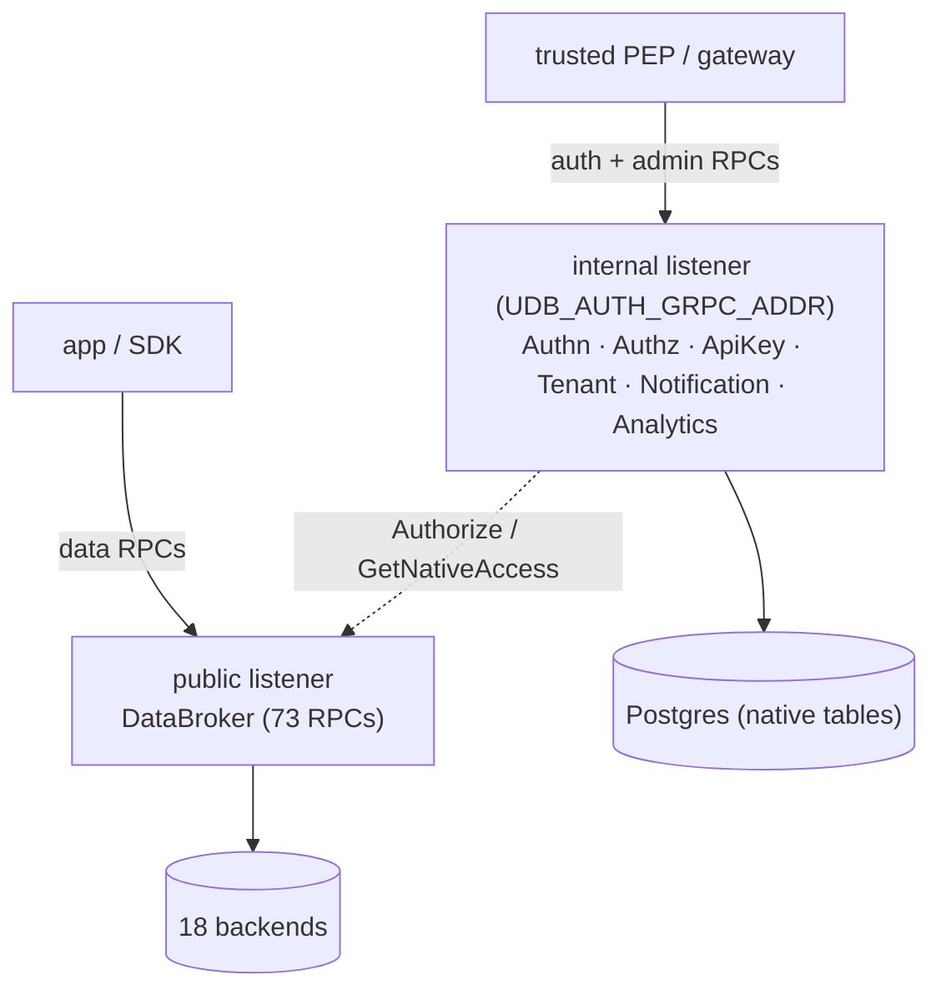

# Native Control Plane

Beyond the data-plane `DataBroker`, UDB serves a UDB-owned **auth/admin control
plane** defined under `proto/udb/core/**`. These services let UDB act as the
authentication + authorization authority in front of the databases it brokers,
rather than delegating identity and access decisions to each calling service.

## Network isolation

The control-plane services are **mounted on a separate gRPC listener** from the
public `DataBroker`, controlled by `UDB_AUTH_GRPC_ADDR` (default: loopback on the
DataBroker port + 10). They are a policy decision point that *accepts the subject
principal as input* (plus a verified-external-claims bridge), so exposing them on
the public port would let any client assert arbitrary identity, roles, or scopes.
Put them behind a trusted PEP / gateway, or bind them to an internal interface for
cross-host PEPs. Wiring: `src/runtime/service/mod.rs::serve()`.

All control-plane CRUD is **proto-driven** — table and column shape is resolved
from the embedded `proto/udb/core/**` manifest through `NativeModel`, and the
tables are created by the normal proto→migration path. Persistence is
**Postgres-backed and fails closed** when no PG pool is configured; there are no
in-memory stores.

## Services

| Service | Proto package | RPCs | Summary |
|---|---|---:|---|
| `AuthnService` | `udb.core.authn.services.v1` | 23 | Authenticate, login/logout, sessions, JWT signing + refresh, TOTP MFA, CSRF, OTP, user admin |
| `AuthzService` | `udb.core.authz.services.v1` | 23 | Authorize/CheckAccess/batch, role/policy/relationship CRUD, audits, `GetNativeAccess`, `GetPolicyBundle` |
| `ApiKeyService` | `udb.core.apikey.services.v1` | 7 | Create/get/list/update/revoke/validate API keys + usage stats |
| `TenantService` | `udb.core.tenant.services.v1` | 6 | Tenant + tenant-config CRUD |
| `NotificationService` | `udb.core.notification.services.v1` | 11 | Notifications, templates, preferences, delivery stats |
| `AnalyticsService` | `udb.core.analytics.services.v1` | 7 | Pipeline metrics, executor performance, reconciliation, throughput, SLA |

### AuthnService

`Authenticate` (native JWT / server-side session / API key / verified external
claims), `Login`/`Logout`, `RefreshToken`, `CreateSession`/`GetSession`/
`ListSessions`/`RefreshSession`/`RevokeSession`, `ValidateToken`, `ValidateCSRF`,
`EnrollMFA`/`ConfirmMFAEnrollment`, `SendOTP`/`VerifyOTP`/`ResendOTP`,
`ChangePassword`, and user admin (`CreateUser`/`GetUser`/`ListUsers`/`UpdateUser`/
`ChangeUserStatus`/`AdminResetPassword`).

Identity features:

- **Native JWT** validation — static PEM (`UDB_JWT_PUBLIC_KEY`) or JWKS URL
  (`UDB_JWT_JWKS_URL`) with `kid` lookup/cache/rotation, `iss`/`aud`/`exp`/`nbf`
  + clock-skew checks.
- **UDB-issued JWTs** — RS256 access-token signing (`UDB_JWT_PRIVATE_KEY`,
  `UDB_JWT_ACCESS_TTL_SECONDS`) + refresh-token issuance/rotation.
- **Passwords** — Argon2id, peppered with the server hash secret; legacy
  keyed-HMAC hashes still verify and are transparently re-hashed on next login.
- **MFA** — RFC 6238 TOTP (authenticator-app compatible), secret encrypted at rest.
- **Sessions** — hashed ids, idle + absolute TTL, immediate revocation, CSRF
  (signed double-submit bound to the session).
- **Hybrid external identity** — the external provider (OIDC / Better Auth /
  Laravel auth) proves *who*; UDB authz still decides *what*.

### AuthzService

`Authorize`, `CheckAccess`, `BatchCheckPermissions`; role/policy/relationship
management (`CreateRole`/`AssignRole`/`RevokeRole`/`ListUserRoles`/…,
`CreatePolicyRule`/`GetPolicyRule`/`ListPolicyRules`/`DeletePolicyRule`,
`PutRoleBinding`/`PutRelationship`/`PutAuthzPolicy`, `LintAuthzPolicies`);
`ListUserPermissions`, `ListAccessDecisionAudits`.

- One engine for **RBAC** (roles + bindings), **ABAC** (attribute conditions), and
  simple **ReBAC** (relationship tuples), over a Casbin enforcer, with
  tenant/project domains, explicit-deny-wins, priority, deterministic
  `decision_id`, and audit records. Broker enforcement routes through it when
  `UDB_AUTHZ_V2` is enabled (default on).
- **`GetNativeAccess`** — authorizes a request and, on allow, mints a short-lived
  restricted-role DSN plus the exact `app.current_*` session variables to
  `SET LOCAL`, so an SDK can talk to Postgres directly while the broker-generated
  RLS still applies. Configured by `UDB_NATIVE_BASE_DSN`,
  `UDB_NATIVE_ROLE_PREFIX`, `UDB_NATIVE_DATABASE`, `UDB_NATIVE_ACCESS_TTL_SECS`.
- **`GetPolicyBundle`** — returns an HMAC-signed, time-boxed snapshot of the
  policy set that an SDK caches to answer `can()` locally
  (`UDB_POLICY_BUNDLE_SECRET`, `UDB_POLICY_BUNDLE_TTL_SECS`).

### ApiKeyService / TenantService / NotificationService / AnalyticsService

- **ApiKey** — hashed key material, prefix lookup, scopes, expiry, rotation,
  revocation, last-used, and `GetApiKeyUsageStats` (daily aggregation over
  `udb_authn.api_key_usages`).
- **Tenant** — `CreateTenant`/`GetTenant`/`ListTenants`/`UpdateTenant` and
  `GetTenantConfig`/`UpdateTenantConfig` over `udb_tenant.*`.
- **Notification** — `SendNotification` (records a `NotificationLog` and emits
  `udb.notification.sent.v1` to the outbox→Kafka relay), templates, preferences,
  and `GetDeliveryStats` (per-channel). Outbound delivery (email/SMS/push) is a
  separate adapter concern.
- **Analytics** — `RecordPipelineMetric` (online hourly aggregation),
  `GetPipelineSummary`/`GetExecutorPerformance`/`GetReconciliationAnalytics`/
  `GetThroughput`/`GetSlaCompliance`, `TriggerSnapshot`, over `udb_analytics.*`.

## SDK usage

Each wrapper SDK exposes an auth client with `Authenticate*` + `Authorize`/`can`,
and most expose the native fast-path helper and a local authz cache:

- Go (`sdk/go/udbclient/auth.go`, `auth_native.go`, `auth_cache.go`)
- Python (`sdk/python/udb_client/auth.py`)
- TypeScript (`sdk/typescript/auth.ts`)
- PHP (`sdk/php/src/UdbAuthClient.php`)
- C# (`sdk/csharp/Udb.Client/UdbAuthClient.cs`)
- Java (`sdk/java/.../UdbAuthClient.java`)

See the [Quickstart Per Language](../README.md#-quickstart-per-language) in the
root README. Source: `src/runtime/authn/`, `src/runtime/authz/`,
`src/runtime/service/auth_service/` (+ `tenant_service`, `notification_service`,
`analytics_service`).
