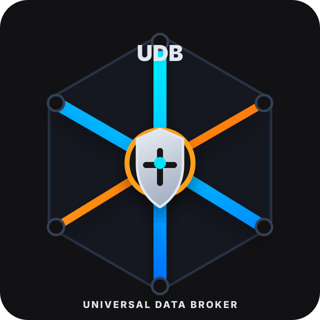

# UDB TypeScript SDK

<!-- UDB_BRAND_HEADER_START -->
<p align="center">
  
</p>

<p align="center">
  <strong>UDB :: Universal Data Broker</strong><br>
  <sub>gRPC data plane | native control plane | tenant/project scope guard<br>crate v0.4.13 | protocol v1.0.0</sub>
</p>
<!-- UDB_BRAND_HEADER_END -->

`@udb_plus/sdk` is the Node.js client for UDB. Use it when a TypeScript service
needs to read or write through the broker, call UDB auth/authz, or run the
version-matched `udb` CLI from a project that installed the package.

## Install

```bash
npm i @udb_plus/sdk@0.4.13
```

Runtime: Node 18+

Main entry points:

- `@udb_plus/sdk/client` for the DataBroker client and metadata helper
- `@udb_plus/sdk/auth` for auth/authz convenience methods
- `@udb_plus/sdk` for the full public surface

## Export UDB Protos For Your App

If your app owns `.proto` schemas and wants to use UDB annotations, export the
shared UDB protos into your project:

```bash
npx udb proto export --fmt
```

Then your app protos can import:

```proto
import "udb/core/common/v1/db.proto";
```

`proto export` is safe to re-run. It refreshes `proto/udb/**`, vendors the
`google/api/**` protos needed for offline generation, and can merge `buf.yaml`
without replacing your own settings.

Run `npx udb proto fmt` any time after export or edits to keep long UDB field
annotations on one line for easier review.

## Connect And Query

```ts
import { dataBrokerClient, metadata, UdbMetadata } from "@udb_plus/sdk/client";
import { UdbAuthClient } from "@udb_plus/sdk/auth";

const meta: UdbMetadata = {
  tenantId: "acme",
  userId: "user-1",
  purpose: "web.request",
  scopes: ["udb:read", "udb:write"],
  serviceIdentity: "billing.api",
  projectId: "billing",
};

const broker = dataBrokerClient("localhost:50051");

broker.Select(
  { message_type: "acme.billing.v1.Invoice", limit: 50 },
  metadata(meta),
  (err: unknown, rs: any) => {
    if (err) throw err;
    console.log(rs?.records);
  },
);

const auth = new UdbAuthClient("localhost:50051", meta);
const [allowed, decision] = await auth.can(
  { message_type: "acme.billing.v1.Invoice" },
  "read",
);
```

## Storage: Upload And Download

The `UdbProject` facade exposes the native `StorageService` file lifecycle on
`udb.storage`. `uploadFile` is a composite helper — it does `RegisterUpload`,
PUTs the bytes to the broker-minted presigned `upload_url` over plain HTTP, then
`FinalizeUpload` — and returns the `FinalizeUpload` response.

For reads, the default is a presigned download URL (no object bytes traverse the
broker). UDB 0.3.6 adds a server-streaming `StorageService.DownloadFile` RPC and
a client helper for clients that can't reach presigned HTTP: it pulls the raw
bytes through the broker and reassembles them into a `Uint8Array`.

```ts
import { UdbProject } from "@udb_plus/sdk/project";

const udb = await UdbProject.connect({
  target: "localhost:50051",
  tenantId: "acme",
  scopes: ["udb:read", "udb:write"],
});
await udb.loginAndAdoptTenant({ username: "admin", password: "secret" });

// Upload: RegisterUpload -> HTTP PUT (presigned) -> FinalizeUpload.
const finalized = await udb.storage.uploadFile(
  "greeting.txt",
  Buffer.from("hello\n", "utf8"),
  { contentType: "text/plain", fileType: "document" },
);
const fileId = finalized.file_id;

// Default download: mint a presigned URL (one GetDownloadUrl RPC).
const { download_url } = await udb.storage.downloadFile(fileId);

// 0.3.6 streaming fallback: pull bytes over DownloadFile -> Uint8Array.
const bytes = await udb.storage.downloadFileBytes(fileId);
// Equivalent via the canonical accessor with the streaming opt-in:
const sameBytes = await udb.storage.downloadFile(fileId, { stream: true });
```

The streaming helper accepts extra request fields (e.g. `chunk_size_bytes`) in
its `opts` argument. See `examples/storage_upload_download.ts` for a full
connect -> login -> upload -> streaming-download example.

## Consistency, Idempotency Replay, And Typed Errors

A mutation returns a `WriteReceipt`; a follow-up read can carry a fence built
from it, or request an explicit consistency mode. A keyed replay-safe mutation
the broker deduplicated reports `was_duplicate` (full contract:
[docs/native-services.md](../../docs/native-services.md)).

```ts
// Raw MutationResponse (the table handle's upsert returns the decoded record;
// use the generated DataBroker call when you want the response envelope).
const resp = await udb.data.upsert({
  context: { tenant_id: tenant, project_id: project },
  message_type: "acme.billing.v1.Invoice",
  record_json: Buffer.from(JSON.stringify(record)),
  idempotency_key: "inv-1-create",
});

// Durable-idempotency replay flag (true = broker replayed a prior keyed write).
const replayed = udb.metadata.wasDuplicate(resp);

// Read-your-writes: fence the next read on the write's receipt.
const receipt = udb.metadata.receiptFromResponse(resp); // null when absent
const call = receipt ? udb.metadata.afterWrite(receipt) : undefined;
const rows = await udb.data.table("invoice").select({ where, call });

// Or request an explicit consistency mode for one call.
const eventual = udb.metadata.withConsistency("eventual"); // strong | read_your_writes | bounded_staleness | replica_bounded | eventual | projection_ok | cache_ok
```

Retry contract: a replay-safe mutation is retried on transient errors **only
when the request carries a non-empty idempotency key** — keyless mutations fail
closed rather than risk a double apply. Typed error details decode from the
`udb-error-detail-bin` trailer onto `UdbError.detail`
(`kind` / `retryable` / `retryAfterMs` / `field_violations`).

## Platform Services (Vault, Metering, Scheduler, …)

Vault, Metering, Scheduler, Search, Webhook, Workflow, Lock, LiveQuery, Config,
Backup, and Embedding have no workflow facade yet — call them through the typed
generated client (native services ride the native listener; set `authTarget`
when it differs from the data-plane target):

```ts
const enc = await udb.generated.VaultService.encrypt({
  tenant_id: tenant,
  key_name: "docs",
  plaintext: "secret",
});
const quota = await udb.generated.MeteringService.checkQuota({ tenant_id: tenant, method: "upsert" });
```

Each service exposes both snake_case and camelCase method aliases; the per-RPC
retry class and idempotency contract are in
[docs/generated/udb-native-contract.json](../../docs/generated/udb-native-contract.json).

## Performance

The SDK uses a **single long-lived gRPC channel** — the generated client caches one
stub per service and reuses it, and `dataBrokerClient()` returns a reusable stub.
Construct the client once and reuse it across every RPC; never build a new client
per call, since a fresh channel forces a TCP+TLS+HTTP/2 handshake every time.

Channels are created with `UDB_DEFAULT_CHANNEL_OPTIONS` (exported from
`@udb_plus/sdk/client`), which add:

- **Keepalive** (`grpc.keepalive_time_ms=30000`, `grpc.keepalive_timeout_ms=10000`,
  `grpc.keepalive_permit_without_calls=1`) so an idle connection stays warm instead
  of dropping to IDLE and re-handshaking.
- No channel-wide retry policy. Generated wrappers retry only read-only unary RPCs
  using proto-derived `operation_kind`; mutating RPCs are never replayed by default.

Pass `channelOptions` in the client/project options to override any of these; your
values are spread on top of the defaults and win.

## Notes For Users

The package bundles the UDB wire protos and loads them at runtime through
`@grpc/proto-loader`. Application code should import the package entry points
above, not files under `gen/`.

The package also exposes a `udb` bin. With a local install, use `npx udb ...`;
with a global install, use `udb ...`.
